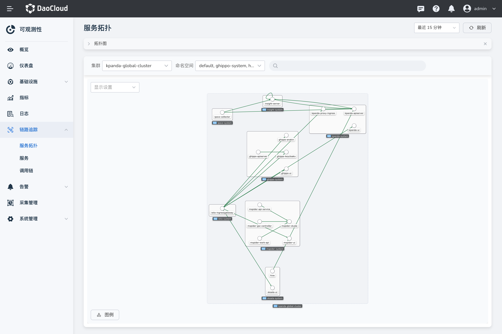

# 服务拓扑

服务拓扑图是对服务之间连接、通信和依赖关系的可视化表示。通过可视化拓扑了解服务间的调用关系，查看服务在指定时间内的调用及其性能状况。拓扑图的节点之间的联系代表两个服务在查询时间范围内服务之间的存在调用关系。

## 前提条件

1. 集群中已[安装 insight-agent](../../quickstart/install/install-agent.md) 且应用处于`运行中`状态。
2. 服务已通过 [Operator](http://demo-dev.daocloud.io/docs/insight/user-guide/quickstart/otel/operator/) 或  [Opentelemetry SDK](http://demo-dev.daocloud.io/docs/insight/user-guide/quickstart/otel/golang/) 的方式接入链路。

## 操作步骤

1. 进入`可观测性` 产品模块，
2. 在左边导航栏选择 `链路追踪 -> 服务拓扑`。
3. 在拓扑图中，您可按需执行以下操作：

   - 单击节点，从右侧划出服务的详情，可查看服务的请求延时、吞吐率、错误率的指标。点击服务名称可跳转至对应服务的详情页。
   - 鼠标悬浮在连线上时，可查看两个服务之间请求的流量指标。
   - 在 `显示设置` 模块，可配置拓扑图中的显示元素。

    {: width="1000px"}
