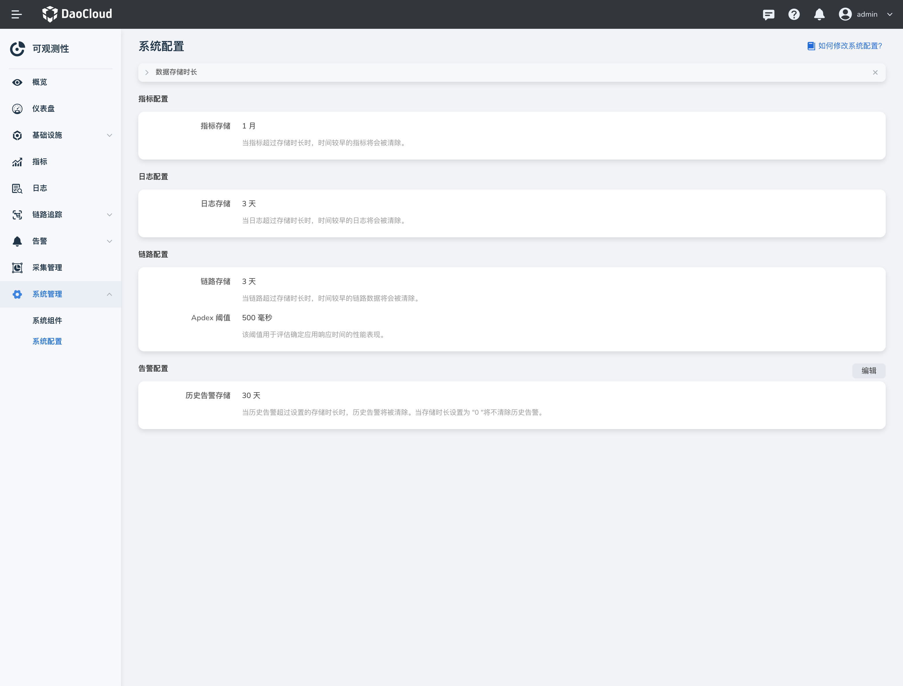

---
hide:
  - toc
---

# 系统配置

`系统配置`展示指标、日志、链路默认的保存时长以及默认的 Apdex 阈值。

1. 点击右侧导航栏，选择`系统配置`。

    

2. 目前仅支持修改历史告警存储时长，点击 `编辑` 输入目标时长。

    当存储时长设置为 "0" 将不清除历史告警。

    

!!! note

    修改其他配置，请点击查看[如何修改系统配置？](modify-config.md)
