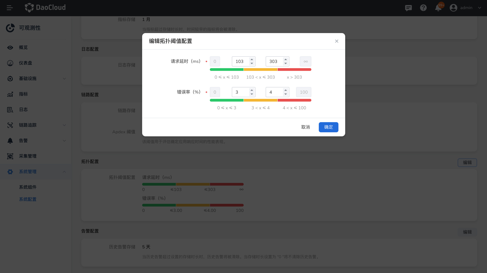

---
hide:
  - toc
---

# 系统配置

 __系统配置__ 展示指标、日志、链路默认的保存时长以及默认的 Apdex 阈值。

1. 点击右侧导航栏，选择 __系统配置__。

    

2. 修改历史告警存储时长，点击 __编辑__ 输入目标时长。

    当存储时长设置为 "0" 将不清除历史告警。

    

3. 修改拓扑图渲染默认配置，点击  __编辑__ 根据需求定义系统中拓扑图阈值。

    阈值设置必须大于 0，前面填写的阈值必须小于后面填写的。且填写的阈值必须在最大和最小的范围之间。

    

!!! note

    修改其他配置，请点击查看[如何修改系统配置？](modify-config.md)
