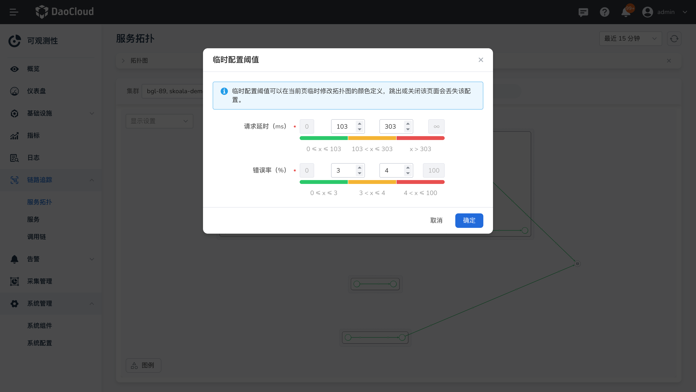

# 服务拓扑

服务拓扑图是对服务之间连接、通信和依赖关系的可视化表示。通过可视化拓扑了解服务间的调用关系，
查看服务在指定时间内的调用及其性能状况。拓扑图的节点之间的联系代表两个服务在查询时间范围内服务之间的存在调用关系。

## 前提条件

1. 集群中已[安装 insight-agent](../../quickstart/install/install-agent.md) 且应用处于 __运行中__ 状态。
2. 服务已通过 [Operator](../../quickstart/otel/operator.md) 或
   [Opentelemetry SDK](../../quickstart/otel/golang/golang.md) 的方式接入链路。

## 操作步骤

1. 进入 __可观测性__ 模块
2. 在左边导航栏选择 __链路追踪 -> 服务拓扑__
3. 在拓扑图中，您可按需执行以下操作：

    - 单击 __节点__，从右侧划出服务的详情，可查看服务的请求延时、吞吐率、错误率的指标。点击服务名称可跳转至对应服务的详情页。
    - 鼠标悬浮在连线上时，可查看两个服务之间请求的流量指标。
    - 在 __显示设置__ 模块，可配置拓扑图中的显示元素。

    { width="1000"}

4. 点击右下角 __图例__ ，可通过 __临时配置__ 修改当前的拓扑图定义的渲染阈值，跳出或关闭该页面即会丢失该配置。

    阈值设置必须大于 0，前面填写的阈值必须小于后面填写的。且填写的阈值必须在最大和最小的范围之间。

    { width="1000"}

    { width="1000"}

### 其他节点

在服务拓扑中会存在游离在集群之外的节点，这些游离在外的节点可分成三类：

- 数据库
- 消息队列
- 虚拟节点

1. 若服务发起请求到`数据库`或`消息队列`时，拓扑图中会默认展示这两类节点。
   而`虚拟服务`表示集群内服务请求了集群外的节点或者未接入链路的服务，拓扑图中默认不会展示 `虚拟服务`。

1. 当服务请求到 MySQL、PostgreSQL、Oracle Database 这三种数据库时，在拓扑图中可以看到请求的详细数据库类型。

    

#### 开启虚拟节点

1. 更新 insight-server chart 的 values，找到下图所示参数，将 `false` 改为 `true`。

    

2. 在服务拓扑的显示设置中勾选 __虚拟服务__ 。
