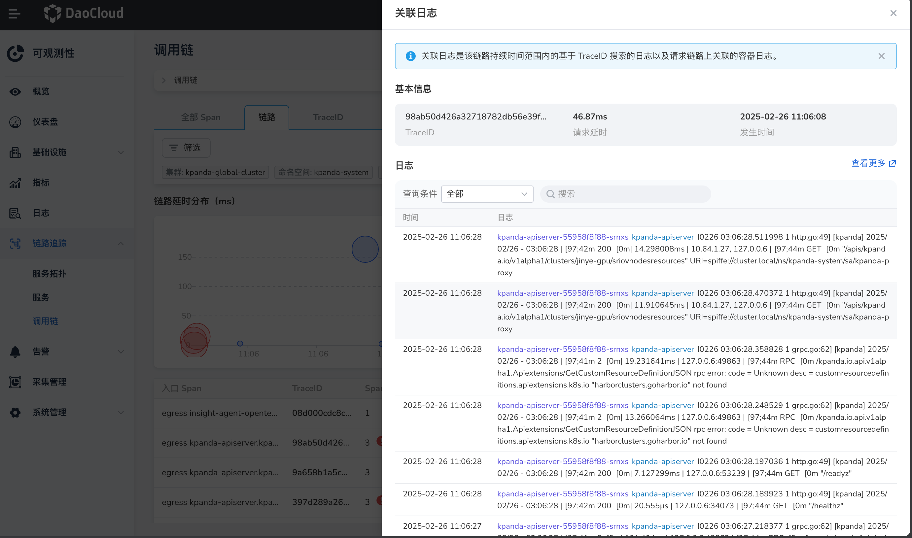

# 链路查询

在 [使用 OTel 增强应用的可观测性](https://docs.daocloud.io/insight/quickstart/otel/otel.html) 后，
Insight 会默认采集应用的链路数据。在`调用链`中，可以通过两个维度查看链路的数据：全部 Span、链路。

- 全部 Span 页面中用户能够查看符合条件的链路中每个 Span 的详细数据。
- 链路页面可以查看每个链路顶层 Span 的详细数据。

## 前提条件

- 集群中已安装 insight-agent 插件，insight-agent 的状态处于**运行中**且已开启 `trace` 功能
- 工作负载已通过 OpenTelemetry Operator 或 SDK 的方式成功接入链路系统

## 名词解释

1. **TraceID**：TraceID 是一个唯一标识符，用于追踪和识别一个完整的请求调用链路。它帮助开发者和运维人员在分布式系统中关联不同服务之间的请求，便于监控和故障排查。
1. **操作（Operation）**：操作是指在特定的 Span 中所执行的具体任务或事件。每个 Span 代表一个操作的执行过程，通常与某个服务的功能或业务逻辑相关联。
1. **入口 Span（Entry Span）**：入口 Span 是请求调用链中的第一个 Span，标识了请求的起始点。它通常对应于接收到外部请求的时刻，标志着整个调用链的开始。
1. **请求延时（Latency）**：延时是指从接收到请求到完成响应所经历的总时间。它是衡量系统性能的重要指标，能够帮助识别潜在的瓶颈和优化点。
1. **Span**：Span 是调用链中一个独立的操作单元，表示在特定时间段内执行的操作。一个完整的请求调用链可能包含多个 Span，每个 Span 记录了操作的开始时间、结束时间、持续时间及相关的上下文信息。
1. **发生时间（Start Time）**：发生时间是指当前链路开始的具体时间点，通常记录请求被接收的时刻。它用于计算延时和分析请求的处理过程。
1. **标签（Tag）**：Tag 是一组键值对，用于对 Span 进行注解和补充信息。每个 Span 可以包含多个 标签，以提供额外的上下文信息，帮助开发者理解操作的细节和状态。

## 查看全部 Span

1. 进入 __可观测性__ 产品模块，
1. 在左边导航栏选择 __链路追踪__ -> __调用链__。，进入后默认展示 `全部 Span` 。

    - 点击右上角的时间控件，可修改查询 Span 的时间范围。默认查询最近 15 分钟内所有服务上报的 Span 数据。
    - 点击筛选按钮，可以基于集群、命名空间、服务、操作等基础字段进行搜索，同时可以通过 Span 详细信息中的标签、延时进行过滤。
    - Span 列表默认基于发生时间排序，另外可对`请求延时`进行排序。
    - 点击列表右上方的选择器可以过滤出时间范围内的错误 Span。

    !!! note

        错误 Span（Error Span）是指在其详细信息中包含标签 error=true 的 Span。这种 Span 表示在执行过程中发生了错误或异常，通常用于链路请求过程中的故障或问题。

    

### 查看 Span 详情

点击目标 Span 的操作名称，点击可查看该 Span 所在的链路的瀑布图。

## 查看链路（顶层 Span）

1. 进入 __可观测性__ 产品模块，
2. 在左边导航栏选择 __链路追踪__ -> __调用链__。

    

    !!! note

        列表中支持对 Span 数、延时、发生时间进行排序。

3. 点击筛选栏中的 __TraceID 搜索__ 切换使用 TraceID 搜索链路。

    使用 TraceID 搜索请输入完整的 TraceID。

    

### 查看链路详情

点击链路列表中的某一链路的 TraceID，可查看该链路的详情调用情况。

### 查看关联日志

1. 点击链路数据右侧的图标，可查询该链路的关联日志。

    - 默认查询该链路的持续时间及其结束之后一分钟内的日志数据。
    - 查询的日志内容为日志文本中包含该链路的 TraceID 的日志和链路调用过程中相关的容器日志。
  
2. 点击 __查看更多__ 后可带条件跳转到 __日志查询__ 的页面。
3. 默认搜索全部日志，但可下拉根据链路的 TraceID 或链路调用过程中相关的容器日志进行过滤。

    

    !!! note

        由于链路会跨集群或跨命名空间，若用户权限不足，则无法查询该链路的关联日志。
