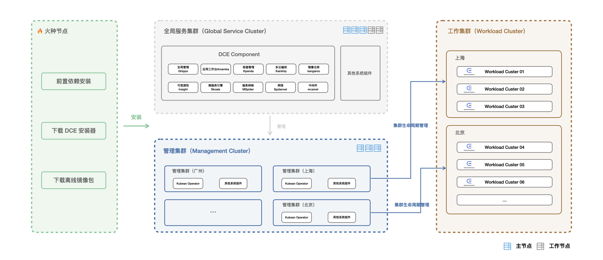
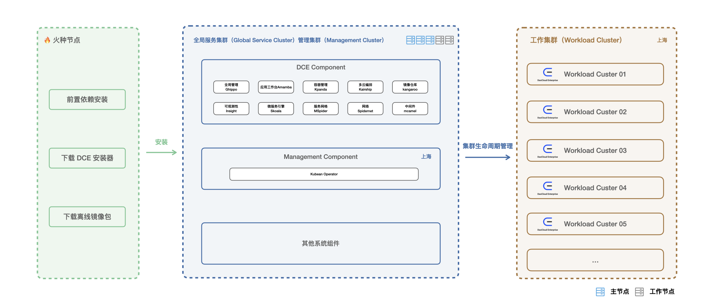

# 部署规划

## 部署模式

DCE 5.0 商业版提供了两种模式：

- 经典模式：管理集群、全局服务集群、工作集群独立部署，适用场景：多数据中心，需要跨网路、跨区域管理集群。
- 简约模式（二合一）：管理集群+全局服务集群（二合一部署）、工作集群，适用场景：单数据中心，无需跨网络、跨区域管理集群。

**集群类型介绍**

| 集群类型                               | 描述                                                                                                                                                   |
| -------------------------------------- | ------------------------------------------------------------------------------------------------------------------------------------------------------ |
| 全局服务集群（Global Service Cluster） | 全局唯一。所有 DEC 5.0 组件都运行在这个集群，因此各个全局服务天然要设计成”多集群“、”单入口“模式。                                                      |
| 管理集群（Management Cluster）         | 部署了 Kubean 组件，自动化管理工作集群的生命周期。                                                                                                     |
| 工作集群（Workload Cluster）           | 支撑业务应用的集群，由管理集群来安装并被管理。                                                                                                         |
| 接入集群                               | DCE 5.0 支持将外部集群接入至平台中从而进行统一管理，只要是基于标准 Kubernetes API 的第三方厂商提供的集群或本地数据中心自建 Kubernetes 集群均可被接入。 |

!!! note

    安装器只负责部署全局服务集群与管理集群，工作集群与接入集群不在安装器的范畴内。

## 经典模式部署架构图

全局服务集群部署 DCE 5.0 所需要的所有组件，主要包含了全局管理、容器管理、可观测性、应用工作台、多云编排、镜像仓库、微服务引擎、服务网格、中间件、网络等组件。

管理集群部署开源软件 [Kubean](https://github.com/kubean-io/kubean) 的 Operator 组件。
[Kubean](https://github.com/kubean-io/kubean) 是基于 Kubespray 的集群生命周期管理的组件。
另外，随着云计算技术的快速发展，企业大部分的应用不仅迁移上云，还将应用部署在私有云、公有云、混合云等各种云平台上，
所以为了满足这样的场景，DCE 5.0 支持部署多套管理集群，来管理不同区域内集群的生命周期。

## 简约模式（二合一）部署架构图

管理集群和全局服务集群二合一部署，此模式下，可以达到节省资源的目的，适用于企业单数据中心，
无需管理不同集群的生命周期以及跨网络通信。如果企业生产环境下存在多数据中心的场景，建议采用经典模式。

## 节点要求

### 火种节点资源规划

无论选择哪种架构模式，安装 DCE 5.0 商业版都需要一台火种节点，火种节点包含用户安装 DCE 5.0 时所需的集群及服务。

**火种节点的系统和硬件要求**

|            | **要求**                                            | **最佳实践**                                              |
| :--------- | :-------------------------------------------------- | :-------------------------------------------------------- |
| CPU 核心数 | 可用 CPU 至少为 4 Core                              | 8 Core                                                    |
| 内存       | 可用内存至少为 8 GB                                 | 16 GB                                                     |
| 磁盘       | 磁盘空间 > 100 GB，用来下载及解压离线包             | 100 GB                                                    |
| 系统版本   | 无特别要求：支持 Linux、macOS 以及 Windows 操作系统 | 无特别要求：支持 Linux、macOS 以及 Windows 操作系统要求： |

### 经典模式资源规划

**测试环境**

| 集群类型                              | 方式 一                                                      | 方式二                                                       |
| :------------------------------------ | :----------------------------------------------------------- | :----------------------------------------------------------- |
| 全局服务集群 (Global Service Cluster) | **3 Master + 2 Worker**  Master 节点：4 Core，8 G；系统盘 100G   Worker 节点：8 Core，16 G；系统盘 100G + 没有分区的磁盘 200G | **3 Master** Master 节点：10 Core，20 G；系统盘 100G + 没有分区的磁盘 200G |
| 管理集群 (Management Cluster)         | **3 Master**  Master 节点：4 Core，4 G；系统盘 100G     | **3 Master**  Master 节点：4 Core，4 G；系统盘 100G     |
| 系统版本                              | CentOS 7.9                                                   | CentOS 7.9                                                   |

**生产环境**

| 集群类型                              | 方式 一                                                      | 方式二                                                       |
| :------------------------------------ | :----------------------------------------------------------- | :----------------------------------------------------------- |
| 全局服务集群 (Global Service Cluster) | **3 Master + 2 Worker**  Master 节点：6 Core，10 G；系统盘 100G   Worker 节点：8 Core，16 G；系统盘 100G + 没有分区的磁盘 200G | **3 Master** Master 节点：10 Core，20 G；系统盘 100G + 没有分区的磁盘 200G |
| 管理集群 (Management Cluster)         | **3 Master**  Master 节点：4 Core，4 G；系统盘 100G     | **3 Master**  Master 节点：4 Core，4 G；系统盘 100G     |
| 系统版本                              | CentOS 7.9                                                   | CentOS 7.9                                                   |

### 简约模式资源规划

**测试环境**

| 集群类型                                                     | 方式 一                                                      | 方式二                                                       |
| :----------------------------------------------------------- | :----------------------------------------------------------- | :----------------------------------------------------------- |
| 全局服务集群+管理集群 (Global Service Cluster + Management Cluster) | **3 Master + 2 Worker**  Master 节点：4 Core，8 G；系统盘 100G   Worker 节点：8 Core，16 G；系统盘 100G + 没有分区的磁盘 200G | **3 Master** Master 节点：10 Core，20 G；系统盘 100G + 没有分区的磁盘 200G |
| 系统版本                                                     | CentOS 7.9                                                   | CentOS 7.9                                                   |

**生产环境**

| 集群类型                                                     | 规模                                                         |
| :----------------------------------------------------------- | :----------------------------------------------------------- |
| 全局服务集群+管理集群 (Global Service Cluster + Management Cluster) | **3 Master + 2 Worker**  Master 节点：6 Core，10 G；系统盘 100G + 没有分区的磁盘 200G  Worker 节点：8 Core，16 G；系统盘 100G + 没有分区的磁盘 200G |
| 系统版本                                                     | CentOS 7.9                                                   |
