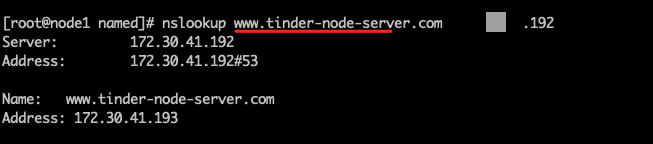
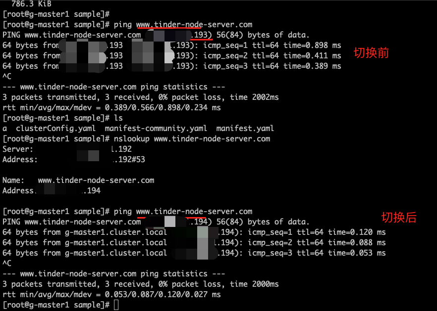
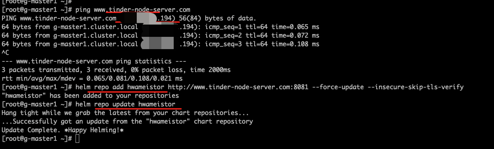

# 火种节点高可用方案

新增 “备用火种节点” 概念，本质上是一台虚拟机，与火种节点所做的事项一样，但是只有在原火种节点出问题时才会短暂使用，
节点修复后需立即切换到原火种节点。并且通过前置的 DNS 或 HAProxy+KeepAlived 或 nginx 反向代理来实现火种服务的高可用，
本文通过前置的 DNS 方式来操作。

整体方案思路架构：


## 环境准备

- 火种节点：操作系统 centos7.9 ，IP `xxx.xx.xx.193`
- global单集群： 操作系统 centos7.9，IP `xxx.xx.xx.194`，CRI containerd
- 备用火种节点： 操作系统 centos7.9，IP `xxx.xx.xx.194`，备用火种节点可以与 global 集群的 master 节点在一起。
- dnsServer：IP `xxx.xx.xx.192`
- 域名： <www.tinder-node-server.com> （初始解析到火种节点 `xxx.xx.xx.193`）

## 操作步骤

### 模拟 dnsServer，根据实际情况配置

在 `xxx.xx.xx.192` 机器中设置 dnsServer 信息。以下配置信息仅作演示参考：

1. 配置信息 `/etc/named.conf`

    ```shell
    zone "tinder-node-server.com" IN {
        type master;
        file "tinder-node-server.com.zone";
        allow-update { none; };
    };
    
    zone "41.30.172.in-addr.arpa" IN {
        type master;
        file "tinder-node-server.com.local";
        allow-update { none; };
    };
    ```

1. 配置信息 `/var/named/tinder-node-server.com.zone`

    ```shell
    $TTL 1D
    @   IN SOA  tinder-node-server.com. rname.invalid. (
                        0   ; serial
                        1D  ; refresh
                        1H  ; retry
                        1W  ; expire
                        3H )    ; minimum
        NS  @
        A   127.0.0.1
        AAAA    ::1
        NS  ns.tinder-node-server.com.
    ns  IN A    xxx.xx.xx.193
    www IN A    xxx.xx.xx.193
    email   IN A    xxx.xx.xx.193
    ```

1. 配置信息 `/var/named/tinder-node-server.com.local`

    ```shell
    $TTL 1D
    @   IN SOA  tinder-node-server.com. rname.invalid. (
                        0   ; serial
                        1D  ; refresh
                        1H  ; retry
                        1W  ; expire
                        3H )    ; minimum
        NS  @
        A   127.0.0.1
        AAAA    ::1
        PTR localhost.
        NS  ns.tinder-node-server.com.
    ns  A   xxx.xx.xx.193
    201 PTR www.tinder-node-server.com.
    201 PTR email.tinder-node-server.com.
    ```

1. DNS 机器的配置文件信息 `/etc/resolv.conf`

    ```shell
    # Generated by NetworkManager
    search default.svc.cluster.local svc.cluster.local
    nameserver xxx.xx.xx.192
    nameserver 223.6.6.6
    options ndots:2 timeout:2 attempts:2
    ```

1. 验证 dnsServer 解析是否正确

    ```bash
    nslookup www.tinder-node-server.com xxx.xx.xx.192
    ```
  
    

!!! note

    - 如果使用外部 dns 服务解析域名时，需要确保各个节点包括火种节点的 /etc/hosts 文件中不能出现该域名配置
    - 可以使用 nslookup 命令检查域名解析状况，需要保证各个节点包括火种节点中，都能使用 nslookup 来检验解析状况

### 基于外部域名模式，安装 DCE 5.0

整体架构如下


1. 安装流程请参考[离线安装 DCE 5.0 商业版](../commercial/start-install.md)

1. 定义好的 clusterConfig 文件参考：

    ```yaml title="clusterConfig.yaml"
    apiVersion: provision.daocloud.io/v1alpha3
    kind: ClusterConfig
    metadata:
      creationTimestamp: null
    spec:
      clusterName: my-cluster
      bootstrapNode: www.tinder-node-server.com ## 基于外部域名模式
    
      masterNodes:
        - nodeName: "g-master1"
          ip: xxx.xx.xx.194
          ansibleUser: "root"
          ansiblePass: "admin"
    
      fullPackagePath: "/home/offline-fix-dns"
      osRepos:
        type: builtin
        isoPath: "/home/CentOS-79-x86_64-DVD-2009.iso"
        osPackagePath: "/home/os-pkgs-centos7-v0.4.8.tar.gz"
    
      imagesAndCharts:
        type: builtin
        additionalSSLSubjectAltName: "xxx.xx.xx.193" ## dns 服务所解析的域名
    
      addonPackage:
      binaries:
        type: builtin
    ```

1. 开始安装

    ```bash
    ./dce5-installer cluster-create -c sample/clusterConfig.yaml -m sample/manifest.yaml
    ```

1. 集群安装成功后，检查 pod 镜像地址

    

1. 检查 global 节点的 hosts 文件以及 coredns pod 配置，其中不存在并且不能存在额外的域名配置

    ```bash
    cat /etc/hostes
    ```
  
    
  
    ```bash
    kubectl -n kube-system get cm coredns -o yaml
    ```
  
    

### 模拟启用备用火种节点

1. 确保备用火种节点已经安装前置依赖工具，参考[安装依赖项](../install-tools.md)，

1. 将火种节点的离线包 scp 到备用火种节点上

1. 定义好的 clusterConfig 文件参考：使用 IP 模式（bootstrapNode 为 auto 或者为火种节点的具体 IP 地址）启动火种节点安装

    ```yaml title="clusterConfig.yaml"
    apiVersion: provision.daocloud.io/v1alpha3
    kind: ClusterConfig
    metadata:
      creationTimestamp: null
    spec:
      clusterName: my-cluster
      bootstrapNode: 172.30.41.194 ## 基于 IP 模式
    
      masterNodes:
        - nodeName: "g-master1"
          ip: xxx.xx.xx.194
          ansibleUser: "root"
          ansiblePass: "admin"
    
      fullPackagePath: "/home/offline-fix-dns"
      osRepos:
        type: builtin
        isoPath: "/home/CentOS-79-x86_64-DVD-2009.iso"
        osPackagePath: "/home/os-pkgs-centos7-v0.4.8.tar.gz"
    
      imagesAndCharts:
        type: builtin
        additionalSSLSubjectAltName: "www.tinder-node-server.com" ## dns 服务所解析的域名
      addonPackage:
      binaries:
        type: builtin
    ```

1. 在备用火种机执行特定步骤 `1,2,3,4,5`

    ```bash
    ./dce5-installer cluster-create -c sample/clusterConfig.yaml -m sample/manifest.yaml -j 1,2,3,4,5
    ```

    !!! note
    
        这里的 -j 参数必不可少，只安装到火种节点本身。

### 基于 DNS 解析实现火种节点的高可用验证测试

前提条件：更新 dnsServer，切换 DNS 解析到备用火种节点，切换后进行验证




1. 验证文件下载正常

    

1. 验证镜像拉取正常

    

1. 验证源火种节点以及备用节点镜像正常

    

1. 验证 charts 仓库正常

    

## FAQ

### bootstrapNode 和 AdditionalSubjectAltName 字段配置

火种节点和备用火种节点关于 clusterConfig.yaml 中的 bootstrapNode、imagesAndCharts.additionalSSLSubjectAltName 配置的说明：

| 节点 | SubjectAltName(bootstrapNode) | AdditionalSubjectAltName |
| --- | ------------------------ | ---------------------------- |
| 原火种节点193   | www.tinder-node-server.com | 172.30.41.193  |
| 备用火种节点194 | 172.30.41.194 | www.tinder-node-server.com |

### 升级场景下，备用火种节点如何升级同步

前提条件：

- 将 dns 解析恢复到原状，即域名指向原火种节点 `xxx.xx.xx.193`

    !!! note
  
        为何需要将解析恢复原状？因为在不修改 clusterConfig 前提下，在域名模式下启动火种节点或者更新火种节点时，存在代码检查逻辑：
        检查当前所给域名是否解析到当前节点的ip，如果是，则什么都不做；如果不是，则会更新火种节点的 hosts 文件以此支持域名模式。
        所以如果不恢复解析原状，会造成火种节点的 hosts 文件的额外修改。

- 火种节点与备用火种节点下载好离线升级包

    1. 在火种节点与备用火种节点分别执行升级火种节点命令，用于升级镜像、minio 文件、charts 版本
    
        ```bash
        ./dce5-installer cluster-create -c sample/clusterConfig.yaml -m sample/manifest.yaml -u tinder
        ```

        修改 fullPackagePath 指向离线包升级包地址。
    
    1. 升级后需要分别检查火种节点与备用节点的镜像、文件、charts 仓库可以正常下载。
