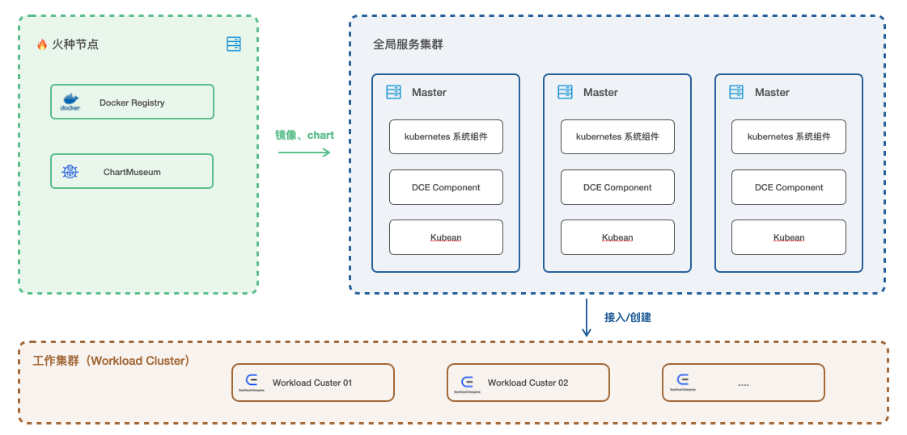
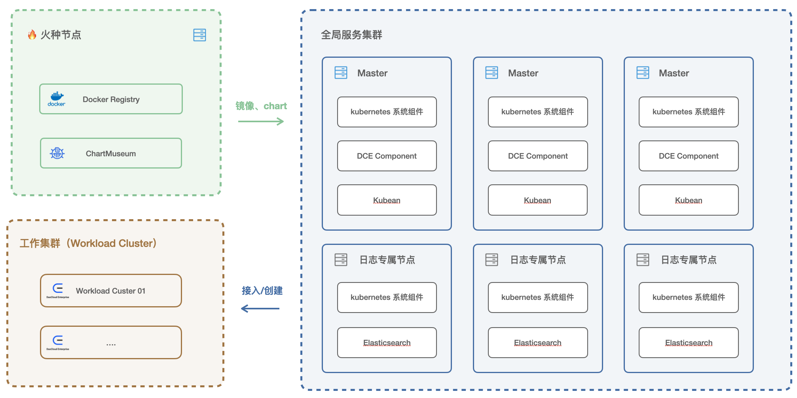

# 部署架构

DCE 5.0 提供了三种部署架构：All-in-One、4 节点、7 节点。

以下描述了架构中涉及到名词介绍：

| 名词         | 介绍                                                         |      |
| ------------ | ------------------------------------------------------------ | ---- |
| 火种节点     | 火种节点也称为 boostrap 节点，安装部署程序的执行，并运行平台所需的镜像仓库和 chart museum。 |      |
| 全局服务集群 | 用来部署DCE 5.0 的所有组件，以及[Kubean](https://github.com/kubean-io/kubean)，其中 Kubean 用来管理集群的生命周期。 |      |
| 工作集群     | 支撑业务应用和服务（成功安装 DCE 之后再部署工作集群）        |      |
| DCE Componet | DCE 5.0 的所有组件，包含全局管理、容器管理、可观测性、应用工作台、多云编排、镜像仓库、微服务引擎、服务网格、中间件等产品模块。 |      |

## All-in-One

All-in-One 模式仅需要一台主机。使用 All-in-One 模式时，建议使用最小化安装 DCE 5.0，即安装命令后添加 `-z` 参数。

## 4 节点模式

4 节点模式由 1个火种节点、3 个集群的主节点组成。

## 7 节点模式（1+6）

7 节点模式由 1个火种节点、3 个集群的主节点、3个集群的工作节点组成。其中工作节点作为 es 组件的专属节点。

