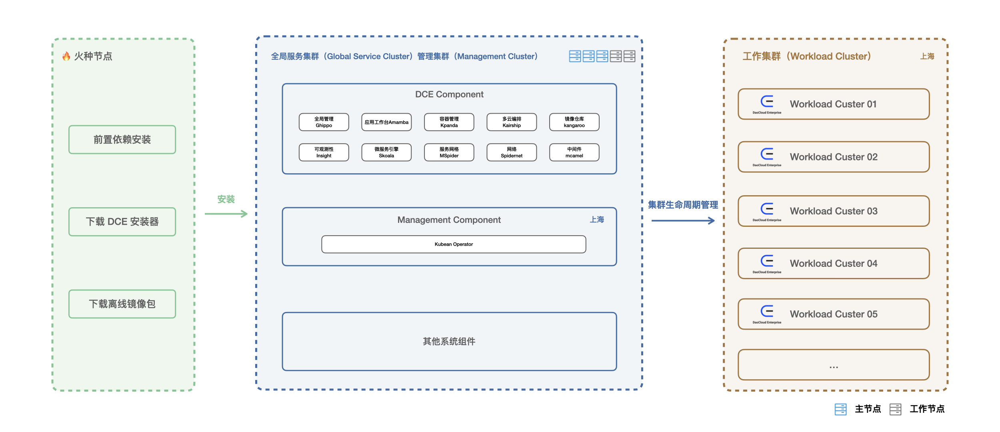

# 部署规划

DCE 5.0 商业版提供了两种模式：经典模式和简约模式。

## 经典模式

经典模式适合跨网络、跨区域的多数据中心，其部署模式为：

- [全局服务集群](../../kpanda/07UserGuide/Clusters/ClusterRole.md#_1)部署 DCE 5.0 的所有组件：全局管理、容器管理、可观测性、应用工作台、多云编排、镜像仓库、微服务引擎、服务网格、中间件、网络等。
- [管理集群](../../kpanda/07UserGuide/Clusters/ClusterRole.md#_2)部署 [Kubean](https://github.com/kubean-io/kubean) 的 Operator
- [工作集群](../../kpanda/07UserGuide/Clusters/ClusterRole.md#_3)支撑业务应用和服务（成功安装 DCE 之后再部署工作集群）

经典模式的部署架构图如下所示：

## 简约模式

将全局服务集群和管理集群部署在一个集群，其他不变。这种模式适合无需跨网络、跨区域的单数据中心。

简约模式的部署架构图如下所示：

全局服务集群和管理集群部署到一起。此模式可以达到节省资源的目的，适用于企业单数据中心，
无需管理不同集群的生命周期以及跨网络通信。如果企业生产环境下存在多数据中心的场景，建议采用经典模式。

## 节点要求

无论选择哪种模式，安装 DCE 5.0 商业版首先需要一台临时的火种节点。

### 火种节点

火种节点也称为 boostrap 节点，通过启动 kind 集群执行一系列自动化的安装过程来部署全局服务集群和管理集群。

**火种节点的系统和硬件要求**

| 资源条目      | 要求         | 建议值       |
| :------------ | :----------- | :----------- |
| 可用 CPU 核数 | 4 Core       | 8 Core       |
| 可用内存      | 8 GB         | 16 GB        |
| 可用磁盘空间  | > 100 GB     | 200 GB       |
| 操作系统      | Linux、macOS | Linux、macOS |

### 经典模式资源规划

**测试环境**

| 集群类型     | 方式 一                                                                                                                | 方式二                                                                 |
| :----------- | :--------------------------------------------------------------------------------------------------------------------- | :--------------------------------------------------------------------- |
| 全局服务集群 | **3 Master + 2 Worker**  Master 节点：4C8G；系统盘 100G  Worker 节点：8C16G；系统盘 100G + 未分区的磁盘 200G | **3 Master** Master 节点：10C20G；系统盘 100G + 未分区的磁盘 200G |
| 管理集群     | **3 Master**  Master 节点：4C4G；系统盘 100G                                                                      | **3 Master**  Master 节点：4C4G；系统盘 100G                      |
| 操作系统     | CentOS 7.9                                                                                                             | CentOS 7.9                                                             |

**生产环境**

| 集群类型     | 方式 一                                                                                                                  | 方式二                                                                 |
| :----------- | :----------------------------------------------------------------------------------------------------------------------- | :--------------------------------------------------------------------- |
| 全局服务集群 | **3 Master + 2 Worker**  Master 节点：6C10G；系统盘 100G   Worker 节点：8C16G；系统盘 100G + 未分区的磁盘 200G | **3 Master** Master 节点：10C20G；系统盘 100G + 未分区的磁盘 200G |
| 管理集群     | **3 Master**  Master 节点：4C4G；系统盘 100G                                                                        | **3 Master**  Master 节点：4C4G；系统盘 100G                      |
| 操作系统     | CentOS 7.9                                                                                                               | CentOS 7.9                                                             |

### 简约模式资源规划

**测试环境**

| 集群类型              | 方式 一                                                                                                                | 方式二                                                                 |
| :-------------------- | :--------------------------------------------------------------------------------------------------------------------- | :--------------------------------------------------------------------- |
| 全局服务集群+管理集群 | **3 Master + 2 Worker**  Master 节点：4C8G；系统盘 100G  Worker 节点：8C16G；系统盘 100G + 未分区的磁盘 200G | **3 Master** Master 节点：10C20G；系统盘 100G + 未分区的磁盘 200G |
| 操作系统              | CentOS 7.9                                                                                                             | CentOS 7.9                                                             |

**生产环境**

| 集群类型              | 规模                                                                                                                                        |
| :-------------------- | :------------------------------------------------------------------------------------------------------------------------------------------ |
| 全局服务集群+管理集群 | **3 Master + 2 Worker**  Master 节点：6C10G；系统盘 100G + 未分区的磁盘 200G  Worker 节点：8C16G；系统盘 100G + 未分区的磁盘 200G |
| 操作系统              | CentOS 7.9                                                                                                                                  |
