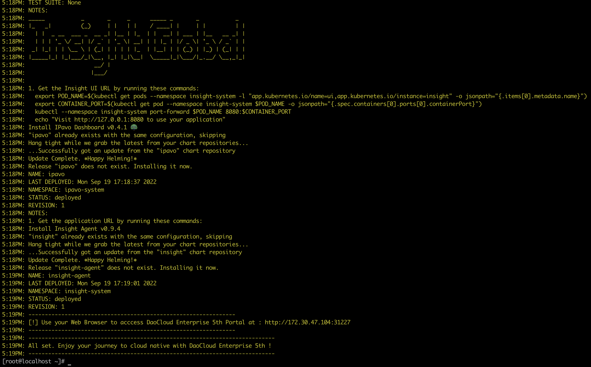

# 使用 Kubernetes 集群离线安装社区版

本页简要说明 DCE 5.0 社区版的离线安装步骤。

!!! note

    点击[社区版部署 Demo](../../../videos/install.md)可观看视频演示。

## 准备工作

- 准备一个 Kubernetes 集群，集群配置请参考文档[资源规划](../resources.md)。

    !!! note

      	- 存储：需要提前准备好 StorageClass，并设置为默认 SC
        - 确保集群已安装 CoreDNS
        - 如果是单节点集群，请确保您已移除该节点的污点

- [安装依赖项](../../install-tools.md)。

    !!! note

        如果集群中已安装所有依赖项，请确保依赖项版本符合要求：

        - helm ≥ 3.9.4
        - skopeo ≥ 1.9.2
        - kubectl ≥ 1.22.0
        - yq ≥ 4.27.5

## 下载和安装

1. 在 k8s 集群控制平面节点（Master 节点）下载社区版的对应离线包并解压，或者从[下载中心](../../../download/dce5.md)下载离线包并解压。

    ```bash
    # 假定版本 VERSION=0.3.30
    export VERSION=v0.3.30
    wget https://qiniu-download-public.daocloud.io/DaoCloud_Enterprise/dce5/offline-centos7-community-$VERSION-amd64.tar
    tar -zxvf offline-centos7-community-$VERSION-amd64.tar
    ```

2. 导入镜像。

    - 下载镜像导入脚本。

        ```bash
        wget https://proxy-qiniu-download-public.daocloud.io/DaoCloud_Enterprise/dce5/offline_image_handler.sh
        ```

        为 `offline_image_handler.sh` 添加可执行权限：

        ```bash
        chmod +x offline_image_handler.sh
        ```

    - 如果使用镜像仓库，请将离线包的镜像推送到镜像仓库。

        ```bash
        # 指定镜像仓库地址, 比如:
        export REGISTRY_ADDR=registry.daocloud.io:30080
        # 指定离线包解压目录, 比如:
        export OFFLINE_DIR=$(pwd)/offline
        # 执行脚本导入镜像
        ./offline_image_handler.sh import
        ```

        !!! note

            - 若导入镜像的过程出现失败, 则失败会被跳过且脚本将继续执行。
            - 失败镜像信息将被记录在脚本同级目录 `import_image_failed.list` 文件中，便于定位。
            - 如果 docker pull 镜像时报错：http: server gave HTTP response to HTTPS client， 请启用 Insecure Registry。

    - 在集群的每个节点上运行 `vim /etc/docker/daemon.json` 命令以编辑 daemon.json 文件，输入以下内容并保存更改。

        ```json
        {
        "insecure-registries" : ["172.30.120.180:80"]
        }
        ```

        !!! note

            请确保将 `172.30.120.180:80` 替换为您自己的 Harbor 仓库地址。
            对于 Linux，daemon.json 文件的路径为 `/etc/docker/daemon.json`。

    - 运行以下命令重启 Docker。

        ```bash
        sudo systemctl daemon-reload
        sudo systemctl restart docker
        ```

    - 如果没有镜像仓库，请将离线包拷贝到每一台节点之后，通过 `docker load/nerdctl load` 命令加载：

        ```shell
        # 指定离线包解压目录
        export OFFLINE_DIR=$(pwd)/offline
        # 执行脚本加载镜像
        ./offline_image_handler.sh load
        ```

3. 在 k8s 集群控制平面节点（Master 节点）下载 dce5-installer 二进制文件。

    ```shell
    # 假定 VERSION 为 v0.3.30
    export VERSION=v0.3.30
    curl -Lo ./dce5-installer https://proxy-qiniu-download-public.daocloud.io/DaoCloud_Enterprise/dce5/dce5-installer-$VERSION
    ```

    为 `dce5-installer` 添加可执行权限：

    ```bash
    chmod +x dce5-installer
    ```

4. 设置集群配置文件 clusterConfig.yaml

    - 如果是非公有云环境（虚拟机、物理机），请启用负载均衡 (metallb)，以规避 NodePort 因节点 IP 变动造成的不稳定。请仔细规划您的网络，设置 2 个必要的 VIP，配置文件范例如下：

        ```yaml
        apiVersion: provision.daocloud.io/v1alpha2
        kind: ClusterConfig
        spec:
          loadBalancer:
            type: metallb
            istioGatewayVip: 10.6.229.10/32 # 这是 Istio gateway 的 VIP，也会是DCE 5.0的控制台的浏览器访问IP
            insightVip: 10.6.229.11/32      # 这是 Global 集群的 Insight-Server 采集所有子集群的监控指标的网络路径所用的 VIP
          registry:
            type: external
            externalRegistry: registry.daocloud.io:30080 # 提前准备的、已有的镜像仓库的地址
        ```

    - 如果是公有云环境，并通过预先准备好的 Cloud Controller Manager 的机制提供了公有云的 k8s 负载均衡能力, 配置文件范例如下:

        ```yaml
        apiVersion: provision.daocloud.io/v1alpha2
        kind: ClusterConfig
        spec:
          loadBalancer:
            type: cloudLB
          registry:
            type: external
            externalRegistry: registry.daocloud.io:30080 # 提前准备的、已有的镜像仓库的地址
        ```

    - 如果使用 NodePort 暴露控制台（仅推荐 PoC 使用），配置文件范例如下:

        ```yaml
        apiVersion: provision.daocloud.io/v1alpha2
        kind: ClusterConfig
        spec:
          loadBalancer:
            type: NodePort
          registry:
            type: external
            externalRegistry: registry.daocloud.io:30080 # 提前准备的、已有的镜像仓库的地址
        ```

5. 解压安装。

    ```shell
    ./dce5-installer install-app -c clusterConfig.yaml -p offline
    ```

    !!! note

        - 参数 -p 指定解压离线包的 offline 目录。
        - 有关 clusterConfig.yaml 文件设置，请参考[在线安装第 2 步](online.md#_2)。

6. 安装完成后，命令行会提示安装成功。恭喜您！:smile: 现在可以通过屏幕提示的 URL 使用默认的账户和密码（admin/changeme）探索全新的 DCE 5.0 啦！

    

    !!! success

        请记录好提示的 URL，方便下次访问。

7. 另外，安装 DCE 5.0 成功之后，您需要正版授权后使用，请参考[申请社区免费体验](../../../dce/license0.md)。
