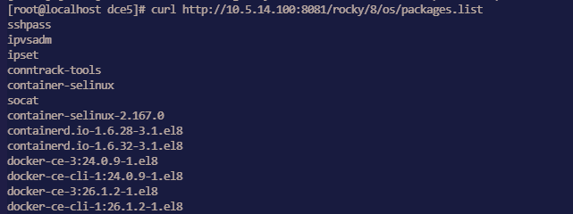
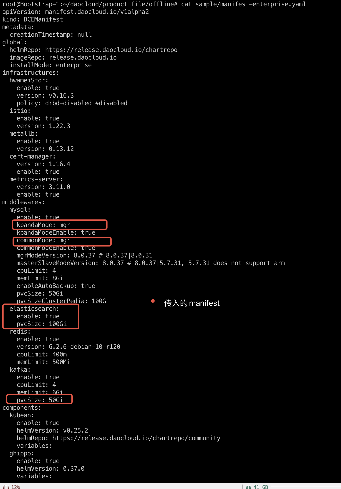

# 安装排障

本页汇总了常见的安装问题及排障方案，便于用户快速解决安装及运行过程中遇到的问题。

## UI 访问问题

### DCE 5.0 界面打不开时，执行 diag.sh 脚本快速排障

安装器自 [v0.12.0 版本](./release-notes.md#v0120)之后新增了 diag.sh 脚本，方便用户在 DCE 5.0 界面打不开时快速排障。

执行命令：

```bash
./offline/diag.sh
```

执行结果示例：


### 使用 Metallb 时 VIP 访问不通导致 DCE 登录界面无法打开

1. 排查 VIP 的地址是否和主机在同一个网段，Metallb L2 模式下需要确保在同一个网段
2. 如果是在全局服务集群中的控制节点新增了网卡导致访问不通，需要手动配置 L2Advertisement。

    请参考 [Metallb 这个问题的文档](https://metallb.universe.tf/configuration/_advanced_l2_configuration/#specify-network-interfaces-that-lb-ip-can-be-announced-from)。

## 火种节点问题

### 火种节点关机重启后，kind 集群无法正常重启

火种节点关机重启后，由于部署时在 openEuler 22.03 LTS SP2 操作系统上未设置 kind 集群开机自启动，会导致 kind 集群无法正常开启。

需要执行如下命令开启：

```bash
podman restart $(podman ps | grep installer-control-plane | awk '{print $1}') 
```

!!! note

    如果其他环境中发生了上述场景，也可以执行该命令进行重启。

### Ubuntu 20.04 作为火种机器部署时缺失 ip6tables

Ubuntu 20.04 作为火种机器部署，由于缺失 ip6tables 会导致部署过程中报错。

请参阅 [Podman 已知问题](https://github.com/containers/podman/issues/3655)。

临时解决方案：手动安装 iptables，参考
[Install and Use iptables on Ubuntu 22.04](https://orcacore.com/install-use-iptables-ubuntu-22-04/)。

### 禁用 IPv6 后安装时，火种节点 Podman 无法创建容器

报错信息如下：

```text
ERROR: failed to create cluster: command "podman run --name kind-control-plane...
```

解决方案：重新启用 IPv6 或者更新火种节点底座为 Docker。

参阅 Podman 相关 Issue：
[podman 4.0 hangs indefinitely if ipv6 is disabled on system](https://github.com/containers/podman/issues/13388)

### 火种节点 kind 容器重启后，kubelet 服务无法启动

kind 容器重启后，kubelet 服务无法启动，并报以下错误：

```text
failed to initialize top level QOS containers: root container [kubelet kubepods] doesn't exist
```

解决方案：

- 方案 1：重启，执行命令 `podman restart [kind] --time 120`，执行过程中不能通过 Ctrl+C 中断该任务

- 方案 2：运行 `podman exec` 进入 kind 容器，执行以下命令：
  
    ```bash
    for i in $(systemctl list-unit-files --no-legend --no-pager -l | grep --color=never -o .*.slice | grep kubepod);
    do systemctl stop $i;
    done
    ```

### 如何卸载火种节点的数据

商业版部署后，如果进行卸载，除了本身的集群节点外，还需要对火种节点进行重置，重置步骤如下：

需要使用 `sudo rm -rf` 命令删除这三个目录：

- /tmp
- /var/lib/dce5/
- /home/kind/etcd

## 证书问题

### 全局服务集群的 kubeconfig 在火种的副本需要更新

v0.20.0 之前的版本中，火种机上存储的全局服务集群的 kubeconfig 不会自动更新，v0.20.0 版本支持了自动更新，每个月执行一次。

之前的版本需要将 dce5-installer 更新到 v0.20.0 然后执行：

```bash
dce5-installer cluster-create -c clusterconfig.yaml -m mainfest.yaml --update-global-kubeconf
```

### 火种节点的 kind 集群本身的证书更新以及 kubeconfig

v0.20.0 之前的版本中，火种机上存储的 kind 集群的 kubeconfig 不会自动更新，v0.20.0 版本支持了自动更新，每个月执行一次。

之前的版本需要将 dce5-installer 更新到 v0.20.0 然后执行：

```bash
dce5-installer cluster-create -c clusterconfig.yaml -m mainfest.yaml --update-kind-certs
```

### Contour 安装后，证书默认有效期仅一年，且不会自动 renew，过期后导致 contour-envoy 组件不断重启

v0.21.0 之前的版本，支持启用安装 Contour 组件，后续版本将不再支持，对于之前版本并且安装了 Contour 的客户，需要执行 helm upgrade 命令来更新证书有效期：

```bash
helm upgrade  -n contour-system contour --reuse-values --set contour.contour.certgen.certificateLifetime=36500
```

## 操作系统相关问题

### 在 CentOS 7.6 安装时报错


在安装全局服务集群的每个节点上执行 `modprobe br_netfilter`，将 `br_netfilter` 加载之后就好了。

### CentOS 环境准备问题

运行 `yum install docker` 时报错：

```text
Failed to set locale, defaulting to C.UTF-8
CentOS Linux 8 - AppStream                                                                    93  B/s |  38  B     00:00    
Error: Failed to download metadata for repo 'appstream': Cannot prepare internal mirrorlist: No URLs in mirrorlist
```

可以尝试下述方法来解决：

- 安装 `glibc-langpack-en`

    ```bash
    sudo yum install -y glibc-langpack-en
    ```

- 如果问题依然存在，尝试：

    ```bash
    sed -i 's/mirrorlist/#mirrorlist/g' /etc/yum.repos.d/CentOS-*
    sed -i 's|#baseurl=http://mirror.centos.org|baseurl=http://vault.centos.org|g' /etc/yum.repos.d/CentOS-*
    sudo yum update -y
    ```

### osRepos 的 external 模式 externalRepoURLs 检查失败

clusterConfig.yaml 如下：

```yaml
  osRepos:
    type: external
    externalRepoType: rocky
    externalRepoURLs:
      - http://10.5.14.100:8081/rocky/\$releasever/os/\$basearch
      - http://10.5.14.100:8081/rocky-iso/\$releasever/os/\$basearch/AppStream
      - http://10.5.14.100:8081/rocky-iso/\$releasever/os/\$basearch/BaseOS
```

报错如下：

```
[root@localhost dce5]# ./dist/dce5-installer cluster-create -c ./sample/clusterConfig.yaml -m ./sample/manifest.yaml --max-tasks 2
[Error]:[Error] invalid ClusterConfig: maybe the binaries.externalRepoURLs http://10.5.14.100:8081/rocky/$releasever/os/$basearch cannot be connected, return code: 404
```

配置实际上是正确的，externalRepoURLs 可以正常使用，但是由于检测时，没有解析变量，导致 404



**影响：**
导致 osRepos 使用 external 模式的集群无法被正常创建。

**绕过方法：**
使用新的二进制文件重试。

### Manifest 开启 MySQL MGR 模式无效

**问题：**

dce5-installer 自 v0.30 无法通过 Manifest 开启 MGR mysql。
其他参数如 pvcSize 等也不生效，只有 enable 参数才能生效。



**解决办法：**

1. 执行安装器命令 `--dry-run` 参数输出执行脚本到 installer.sh

    ```shell
    ./dce5-installer cluster-create -c clusterConfig.yml -m manifest-enterprise.yaml -z --dry-run > installer.sh
    ```

1. 在 installer.sh 脚本文件开头加一行：

    ```script title="installer.sh"
    ManifestFile=/root/data/manifest-enterprise.yaml
    ```

1. 增加 -s 参数，重新执行 installer.sh

    ```shell
    ./dce5-installer cluster-create -c clusterConfig.yml -m manifest-enterprise.yaml -z -s installer.sh
    ```

### MGR 模式 MySQL Common 实例初始化失败导致 DCE 安装失败

在执行 DCE 安装过程中，`mcamel-common` 实例的 MySQL 初始化阶段失败。  
通过观察发现，`mysqlrouter` 用户在 MySQL 中丢失，导致 `router` 的 Deployment
副本数 (`replica`) 一直为 `0`，从而导致整个安装过程无法继续。

```text
mcamel-common 实例未能成功重建 mysqlrouter 用户
→ router deployment replica = 0
→ DCE 安装卡住/失败
```

* **影响模块：** DCE 安装器的 MySQL 初始化流程
* **影响范围：** 所有使用 MGR 模式的 `common` MySQL 实例
* **影响版本：** v0.27.0, v0.28.0, v0.29.0 等
* **现象总结：**

    * router 无法连接 MGR 集群
    * `mysqlrouter` 用户缺失
    * router deployment 无法启动（replica = 0）

**故障原因分析**

在一次异常操作（如断电重启或 PVC 清理）后，运维人员手动恢复了 MGR 集群，但
Operator 未能感知集群状态的改变，因此未触发对应的调谐逻辑。

由于 PVC 被清空，原有的 `mysqlrouter` 用户信息在 MySQL 数据库中丢失，导致
router 无法认证连接到集群，进而安装不断 Crash。

**数据验证**

通过 MySQL 查询用户表，发现找不到 `mysqlrouter` 用户：

```mysql
mysql> select user,host from mysql.user;
+---------------------------+-----------+
| user                      | host      |
+---------------------------+-----------+
| kpanda                    | %         |
| mysql_innodb_cluster_1000 | %         |
| mysql_innodb_cluster_1001 | %         |
| mysql_innodb_cluster_1002 | %         |
| mysqladmin                | %         |
| root                      | %         |
| localroot                 | localhost |
| mysql.infoschema          | localhost |
| mysql.session             | localhost |
| mysql.sys                 | localhost |
| mysqlhealthchecker        | localhost |
| mysqlmetrics              | localhost |
+---------------------------+-----------+
12 rows in set (0.00 sec)
```

**解决方案**

1. 获取 `mysqlrouter` 的 Secret

    从 Kubernetes 集群中获取 Router 的用户名与密码：

    ```shell
    kubectl get secret mcamel-common-kpanda-mgr-router -n mcamel-system -oyaml
    ```

    示例输出：

    ```yaml
    apiVersion: v1
    data:
      routerPassword: aVVOZHEtWm9tb0gtamJYTGstS3E9VEotNnlqc1M=
      routerUsername: bXlzcWxyb3V0ZXI=
    kind: Secret
    metadata:
      name: mcamel-common-kpanda-mgr-router
      namespace: mcamel-system
    ```

    解码得到用户名和密码：

    ```console
    ➜ b64-d bXlzcWxyb3V0ZXI=
    mysqlrouter

    ➜ b64-d aVVOZHEtWm9tb0gtamJYTGstS3E9VEotNnlqc1M=
    iUNdq-ZomoH-jbXLk-Kq=TJ-6yjsS
    ```

2. 手动在 MGR 集群中创建 `mysqlrouter` 用户

    登录已恢复正常的 MGR 集群，调用 `setupRouterAccount()` 函数重新创建 `mysqlrouter` 用户：

    ```mysql
    MySQL  localhost:33060+ ssl  JS > cluster.setupRouterAccount('mysqlrouter', {password: "iUNdq-ZomoH-jbXLk-Kq=TJ-6yjsS"})
    ```

    输出结果：

    ```text
    Creating user mysqlrouter@%.
    Account mysqlrouter@% was successfully created.
    ```

    验证 `mysqlrouter` 用户是否创建成功：

    ```mysql hl_lines="10"
    MySQL  localhost:33060+ ssl  SQL > select user,host from mysql.user;
    +---------------------------+-----------+
    | user                      | host      |
    +---------------------------+-----------+
    | kpanda                    | %         |
    | mysql_innodb_cluster_1000 | %         |
    | mysql_innodb_cluster_1001 | %         |
    | mysql_innodb_cluster_1002 | %         |
    | mysqladmin                | %         |
    | mysqlrouter               | %         |
    | root                      | %         |
    | localroot                 | localhost |
    | mysql.infoschema          | localhost |
    | mysql.session             | localhost |
    | mysql.sys                 | localhost |
    | mysqlhealthchecker        | localhost |
    | mysqlmetrics              | localhost |
    +---------------------------+-----------+
    13 rows in set (0.00 sec)
    ```

3. 重新启动 `router` 的 deployment：

    ```shell
    kubectl scale deploy mcamel-common-kpanda-mgr-router --replicas=0 -n mcamel-system
    kubectl scale deploy mcamel-common-kpanda-mgr-router --replicas=2 -n mcamel-system
    ```

    验证恢复情况：

    ```shell
    kubectl get deploy | grep router

    mcamel-common-kpanda-mgr-router             2/2     2            2           2d2h
    mcamel-common-mgr-cluster-router            2/2     2            2           2d2h
    ```

    此时 `router` 正常运行，DCE 安装流程恢复正常。

## 社区版问题

### kind 集群重装 DCE 5.0 时 Redis 卡住

问题：Redis Pod 出现了 0/4 running 很久的情况，提示：`primary ClusterIP can not unset`

1. 在 `mcamel-system` 命名空间下删除 rfs-mcamel-common-redis

    ```shell
    kubectl delete svc rfs-mcamel-common-redis -n mcamel-system
    ```

1. 然后重新执行安装命令

### 社区版 fluent-bit 安装失败

报错：

```text
DaemonSet is not ready: insight-system/insight-agent-fluent-bit. 0 out of 2 expected pods are ready
```

排查 Pod 日志是否出现下述关键信息：

```text
[warn] [net] getaddrinfo(host='mcamel-common-es-cluster-masters-es-http.mcamel-system.svc.cluster.local',errt11):Could not contact DNS servers
```

出现上述问题是一个 fluent-bit 的 bug，可以参考 aws/aws-for-fluent-bit 的一个 Issue：
[Seeing `Timeout while contacting DNS servers` with latest v2.19.1](https://github.com/aws/aws-for-fluent-bit/issues/233)
