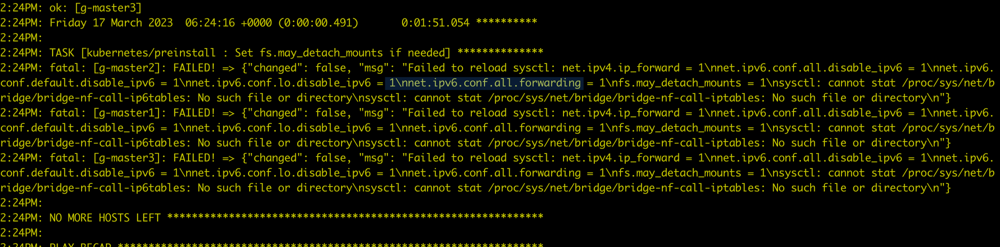

# 常见问题

本页汇总了常见的安装器问题及其解决方案，便于用户快速解决安装过程中遇到的问题。

## 火种节点重启后 Podman 无法自动恢复

火种节点重启后，等待 kind 启动成功：

1. 执行 `podman exec` 进入容器。
2. `sed -i 's/server: .*:6443/server: https://127.0.0.1:6443/g' /etc/kubernetes/controller-manager.conf`
3. `sed -i 's/server: .*:6443/server: https://127.0.0.1:6443/g ' /etc/kubernetes/scheduler.conf`

## 禁用 IPv6 后安装时 Podman 无法创建容器

报错信息如下：

```bash
ERROR: failed to create cluster: command "podman run --name kind-control-plane...
```

解决方案：重新启用 IPv6 或者更新火种节点底座为 Docker。

Podman 相关 issue 地址：https://github.com/containers/podman/issues/13388

## Kind 集群重装 DCE 5.0 时 Redis 卡住重装

问题：Redis Pod 出现了 0/4 running 很久的情况，提示：primary ClusterIP can not unset

1. 在 mcamel-system 命名空间下删除 rfs-mcamel-common-redis

    ```shell
    kubectl delete svc rfs-mcamel-common-redis -n mcamel-system
    ```

1. 然后重新执行安装命令

## 使用 Metallb 时 VIP 访问不通导致 DCE 登录界面无法打开

1. 排查 VIP 的地址是否和主机在同一个网段，Metallb L2 模式下需要确保在同一个网段
2. 如果是在 Global 集群中的控制节点新增了网卡导致访问不通，需要手动宣告配置 L2Advertisement。
   请参考 [Metallb 这个问题的文档](https://metallb.universe.tf/configuration/_advanced_l2_configuration/#specify-network-interfaces-that-lb-ip-can-be-announced-from)

## 社区版 fluent-bit 安装失败

报错：`DaemonSet is not ready: insight-system/insight-agent-fluent-bit. 0 out of 2 expected pods are ready`

排查查看 Pod 日志是否出现下述关键信息：

```bash
 [ warn] [net] getaddrinfo(host='mcamel-common-es-cluster-masters-es-http.mcamel-system.svc.cluster.local',errt11):Could not contact DNS servers
```

出现上述问题是一个 fluent-bit 的 bug，可以参考： https://github.com/aws/aws-for-fluent-bit/issues/233

## 在 CentOS 7.6 安装时报错



在安装全局服务集群的每个节点上执行 `modprobe br_netfilter`，将 `br_netfilter` 加载之后就好了。
