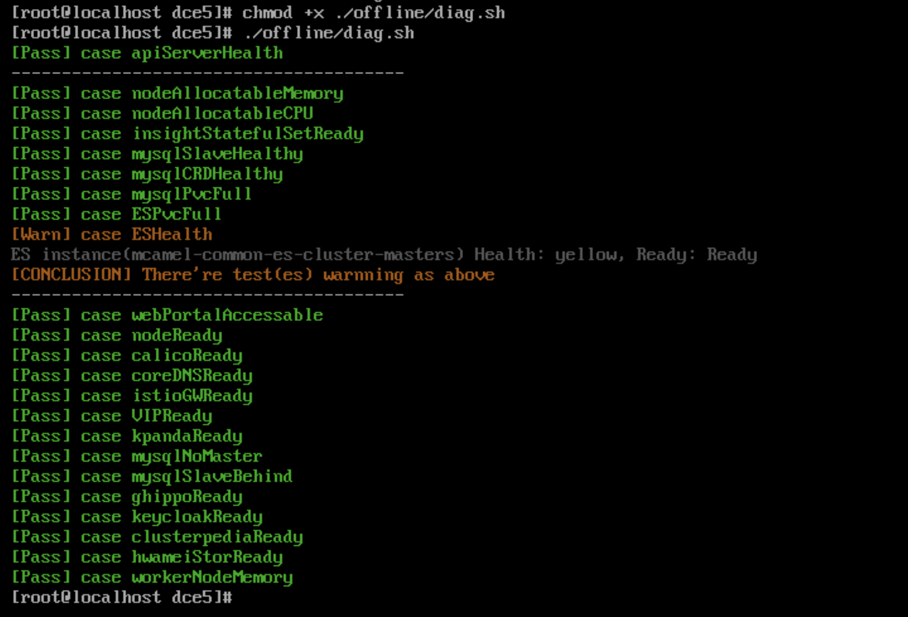

# 安装排障

本页汇总了常见的安装器问题及其排障方案，便于用户快速解决安装及运行过程中遇到的问题。

## 当 DCE 5.0 平台界面打不开时，执行 diag.sh 脚本快速排障

安装器 v0.12.0 版本之后新增了 diag.sh 脚本，方便用户可以在 DCE 5.0 平台界面打不开时快速排障。

执行命令：

```bash
./offline/diag.sh
```

执行结果示例：



## Kind 容器重启后，kubelet 服务无法启动

Kind 容器重启后，kubelet 服务无法启动，并报错：

```text
failed to initialize top level QOS containers: root container [kubelet kubepods] doesn't exist
```

解决方案：

- 方案一 重新重启，执行命令 `podman restart [kind] --time 120`，执行过程中不能通过 ctrl+c 中断该任务

- 方案二 `podman exec` 进入 Kind 容器，执行以下命令：
  
    ```bash
    for i in $(systemctl list-unit-files --no-legend --no-pager -l | grep --color=never -o .*.slice | grep kubepod);
    do systemctl stop $i;
    done
    ```

## 禁用 IPv6 后安装时 Podman 无法创建容器

报错信息如下：

```text
ERROR: failed to create cluster: command "podman run --name kind-control-plane...
```

解决方案：重新启用 IPv6 或者更新火种节点底座为 Docker。

Podman 相关 issue 地址：https://github.com/containers/podman/issues/13388

## Kind 集群重装 DCE 5.0 时 Redis 卡住重装

问题：Redis Pod 出现了 0/4 running 很久的情况，提示：primary ClusterIP can not unset

1. 在 mcamel-system 命名空间下删除 rfs-mcamel-common-redis

    ```shell
    kubectl delete svc rfs-mcamel-common-redis -n mcamel-system
    ```

1. 然后重新执行安装命令

## 使用 Metallb 时 VIP 访问不通导致 DCE 登录界面无法打开

1. 排查 VIP 的地址是否和主机在同一个网段，Metallb L2 模式下需要确保在同一个网段
2. 如果是在 Global 集群中的控制节点新增了网卡导致访问不通，需要手动宣告配置 L2Advertisement。
   
     请参考 [Metallb 这个问题的文档](https://metallb.universe.tf/configuration/_advanced_l2_configuration/#specify-network-interfaces-that-lb-ip-can-be-announced-from)

## 社区版 fluent-bit 安装失败

报错：

```
DaemonSet is not ready: insight-system/insight-agent-fluent-bit. 0 out of 2 expected pods are ready
```

排查查看 Pod 日志是否出现下述关键信息：

```text
[warn] [net] getaddrinfo(host='mcamel-common-es-cluster-masters-es-http.mcamel-system.svc.cluster.local',errt11):Could not contact DNS servers
```

出现上述问题是一个 fluent-bit 的 bug，可以参考： https://github.com/aws/aws-for-fluent-bit/issues/233

## 在 CentOS 7.6 安装时报错


在安装全局服务集群的每个节点上执行 `modprobe br_netfilter`，将 `br_netfilter` 加载之后就好了。

## CentOS 环境准备问题

运行 `yum install docker` 时报错：

```text
Failed to set locale, defaulting to C.UTF-8
CentOS Linux 8 - AppStream                                                                    93  B/s |  38  B     00:00    
Error: Failed to download metadata for repo 'appstream': Cannot prepare internal mirrorlist: No URLs in mirrorlist
```

可以尝试以下述方法来解决：

- 安装 `glibc-langpack-en`

    ```bash
    sudo yum install -y glibc-langpack-en
    ```

- 如果问题依然存在，尝试：

    ```bash
    sed -i 's/mirrorlist/#mirrorlist/g' /etc/yum.repos.d/CentOS-*
    sed -i 's|#baseurl=http://mirror.centos.org|baseurl=http://vault.centos.org|g' /etc/yum.repos.d/CentOS-*
    sudo yum update -y
    ```
