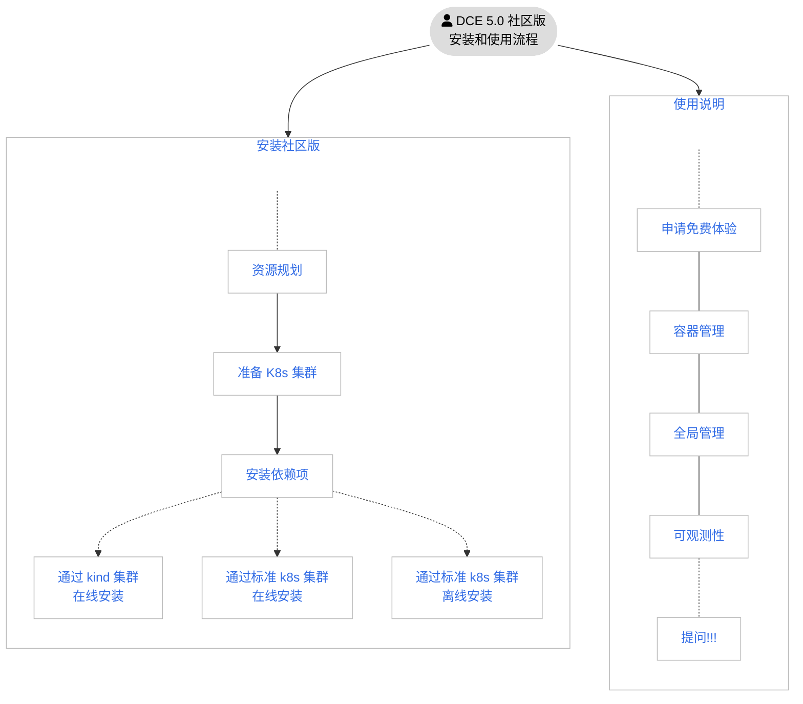
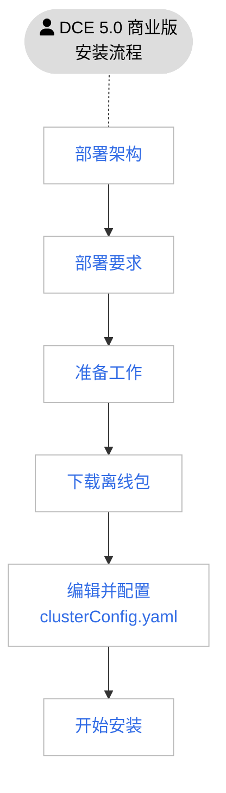

# 安装简介

DCE 5.0 大体分为两个版本：社区版和商业版。

社区版可包括容器管理、全局管理、可观测性三大模块，可永久免费使用。

商业版在社区版的基础上可按需购买服务网格、微服务引擎、多云编排、数据服务中间件、镜像仓库等高级模块，功能更全面，更能适应生产环境需求。

<table>
  <thead>
    <tr>
      <th>版本</th>
      <th>包含的模块</th>
      <th>描述</th>
    </tr>
  </thead>
  <tbody>
    <tr>
      <td>社区版</td>
      <td>
        <ul>
          <li><a href="https://docs.daocloud.io/ghippo/intro/index.html">全局管理</a></li>
          <li><a href="https://docs.daocloud.io/kpanda/intro/index.html">容器管理</a></li>
          <li><a href="https://docs.daocloud.io/insight/intro/index.html">可观测性</a></li>
        </ul>
      </td>
      <td>
        <a href="https://docs.daocloud.io/dce/license0.html">永久免费授权</a>，3 个模块会保持持续更新，可随时
        <a href="https://docs.daocloud.io/download/index.html#_3">下载子模块的离线包</a>
      </td>
    </tr>
    <tr>
      <td>商业版</td>
      <td>
        <ul>
          <li><a href="https://docs.daocloud.io/ghippo/intro/index.html">全局管理</a></li>
          <li><a href="https://docs.daocloud.io/kpanda/intro/index.html">容器管理</a></li>
          <li><a href="https://docs.daocloud.io/insight/intro/index.html">可观测性</a></li>
          <li><a href="https://docs.daocloud.io/amamba/intro/index.html">应用工作台</a></li>
          <li><a href="https://docs.daocloud.io/kairship/intro/index.html">多云编排</a></li>
          <li><a href="https://docs.daocloud.io/skoala/intro/index.html">微服务引擎</a></li>
          <li><a href="https://docs.daocloud.io/mspider/intro/index.html">服务网格</a></li>
          <li><a href="https://docs.daocloud.io/middleware/index.html">精选中间件</a></li>
          <li><a href="https://docs.daocloud.io/kangaroo/intro/index.html">镜像仓库</a></li>
        </ul>
      </td>
      <td>
        联系我们授权：电邮 info@daocloud.io 或致电 400 002 6898，各个模块可按需自由组合，可随时
        <a href="https://docs.daocloud.io/download/index.html#_3">下载子模块的离线包</a>
      </td>
    </tr>
  </tbody>
</table>

## 社区版安装流程

DCE 5.0 社区版的安装流程如下图：

!!! tip

    上图中的蓝色文字可点击跳转

## 商业版安装流程

DCE 5.0 商业版的安装流程如下图：

## 联系我们

DaoCloud Enterprise 5.0 还处于发布初期，安装流程可能会有变更。请收藏此页，关注更新动态，更多操作文档也在制作之中。

- 若有任何安装或使用问题，请[提出反馈](https://github.com/DaoCloud/DaoCloud-docs/issues)。

- 欢迎扫描二维码，与开发者畅快交流：

    

[下载 DCE 5.0](../download/index.md){ .md-button .md-button--primary }
[申请社区免费体验](../dce/license0.md){ .md-button .md-button--primary }
