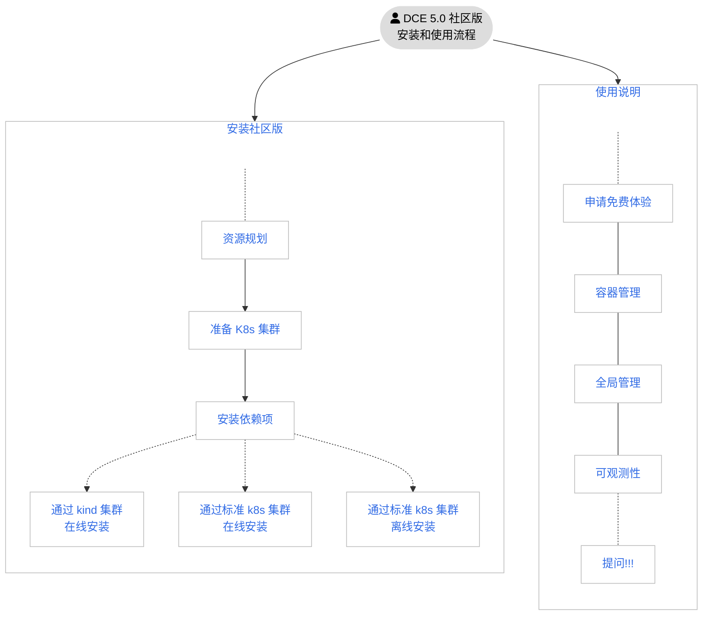
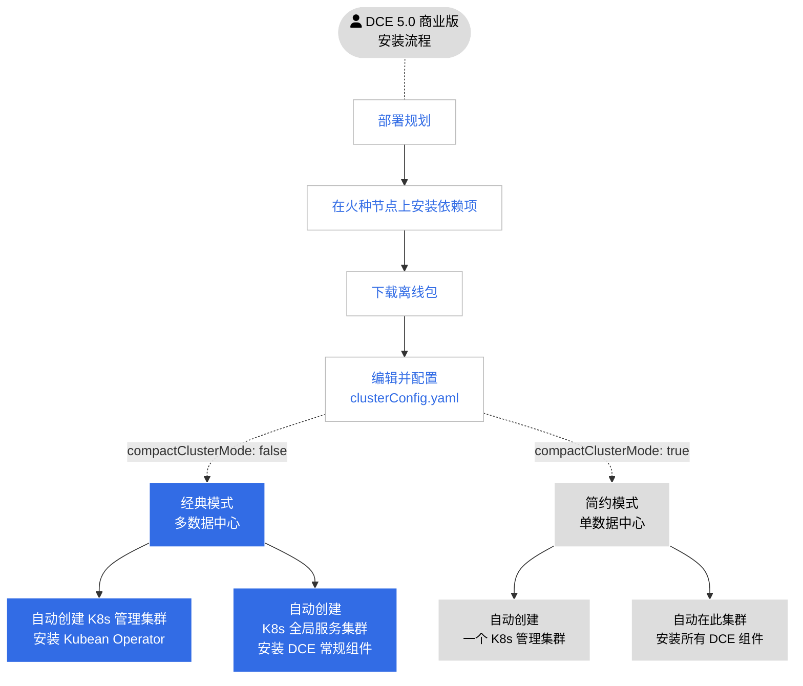

---
hide:
  - toc
---

# 安装简介

DCE 5.0 有两个版本：社区版和商业版。

| 版本   | 包含的模块                                                   | 描述                                               |
| ------ | ------------------------------------------------------------ | -------------------------------------------------- |
| 社区版 | [全局管理](../ghippo/01ProductBrief/WhatisGhippo.md) [容器管理](../kpanda/03ProductBrief/WhatisKPanda.md) [可观测性](../insight/03ProductBrief/WhatisInsight.md)                         | [永久免费授权](../dce/license0.md)，3 个模块会保持持续更新，可随时[下载子模块的离线包](../download/dce5.md) |
| 商业版 | [全局管理](../ghippo/01ProductBrief/WhatisGhippo.md) [容器管理](../kpanda/03ProductBrief/WhatisKPanda.md) [可观测性](../insight/03ProductBrief/WhatisInsight.md) [应用工作台](../amamba/01ProductBrief/WhatisAmamba.md) [多云编排](../kairship/01product/whatiskairship.md) [微服务引擎](../skoala/intro/features.md) [服务网格](../mspider/01Intro/WhatismSpider.md) [精选中间件](../middleware/midware.md) [云原生网络](../network/intro/what-is-net.md) [云原生存储](../hwameistor/intro/what.md) [镜像仓库](../kangaroo/intro.md) | [正版授权](https://qingflow.com/f/e3291647)，各个模块可按需自由组合，可随时[下载子模块的离线包](../download/dce5.md)   |

## 社区版安装流程

DCE 5.0 社区版的安装流程如下图：

!!! tip

    - 上图中的蓝色文字可点击跳转
    - 可参考[保姆式安装 DCE 5.0](../blogs/dce5-install1209.md)

## 商业版安装流程

DCE 5.0 商业版的安装流程如下图：

### 联系我们

DaoCloud Enterprise 5.0 还处于发布初期，安装流程可能会有变更。请收藏此页，关注更新动态，更多操作文档也在制作之中。

- 若有任何安装或使用问题，请[提出反馈](https://github.com/DaoCloud/DaoCloud-docs/issues)。

- 欢迎扫描二维码，与开发者畅快交流：

    

[下载 DCE 5.0](../download/dce5.md){ .md-button .md-button--primary }
[申请社区免费体验](../dce/license0.md){ .md-button .md-button--primary }
