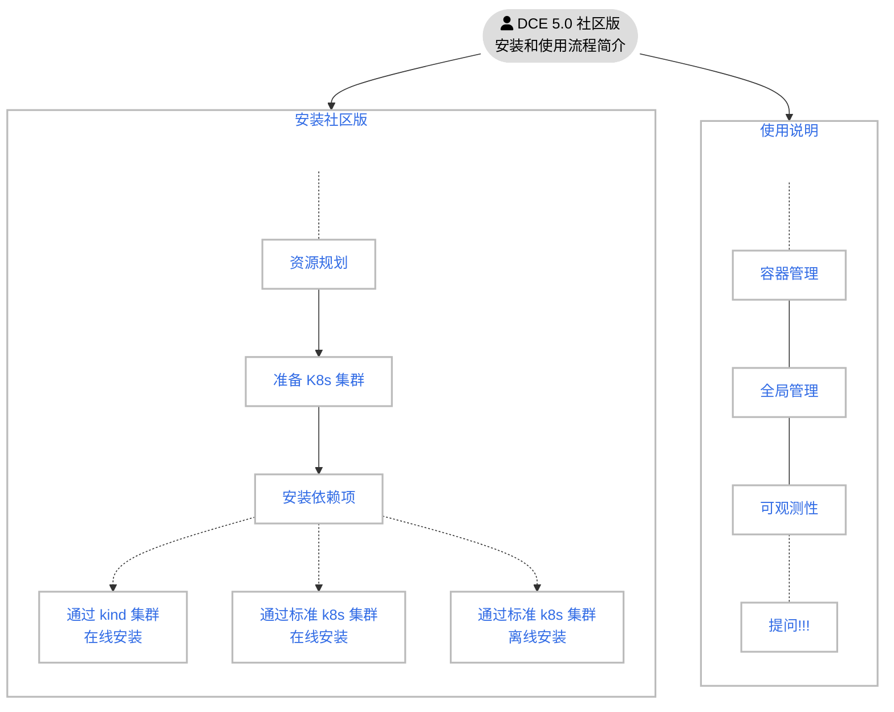

---
hide:
  - toc
---

# 安装简介

DCE 5.0 有两个版本：社区版和商业版。

| 版本   | 包含的模块                                                   | 描述                                               |
| ------ | ------------------------------------------------------------ | -------------------------------------------------- |
| 社区版 | 全局管理 容器管理 可观测性                         | [免费体验](../dce/license0.md)，3 个模块会保持持续更新，可随时[下载子模块的离线包](../download/dce5.md) |
| 商业版 | 全局管理 容器管理 可观测性 应用工作台 多云编排 微服务引擎 服务网格 精选中间件 云原生网络 云原生存储 镜像仓库 | [正版授权](https://qingflow.com/f/e3291647)，各个模块可按需自由组合，随时[下载子模块的离线包](../download/dce5.md)   |

DCE 5.0 社区版的安装流程图如下：

