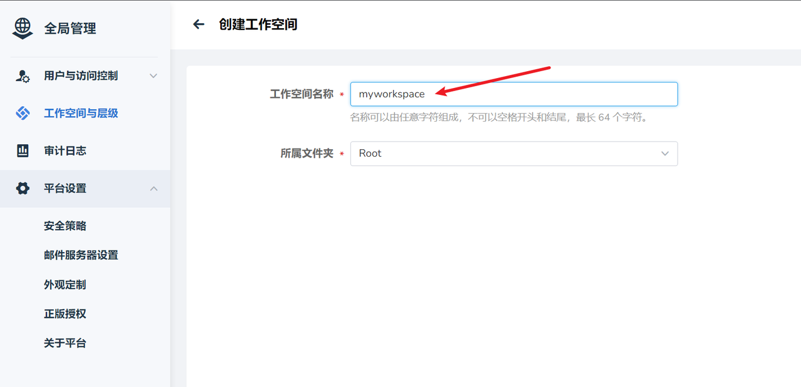
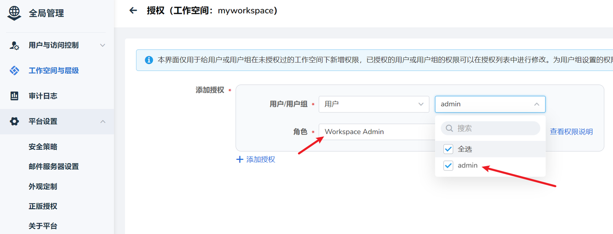
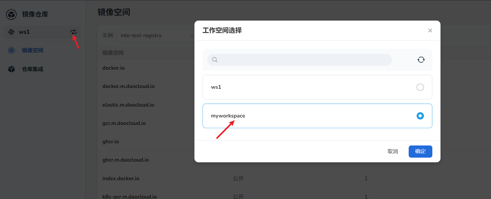
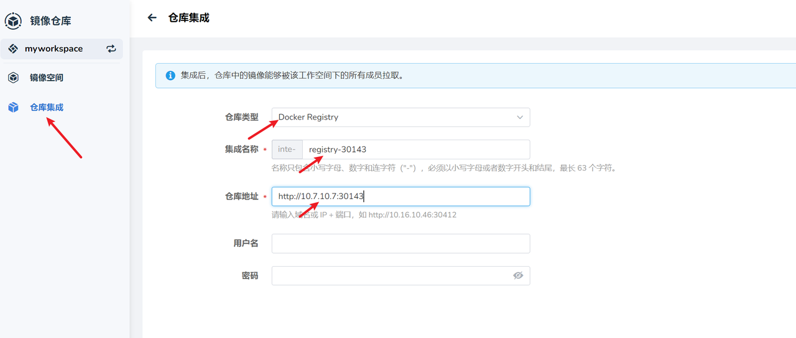
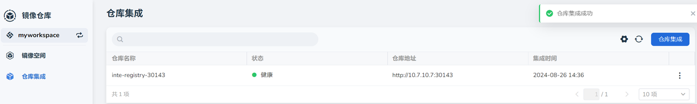
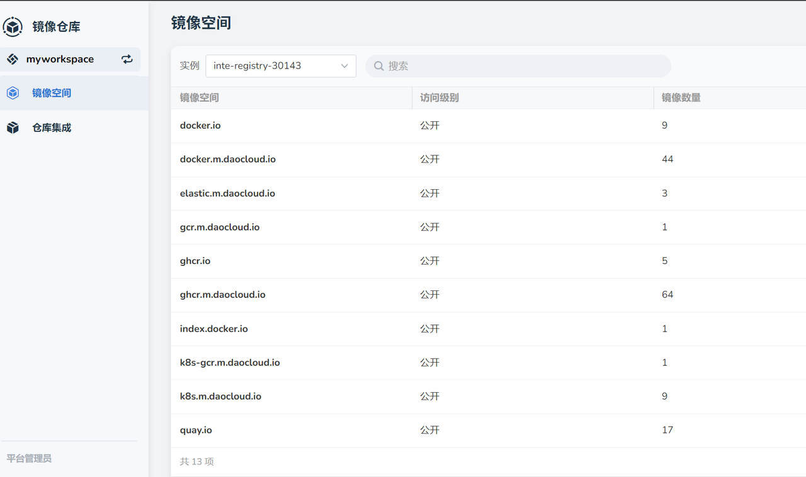

# 安装器实现轻量化部署

本文档介绍如何通过安装器实现 DCE5.0 轻量化部署。如果您想了解轻量化具体做了哪些裁剪优化，请参考[轻量化部署裁剪方案验证](./light-install-solution.md)。

## 准备事项

### 配置准备

1. 组件配置文件 Manifest.yaml 示例

    !!! note

        在具体组件版本应与离线包中版本一致。

    ```yaml
    apiVersion: manifest.daocloud.io/v1alpha1
    kind: DCEManifest
    metadata:
      creationTimestamp: null
    global:
      helmRepo: https://release.daocloud.io/chartrepo
      imageRepo: release.daocloud.io
    infrastructures:
      istio:
        enable: true
        version: 1.16.1
      mysql:
        kpandaMode: master-slave # mgr|master-slave
        kpandaModeEnable: true
        commonMode: master-slave # mgr|master-slave
        commonModeEnable: true
        version: 8.0.29
        cpuLimit: 1
        memLimit: 2Gi
        enableAutoBackup: true
        pvcSize: 15Gi
        pvcSizeClusterPedia: 25Gi
      redis:
        version: 6.2.6-debian-10-r120
        cpuLimit: 400m
        memLimit: 500Mi
    components:
        kubean:
          enable: true
          helmVersion: v0.18.4
          helmRepo: https://kubean-io.github.io/kubean-helm-chart
          variables:
        ghippo:
          enable: true
          helmVersion: 0.29.0
          variables:
        kpanda:
          enable: true
          helmVersion: 0.31.0
          variables:
        kangaroo:
          enable: true
          helmVersion: 0.20.0
          variables:
        kairship:
          enable: true
          helmVersion: 0.22.0
          variables:
        mcamel-mysql:
          enable: false
          helmVersion: 0.21.0
          variables:
        mcamel-redis:
          enable: false
          helmVersion: 0.21.0
          variables:
        mcamel-minio:
          enable: false
          helmVersion: 0.17.0
          variables:
    ```

2. 集群配置文件 ClusterConfig.yaml 示例

    ```yaml
    apiVersion: provision.daocloud.io/v1alpha4
    kind: ClusterConfig
    metadata:
      creationTimestamp: null
    spec:
      clusterName: my-cluster
    
    loadBalancer:
      type: NodePort
    
    masterNodes:
      - nodeName: "g-master1"
        ip: 10.7.10.7
        ansibleUser: "root"
        ansiblePass: "dangerous@2022"
    
    ntpServer:
      - 0.pool.ntp.org
      - ntp1.aliyun.com
      - ntp.ntsc.ac.cn
    
    fullPackagePath: "/home/offline"
    osRepos:
      type: builtin
      isoPath: "/home/iso/Kylin-Server-V10-SP3-2403-Release-20240426-arm64.iso"
      osPackagePath: "/home/ospkgs/os-pkgs-kylin-v10sp3-v0.17.5.tar.gz"
    
    imagesAndCharts:
      type: builtin
    
    binaries:
      type: builtin
    ```

### 离线包准备

!!! note

    安装包下载需要在线网络环境，请在到达客户现场之前，提前下载好。

1. 安装器离线包下载

    安装包版本需高于（包含）v0.21.0版本，推荐下载官网最新版本。

    | 名称 | 版本 | 下载 | 更新日期 |
    | ----- | ----- | ---- | --------- |
    | offline-v0.21.0-arm64.tar | v0.21.0 | [:arrow_down: 下载](https://qiniu-download-public.daocloud.io/DaoCloud_Enterprise/dce5/offline-v0.21.0-arm64.tar) | 2024-11-04 |
    | offline-v0.21.0-amd64.tar | v0.21.0 | [:arrow_down: 下载](https://qiniu-download-public.daocloud.io/DaoCloud_Enterprise/dce5/offline-v0.21.0-amd64.tar) | 2024-11-04 |

2. jq 工具

    | 名称 | 版本 | 下载 | 更新日期 |
    | ----- | ----- | ---- | --------- |
    | jq-linux-arm64 | V1.7.1 | [:arrow_down: 下载](https://github.com/jqlang/jq/releases/download/jq-1.7.1/jq-linux-arm64) | 2024-11-04 |
    | jq-linux-arm64 | V1.7.1 | [:arrow_down: 下载](https://github.com/jqlang/jq/releases/download/jq-1.7.1/jq-linux-amd64) | 2024-11-04 |

### 脚本准备

!!! note

    请在到达客户现场之前，提前下载好。

1. 清理 istio sidecar 脚本: [clean_istio_proxy.sh](https://gitlab.daocloud.cn/bo.jiang/installer-tools/-/blob/master/clean_istio_proxy.sh)

2. 部署 register 脚本：[mv-registry.sh](https://gitlab.daocloud.cn/bo.jiang/installer-tools/-/blob/master/mv-registry.sh)

## 安装步骤

### 安装依赖项

开始安装前，需先安装好前置依赖项。

```yaml
export VERSION=v0.20.0
curl -LO https://proxy-qiniu-download-public.daocloud.io/DaoCloud_Enterprise/dce5/install_prerequisite_${VERSION}.sh
curl -LO https://qiniu-download-public.daocloud.io/DaoCloud_Enterprise/dce5/prerequisite_${VERSION}_amd64.tar.gz

export BINARY_TAR=prerequisite_${VERSION}_amd64.tar.gz
chmod +x install_prerequisite_${VERSION}.sh
./install_prerequisite_${VERSION}.sh offline full
```

### 开始安装

详细安装流程参考[安装教程](../index.md)

```shell
$ export INSTALLER_CUSTOM_CPU_THRESHOLD=8
$ export INSTALLER_CUSTOM_MEM_THRESHOLD=8
$ export INSTALLER_COMMON_DB_SHARED=1
$ ./dce5-installer cluster-create -d -c clusterConfig.yaml -m manifest.yml -z -j1,2,3,4,5,6,8,10,11,12
```

### 精简版 Insight 安装（可选）

!!! note

    追加 Insight 组件需要至少 12 G 的内存环境， 若资源受限，则建议不要安装，否则影响整体功能稳定性。

增加 insight 精简组件的操作步骤如下：

1. manifest.yml 底部新增如下内容

    ```yaml
    insight:
      enable: true
      helmVersion: 0.30.0-rc2
      variables:
    insight-agent:
      enable: true
      helmVersion: 0.30.0-rc2
    ```

!!! note

    具体组件版本应与离线包中版本一致。
 
2. 再次执行第 11, 12 步

    ```shell
    ./dce5-installer cluster-create -c clusterConfig.yaml -m manifest.yml -z -j11,12
    ```

3. 保存下述文件为 insight-server-patch.yml

    ```yaml
    global:
      kafka:
        enabled: false
      tracing:
        enable: false
        aggregator:
          enabled: false
        kafkaReceiver:
          enabled: false
      applyDependenciesCrds: true
      ghippo:
        applyCR: true
      elasticAlert:
        enable: false
    vector:
      enabled: false
    ```

4. 保存下述文件为 insight-agent-patch.yml

    ```yaml
    global:
      exporters:
        trace:
          enable: false
    tailing-sidecar-operator:
      enabled: false
    opentelemetry-kubernetes-collector:
      enabled: false
    fluent-bit:
      enabled: false
    ```

5. 更新 insight-server 和 insight-agent

    ```shell
    $ helm upgrade -n insight-system insight offline/dce5/insight-0.30.0-rc2.tgz --version 0.30.0-rc2 --reuse-values -f insight-server-patch.yml

    $ helm upgrade -n insight-system insight-agent offline/dce5/insight-agent-0.30.0-rc2.tgz --version 0.30.0-rc2 --reuse-values -f insight-agent-patch.yml
    ```

## 安装后的裁剪

1. 清理 istio sidecar

    ```shell
    # 需要提前安装 jq 工具
    $ chmod +x jq-linux-amd64
    $ mv jq-linux-amd64 /usr/local/bin/jq

    # 执行 sidecar 清理脚本
    $ bash clean_istio_proxy.sh
    ```

2. 部署 register，并手动纳管

    ```shell
    $ export REGISTRY_NODEPORT=30143 # 设置新 registry nodeport
    $ bash mv-registry.sh clusterConfig.yaml
    ```

    纳管操作如下：

    1. **全局管理** -> **工作空间与层级** -> **创建工作空间**

        

    2. 添加授权，设置当前登录用户的角色为工作空间管理员

        

    3. 镜像仓库选择工作空间

        

    4. 仓库集成

        
        
        

3. Kairship 配置更新

    需要将 kairship 组件中的火种镜像地址更新到新的 registry 当中。

    ```shell
    # 假设当前节点 IP 为 10.5.14.160
    # 且由之前的 REGISTRY_NODEPORT 环境变量得知端口为 30143
    # 则生成关于 10.5.14.160:30143 的 patch 配置
    # * 实际操作请以具体 IP 和端口为准 *
    export REGISTRY_ADDR="10.5.14.160:30143"
    cat << EOF >> kairship-patch.yml 
    global:
      imageRegistry: ${REGISTRY_ADDR}/release.daocloud.io
      kairship:
        instanceConfig:
          karmadaRegistry: ${REGISTRY_ADDR}/release.daocloud.io/karmada
          kubeRegistry: ${REGISTRY_ADDR}/release.daocloud.io/karmada
    EOF

    # 这里命令默认:
    # 安装器离线包的解压路径为 /home/offline/,
    # 且 kairship 的版本ji为 0.22.0-rc1
    # * 实际操作请以具体路径和版本为准 *
    export KAIRSHIP_VERSION="0.22.0-rc1"
    export OFFLINE_RESOURCES_PATH="/home/offline"
    helm upgrade -n kairship-system kairship \
        ${OFFLINE_RESOURCES_PATH}/dce5/kairship-${KAIRSHIP_VERSION}.tgz \
        --reuse-values -f kairship-patch.yml \
        --version ${KAIRSHIP_VERSION}
    ```

4. 关停 kind 火种集群

    !!! note

        火种集群的关停应该在所有安装操作都已正常完成之后执行。

    ```shell
    $ tinder_name=$(yq '.spec.tinderKind.instanceName' clusterConfig.yaml)
    $ [ "$tinder_name" == null ] && tinder_name=my-cluster-installer
    $ kind delete cluster -n $tinder_name
    ```

以上，完成轻量化版本安装部署。