# 轻量化部署裁剪方案验证

考虑到在某些场景下，对于云端软件部署资源要求较苛刻，特别是在军工场景，故本文介绍基于 DCE5.0社区版部署轻量化裁剪方案和验证流程，旨在满足客户场景部署轻量化需求。

本次裁剪方案分为四个阶段逐步缩容验证，详情如下：

## 验证环境

操作系统：Kylin Linux Advanced Server V10 (Halberd) for ARM
CPU: 10C
内存: 17Gi 

## 安装组件及资源统计

DCE5.0 安装组件及裁剪方案及分阶段裁剪思路如下：

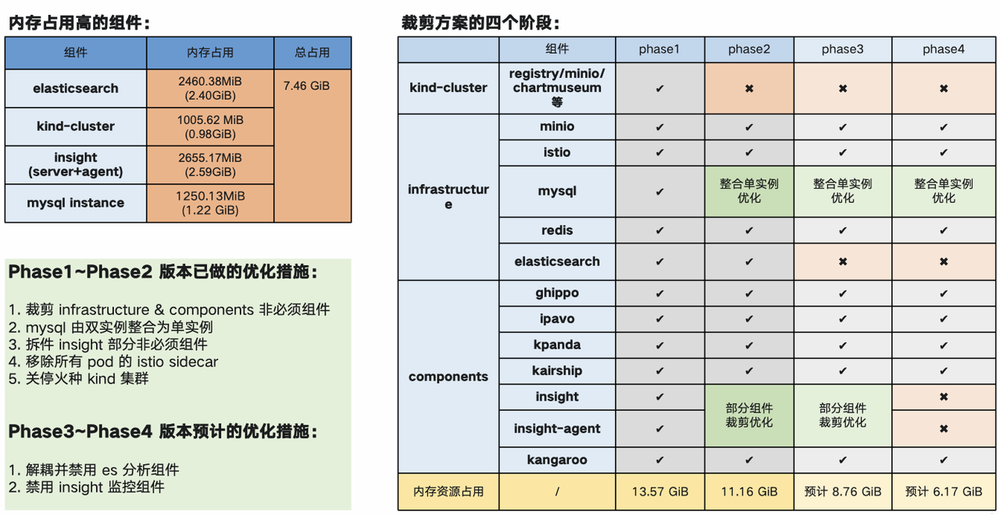

组件轻量化裁剪 Phase1 全貌：

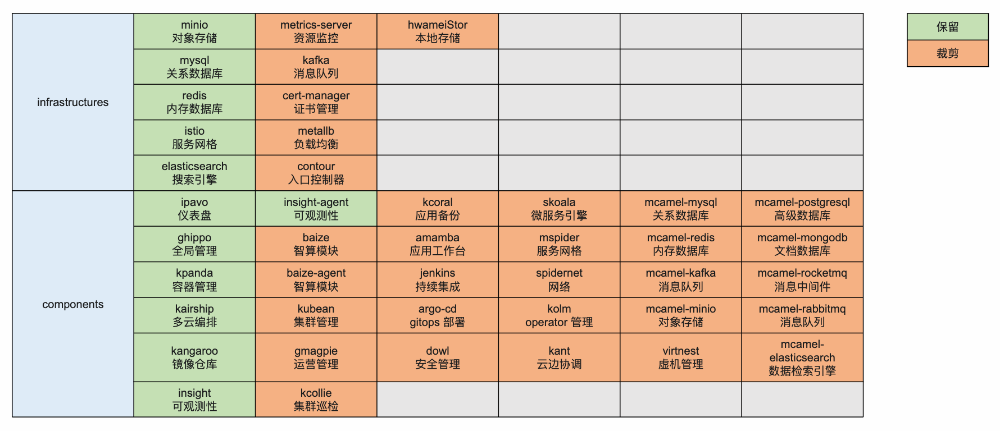

## 优化措施

### 概览

1. Insight 在保证监控能力正常的前提下，可以停止以下 pod:

    | Pod name                                                 | Mem Size   |
    | :------------------------------------------------------- | ---------- |
    | insight-agent-fluent-bit-5x2rn                           | 99.62 MiB  |
    | insight-agent-otel-kubernetes-collector-69f67cc745-xt5hj | 74.94 MiB  |
    | insight-agent-tailing-sidecar-operator-6f85f7bb75-67xc8  | 46.81 MiB  |
    | insight-elastic-alert-64bbb468dc-l4mk5                   | 30.38 MiB  |
    | insight-jaeger-collector-5cd5b94dcc-mwgcl                | 32.50 MiB  |
    | insight-jaeger-query-5495c59bbd-fk287                    | 28.88 MiB  |
    | insight-opentelemetry-collector-5d47dd6c6b-nk54t         | 62.12 MiB  |
    | 可优化内存                                               | 375.25 MiB |

1. **Istio sidecar 移除，通过脚本** **[clean_istio_proxy.sh](https://gitlab.daocloud.cn/bo.jiang/installer-tools/-/blob/master/clean_istio_proxy.sh)**

2. **关闭火种 kind-cluster 以及 elasticsearch** **组件**

   a. 安装器部署之前，manifest.yml disable elasticSearch 组件

   【不可行】insight-server 强依赖 es

    b. 安装器部署完后，关闭 kind-cluster 容器 

   【可行】镜像拉取策略存在隐患，需调整为 **IfNotPresent**

3. Global 中部署 registry，通过 kangaroo 纳管 【可行】

4. 部署 mysql 单实例, kpanda 外接 mysql 实例 【可行

### 阶段优化

**Phase1 优化**

Phase1 裁剪 infrastructure & components 非必须组件。

1. 火种内资源占用

    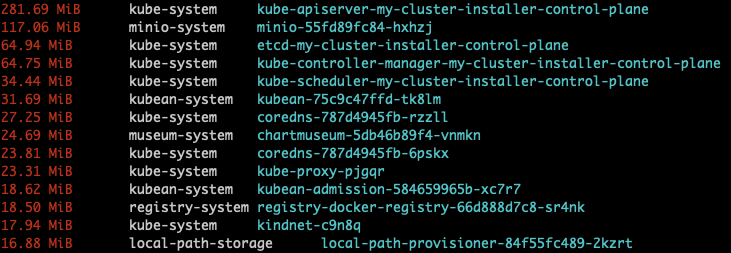

2. Global + kind火种 资源占用

    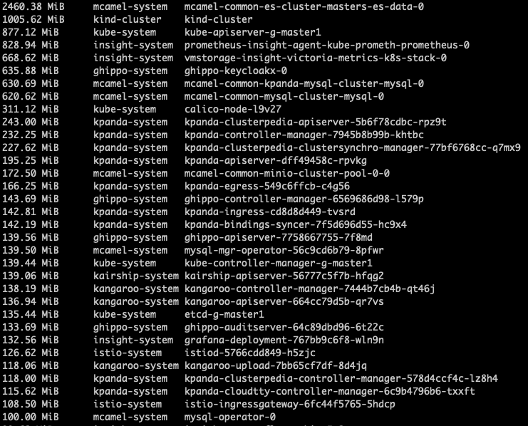

    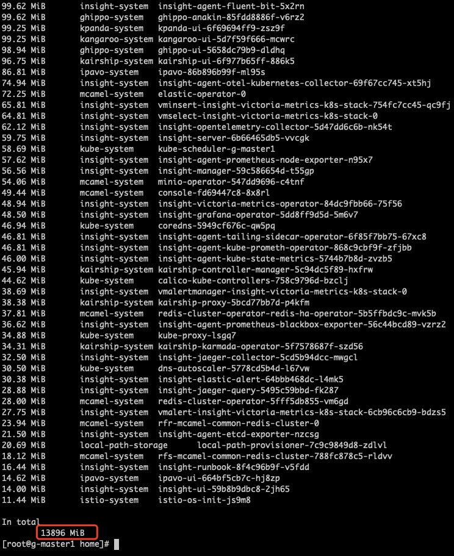

按脚本统计，内存总消耗：13.6 GiB。

可裁剪组件理论内存消耗统计：

!!! note

    统计计算结果与实际部署消耗会存在差异，比如系统运行期间产生的动态缓存，都会影响内存实际占用。

| 组件 | 占用 |
| :---- | ----- |
| elasticsearch | 2460.38MiB (2.40GiB) |
| kind-cluster | 1005.62 MiB (0.98GiB) |
| insight | 2655.17MiB (2.59GiB) |
| kangaroo | 277.25MiB (0.27GiB) |
| 总计 | 6.24 GiB |

若不装此四类组件，内存消耗预计7.36GiB，但前期做过社区版裁剪，即不带此四类组件，8G 内存勉强运行，但不稳定。

**Phase2 优化**

Phase2 mysql 由双实例整合为单实例，同时裁剪优化 insight 部分组件。

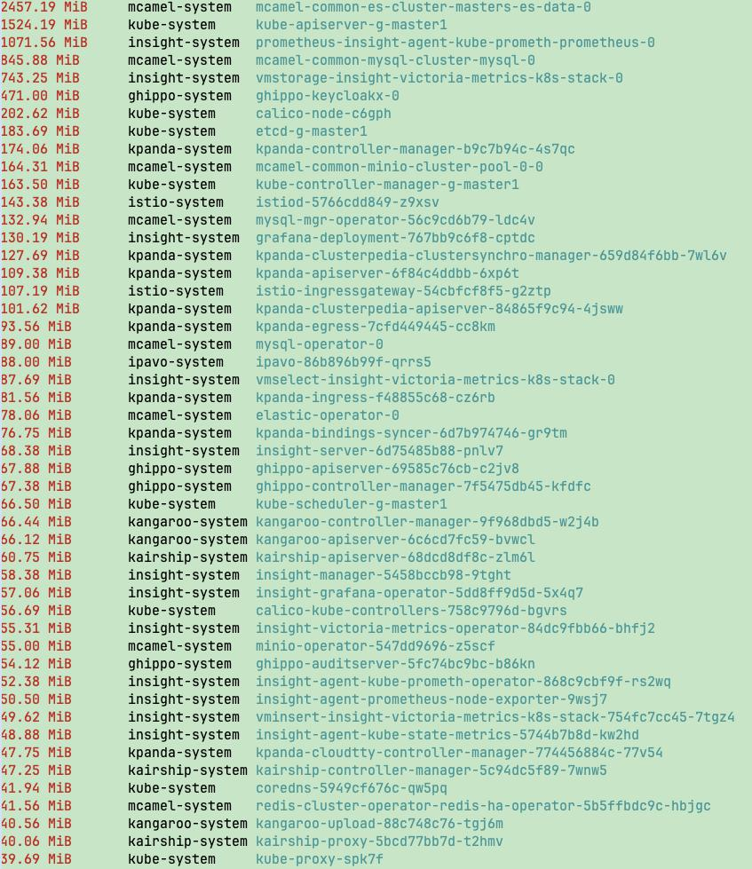

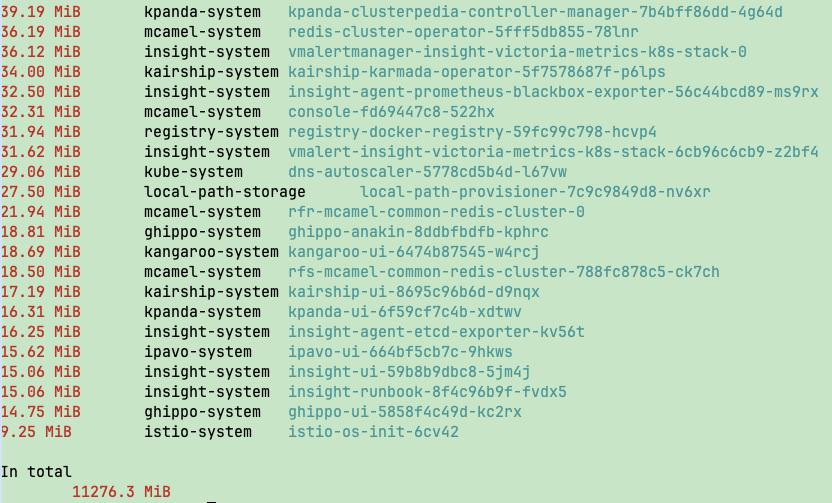

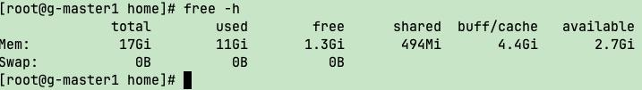

**Phase3 优化**

优化项：移除ES（副本=0），依据 https://gitlab.daocloud.cn/ndx/engineering/insight/insight/-/issues/2268#note_558331。

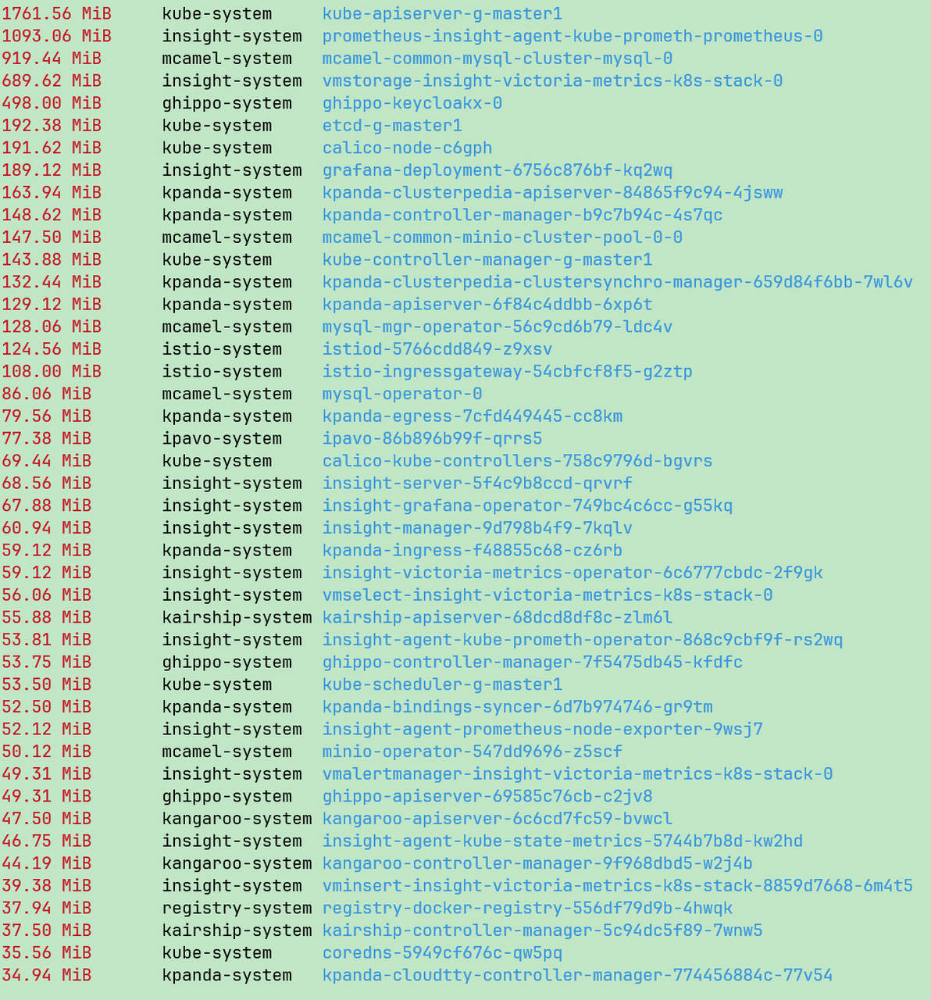

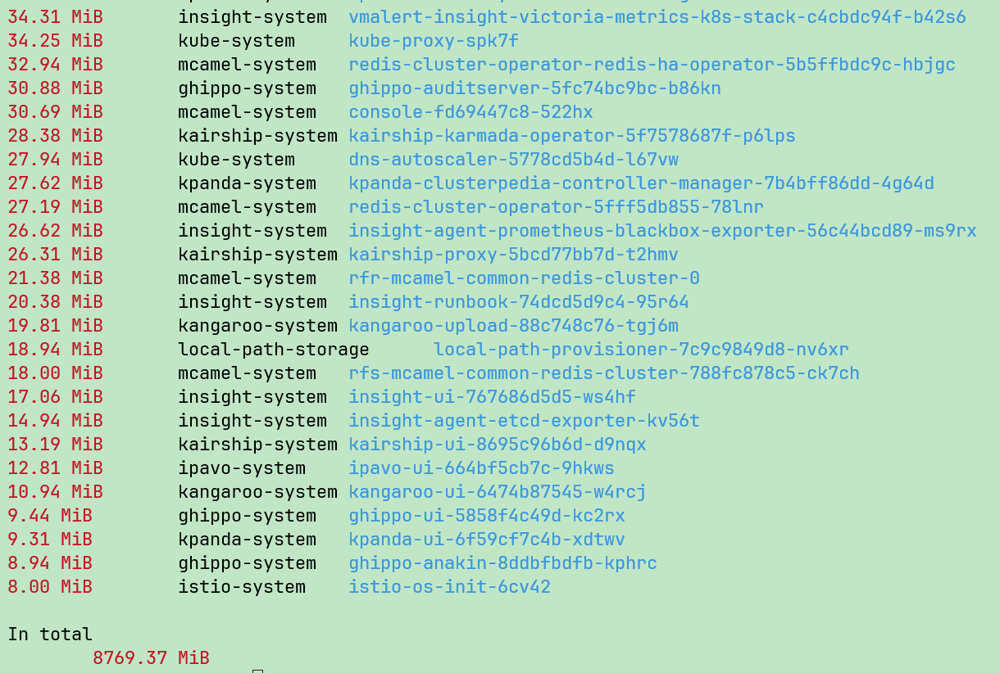

**Phase4 优化**

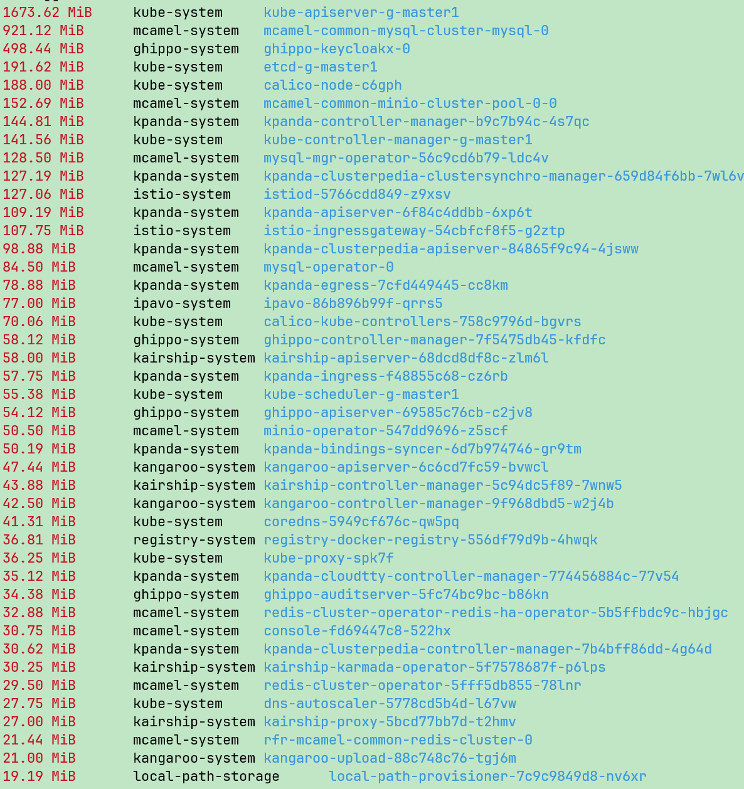

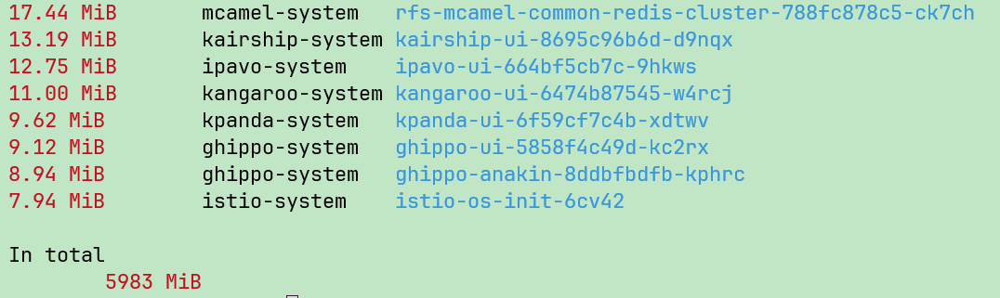

## 结论

此轻量化方案是通过在充足内存下的完整 K8s + dce5 社区版，不断裁剪缩容而成的静置状态，从统计内存数值来看，内存刚好能满足。

在实际真实场景下，基于 8Gi 内存环境，按序安装（自适应裁剪），但因尾部涉及手动执行脚本，会导致触发 deploy 滚动更新，临时内存需求激增，另操作系统本身也会占用一部分动态内存资源；

故综合情况下，实际上 8G 内存环境中运行 DCE5 轻量化裁剪环境，资源依然不足；

即**安装状态所需内存 != 静置状态内存**

以 Phase 4  为最终裁剪目标来看，至少需要 10G+ 内存。
以 Phase 3  为最终裁剪目标来看（包含可观测性组件），至少需要 12G+ 内存。

如何通过安装器实现部署轻量化，参见[安装器轻量化部署方案](./install-light.md)
