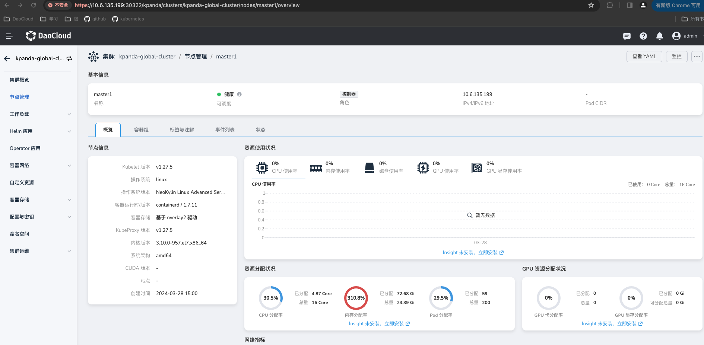

# 在 NeoKylin Linux Advanced Server V7Update6 上部署 DCE 5.0 商业版

本文将介绍如何在 NeoKylin Linux Advanced Server V7Update6 操作系统上部署 DCE 5.0。

## 前提条件

- 请提前阅读[部署架构](../commercial/deploy-arch.md)，确认本次部署模式。

- 请提前阅读[部署要求](../commercial/deploy-requirements.md)，确认网络、硬件、端口等是否符合需求。

- 请提前阅读[准备工作](../commercial/prepare.md)，确认机器资源及前置检查。

- 需提前在节点上安装好 `iptables`、`iproute`。

  ```bash
  # 安装iptables
   
  wget https://rpmfind.net/linux/centos/7.9.2009/os/x86_64/Packages/iptables-1.4.21-35.el7.x86_64.rpm
   
  rpm -ivh iptables-1.4.21-35.el7.x86_64.rpm
   
  iptables --version
   
  # 安装iproute
   
  wget https://rpmfind.net/linux/centos/7.9.2009/os/x86_64/Packages/iproute-4.11.0-30.el7.x86_64.rpm
   
  rpm -ivh iproute-4.11.0-30.el7.x86_64.rpm
  ```

## 离线安装

1. 下载全模式离线包，可以在[下载中心](../../download/index.md)下载最新版本。

    | CPU 架构 | 版本   | 下载地址    |
    | -------- | ------ | -------- |
    | AMD64    | v0.17.0 | <https://qiniu-download-public.daocloud.io/DaoCloud_Enterprise/dce5/offline-v0.17.0-amd64.tar> |

    下载完毕后解压离线包：

    ```bash
    curl -LO https://qiniu-download-public.daocloud.io/DaoCloud_Enterprise/dce5/offline-v0.17.0-amd64.tar
    tar -xvf offline-v0.17.0-amd64.tar
    ```

2. 下载 NeoKylin Linux Advanced Server V7Update6 镜像文件。

    ```bash
    # Oracle Linux R9 U1
    curl -LO https://yum.oracle.com/ISOS/OracleLinux/OL9/u1/x86_64/OracleLinux-R9-U1-x86_64-dvd.iso
    ```

3. 制作 NeoKylin Linux Advanced Server V7Update6 OS Package 离线包。

    **前提条件：**

    - 检查`libselinux-python`是否存在，如不存在，可参考下面的安装依赖包方式进行安装。

      ```bash
      rpm -q libselinux-python
      ```

    - 安装依赖包 `device-mapper-libs`、`conntrack`、`sshpass`，依赖包的下载地址：https://rpmfind.net/linux/rpm2html/search.php?query=sshpass&submit=Search+，安装命令如下：

      ```bash
      rpm -ivh <package name>
      ```

    - 手动修改 os-release 文件中的 `VERSION_ID="7"`

      ```
      vi /etc/os-release
      ```

    **参考[制作 OS Package 离线包](../os-install/otherlinux.md#os-package)，开始制作离线包。**

4. 下载 addon 离线包，可以在[下载中心](../../download/index.md)下载最新版本（可选）

5. 设置[集群配置文件 clusterConfig.yaml](../commercial/cluster-config.md)，可以在离线包 `offline/sample` 下获取该文件并按需修改。
    参考配置为：

    ```yaml
    apiVersion: provision.daocloud.io/v1alpha3
    kind: ClusterConfig
    metadata:
      creationTimestamp: null
    spec:
      clusterName: my-cluster
      masterNodes:
        - nodeName: "master1"
          ip: 10.6.135.199
          ansibleUser: "root"
          ansiblePass: "dangerous@2024"
      workerNodes: []
      osRepos:
        type: none #需要修改成none
      imagesAndCharts:
        type: builtin
      binaries:
        type: builtin
      loadBalancer:
        type: NodePort
      fullPackagePath: /home/offline
    
    ```

6. 开始安装 DCE 5.0。

    ```bash
    ./dce5-installer cluster-create -m ./sample/manifest.yaml -c ./sample/clusterConfig.yaml
    ```

    !!! note

        部分参数介绍，更多参数可以通过 `./dce5-installer --help` 来查看：
        
        - `-z` 最小化安装
        - `-c` 指定集群配置文件，使用 NodePort 暴露控制台时不需要指定 `-c`
        - `-d` 开启 debug 模式
        - `--serial` 指定后所有安装任务串行执行

7. 安装完成后，命令行会提示安装成功。恭喜您！:smile: 现在可以通过屏幕提示的 URL 使用默认的账户和密码（admin/changeme）探索全新的 DCE 5.0 啦！

    

    !!! success

        请记录好提示的 URL，方便下次访问。

    

8. 成功安装 DCE 5.0 商业版之后，请联系我们授权：电邮 [info@daocloud.io](mailto:info@daocloud.io) 或致电 400 002 6898。
