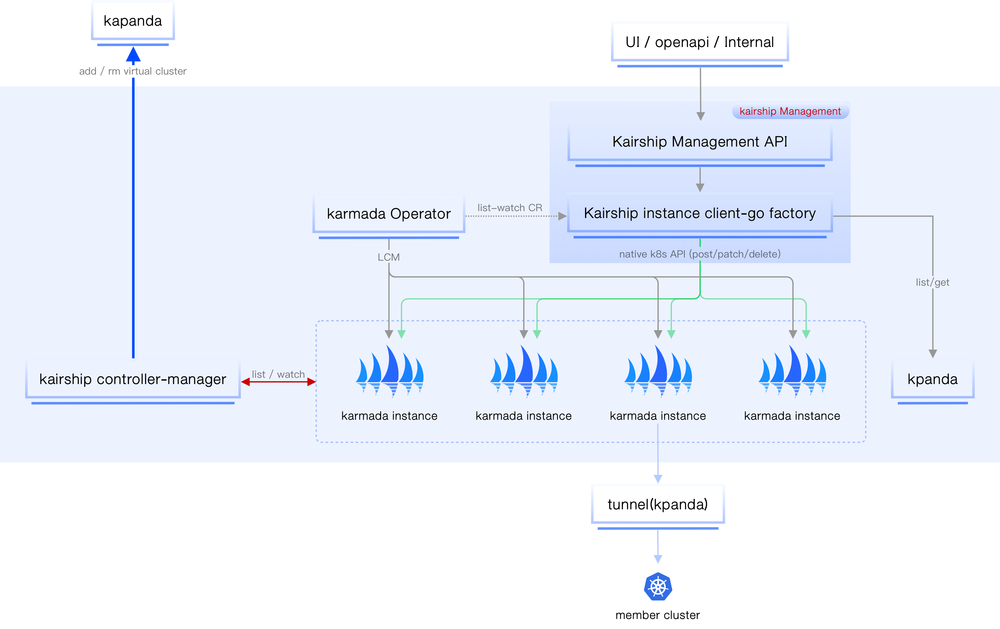
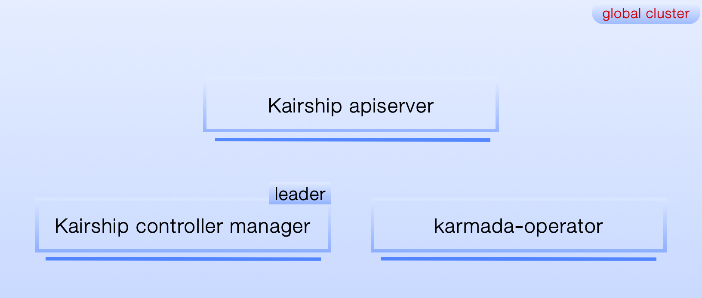
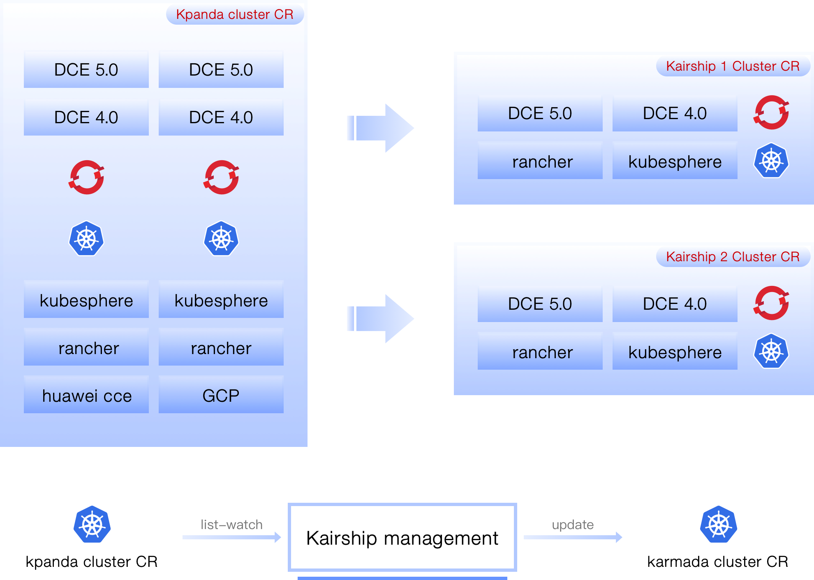

# 产品架构

多云编排的管理面主要负责以下功能：

- 多云实例（基于 Karmada）的生命周期管理（LCM）
- 作为多云产品统一的流量入口（OpenAPI、Kairship UI、内部模块 GRPC 调用）
- 代理多云实例的 API 请求（Karmada 原生风格）
- 多云实例内的集群信息（监控、管理、控制）等的聚合
- 多云工作负载等资源的管理和监控
- 后续可能的权限操作

## 核心组件

多云编排主要包括两个核心组件:

- kairship apiserver

    多云编排数据流入口，所有 API 的入口（protobuf 优先，通过 proto 定义所有的 API 接口，并以此生成对应的前后端代码，使用 grpw-gateway 实现同时支持 http restful 和 grpc）。

- kairship controller-manager

    多云编排控制器，主要负责实例状态同步、资源搜集、Karmada 实例注册、全局资源注册等。

!!! note

    目前多云编排的鉴权功能只验证 Karmada 实例的权限。kairship apiserver 校验来自阿猫的接口是否有权限操作或访问 Karmada 实例。

### Kairship apiserver

kairship apiserver 主要担负着多云编排所有流量的入口（openapi、grpc 等），启动的时候会从[全局管理模块](../../ghippo/01ProductBrief/WhatisGhippo.md)获取操作人的身份信息，用于后续 AuthZ 的安全性校验。

<!--无状态服务，具体接口待补充（目前比较简单）-->

### kairship controller-manager

!!! note

    多副本部署，通过 leader 机制选举，保持同一个时刻只有一个工作的 Pod（参考 Kubernetes 的 controller-manager 选举机制）。

该组件主要负责多云编排一系列控制逻辑的处理（每个逻辑单独成 controller），通过 list-watch 机制监听特定对象的变更，然后处理对应事件。主要包括:

- virtual-cluster-sync-controller

    多云编排实例 CRD 的 CRUD 事件监听，一旦创建 kariship 实例，则同步创建对应的 Kpanda cluster（virtual 类型，容器管理界面无须展示）。
    多云编排实例所有资源的检索（多云工作负载、pp、op）都将通过[容器管理模块](../../kpanda/03ProductBrief/WhatisKPanda.md)内部的加速机制完成（借助 [Clusterpedia](../../community/clusterpedia.md)），实现读写分离，进而提高性能。
    实例删除，则同步删除注册在容器管理模块中的 virtual cluster。

- resource statistics controller

    主要搜集多云编排实例中加入的所有集群的统计信息，并将其回写到多云编排实例 CRD 中（例如该实例所管理的集群中总共包含多少 CPU、内存、节点数）。

- status sync controller

    多云编排实例本身的状态同步、统计。

- instance registry controller

    多云编排需要通过自定义资源将平台内所有 `Karmada` 实例注册到[全局管理模块](../../ghippo/01ProductBrief/WhatisGhippo.md)，这样才能在全局管理中完成角色与 Karmada 实例的绑定关系。
    最终这些绑定关系会同步到多云编排模块中。

- Ghippo webhook controller

    在[全局管理模块](../../ghippo/01ProductBrief/WhatisGhippo.md)完成角色与 Karmada 实例的绑定关系之后，通过 sdk 告知多云编排，多云编排据此完成鉴权动作。

上图 `Kairship management` 中有一个 instance proxy 的组件（内部组件），主要负责多云编排管理面同各个 `Karmada` 实例间的通信。
可以理解成是一个 Kubernetes client 的集合，根据 Cluster Name 获取对应的 client，然后访问真正的 Karmada 实例。

## 数据流图

!!! note

    多云实例之间互不感知、相互隔离。

多云编排管理面需要操作每个多云编排实例，主要分为以下几种场景：

- 获取 Karmada 相关的分发策略以及应用的状态信息。
- 获取多云编排实例内的集群、节点的统计、监控信息。
- 编辑、更新、删除相关 Karmada 实例中的多云应用相关的信息（主要围绕 Karmada 工作负载和 pp、op 两个 CRD）。

所有的请求数据流都直接传递到位于[全局服务集群](../../kpanda/07UserGuide/Clusters/ClusterRole.md)的多云编排实例中。这样在大规模请求的时候，性能可能会受影响，如图所示:

如上图所示，所有访问多云模块的请求经过多云编排之后将会被分流，所有 get/list 之类的读请求将会访问[容器管理模块](../../kpanda/03ProductBrief/WhatisKPanda.md)，写请求会访问 Karmada 实例。这样会产生一个问题：通过多云编排创建一个多云应用之后，通过[容器管理模块](../../kpanda/03ProductBrief/WhatisKPanda.md)怎么能获取的相关资源信息?

了解 Karmada 的小伙伴都知道，Karmada control-plane 其本质也就是一个完整 Kubernetes 控制面，只是没有任何承载工作负载的节点。
因此多云编排在创建实例的时候，采用了一个取巧的动作，把实例本身作为一个隐藏的集群加入到[容器管理模块](../../kpanda/03ProductBrief/WhatisKPanda.md)中（不在容器管理中显示）。
这样就可以完全借助容器管理模块的能力（搜集加速检索各个 Kubernetes 集群的资源、CRD 等），当在界面中查询某个多云编排实例的资源（deployment、pp、op 等）就可以直接通过容器管理模块进行检索，做到读写分离，加快响应时间。

## 多云编排实例 LCM

### 部署拓扑

如图所示，整个多云编排有三个组件组成，kairship apiserver、kairship controller manager，karmada operator 都部署在[全局服务集群](../../kpanda/07UserGuide/Clusters/ClusterRole.md)。
其中 karmada operator 完全遵守开源社区的部署架构；kairship apiserver 无状态服务支持水平扩展；kairship controller manager 高可用架构，内部有选举机制，同时可单一 Pod 工作。

### 集群导入

如图所示，Karmada 实例中纳管的所有 Kubernetes 集群都来自于 `Kpanda` 集群，Karmada 实例加入某个集群之后，会自动进行 CR 的同步工作（Kpanda Cluster --> Karmada Cluster）。
同时多云编排管理面有控制循环逻辑会实时监听 Kpanda Cluster 变更，第一时间同步到控制面，进一步反馈到对应 `Karmada` 实例的 Karmada Cluster 中，目前主要监听 Kpanda cluster 访问凭证的变更。

### Karmada 实例 CR

Karmada 社区最近在做 karmada operator，此处我们不做单独的设计，参照社区最新进展即可。
因此此文没有对 `Karmada` 示例的 LCM 做设计，假设现阶段社区的 Operator 仍不完善，我们可以先进行 CR 转换的对接。
