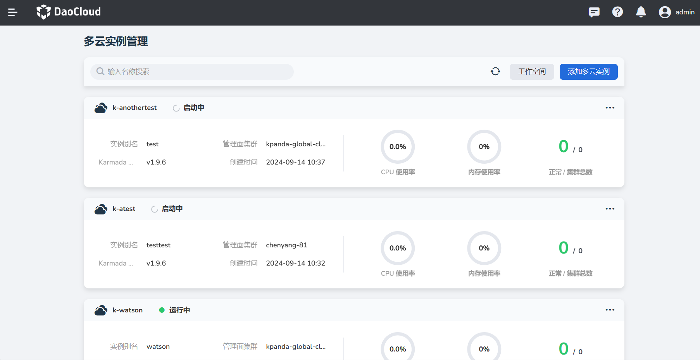
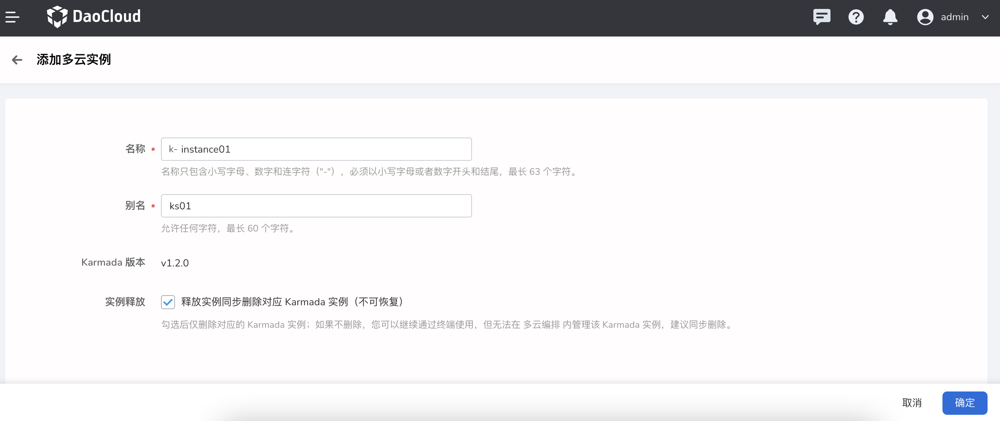

---
hide:
  - toc
---

# 添加实例

DaoCloud 基于 Karmada 提供强大的多云模块的多实例管理能力，您只需按照如下步骤进行简单操作即可。

首次进入多云编排时，需要`添加多云实例`。简单的操作步骤如下：

1. 在多云实例列表中，点击右上角的`添加多云实例`。

    

2. 在`添加多云实例`窗口中，配置实例名称和别名后，点击`确认`。

    

3. 返回多云实例列表，屏幕右上角提示创建成功，新创建的实例默认位于列表第一项。

!!! note

    当前多云编排的产品功能设计，创建的多云实例默认会在 `全局管理集群`内，并且以虚拟集群的出现 DCE5.0 之中，这对您是透明地，所以无需感知；但一些注意事项需要您关注。

## 实例名称前缀

因为多云实例是以虚拟集群的形式 DCE5.0 中，为了避免名称与现有集群产生冲突，所以我们设计上要求在集群名称之前增加前缀，以解决此问题。

## 实例释放的操作

近期我们更新了实例释放时的是否同步对 Karmada 实例进行释放的能力；之所以这样设计的目的，是为了给用户更大的资源度，当集群被删除时，是否同步对已存在的资源进行同步清理。

默认开启同步删除，如果您关闭后，则集群删除后，我们不会对 Karmada 实例进行回收，您可以根据需要进行自行回收。

> 注意：删除实例后，会从多云编排的实例列表中移除
