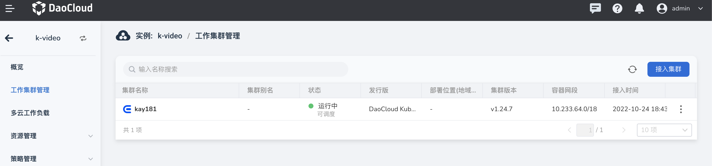
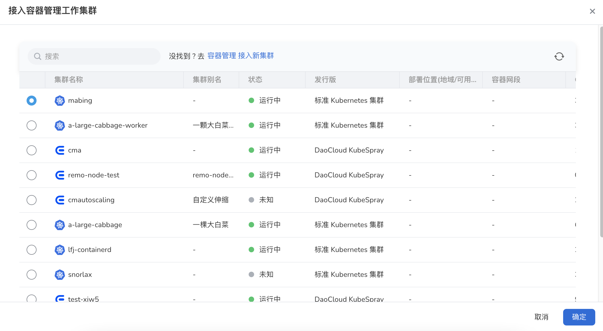
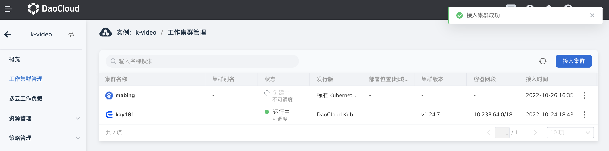

---
hide:
  - toc
---

# 接入集群

创建多云实例后，需要先接入工作集群。

1. 点击左侧导航栏的`工作集群管理`，进入多云集群管理页面，点击右上角的`接入集群`按钮。

    

2. 在弹出的页面中，选择一个工作集群后，点击`确认`。

    

3. 返回工作集群列表，屏幕提示创建成功。点击列表右侧的 `…` 按钮，可以对集群执行更多操作：暂停/恢复调度、编辑集群标签、修改集群污点和移除。

    
