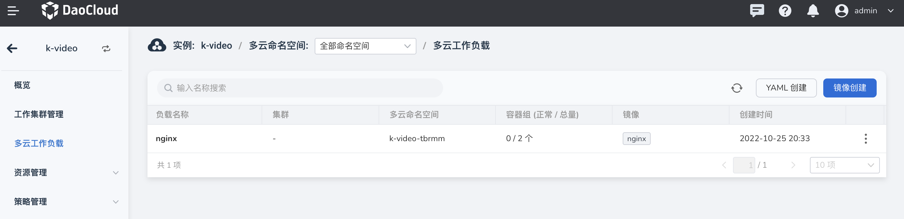
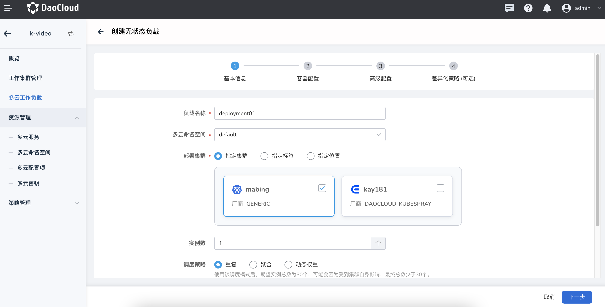
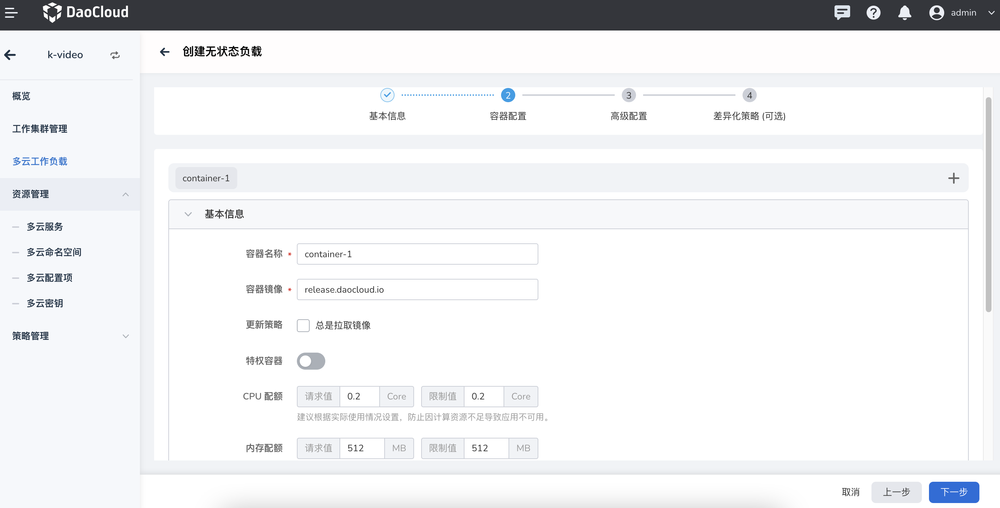
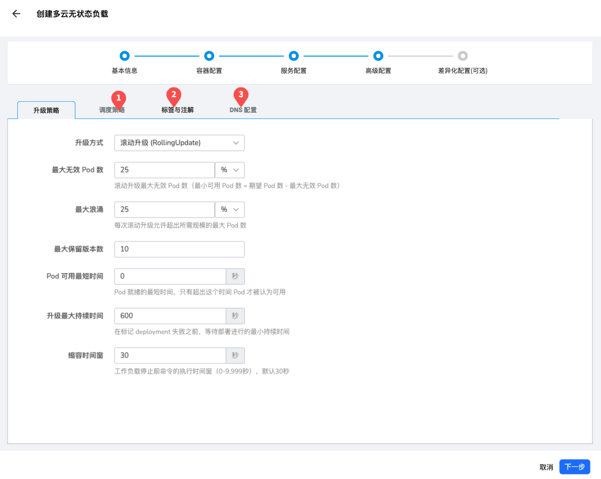
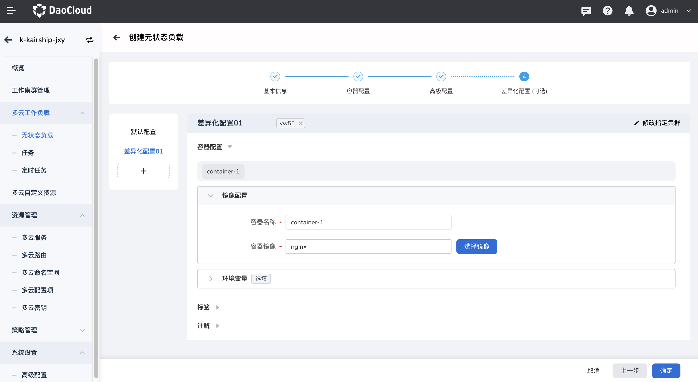

---
hide:
  - toc
---

# 通过表单创建多云工作负载

参照以下步骤创建一个无状态负载（Deployment）。

1. 在左侧导航栏中，点击`多云工作负载`，进入多云无状态负载页面，点击右上角的`镜像创建`按钮。

    

2. 在`创建无状态负载`页面中，配置负载的基本信息后，点击`下一步`。

    

    在基本信息之中，我们需要指定对应的部署工作集群，多云编排提供了非常详细的集群部署能力，可以完全匹配 Karmada 的全部能力

    注意在部署副本数的调度策略选取时，需要关注下方提示的说明：

    - 当部署类型为 重复 时，则指在全部覆盖的每个工作集群，均启动对应副本数的实例
    - 当部署类型为 聚合或动态权重 时，则指在全部覆盖的工作集群中，一共启动设定的副本数

3. 在`容器配置`页面中，配置负载所在容器的基本信息，可选择配置生命周期、健康检查等信息，然后点击`下一步`。

    

4. 在`高级配置`页面中，分配配置升级策略、调度策略、标签与注解以及 DNS 后点击`下一步`。

    

    如果您在创建完成后，无需配置差异化时，则可以直接使用 `确认` 完成多云工作负载的创建

5. 在`差异化配置`页面中，选择个性化的容器配置、标签和注解后，点击`确定`。

    

    您可以在左侧列表区域增加对应的差异化配置项，当您新增一个差异化配置项之后，需要指定对应的集群。
    集群的可选择范围仅为刚开始选择的集群，被选择的集群则会使用指定的差异化配置；未被指定的集群仍旧使用默认配置

6. 屏幕出现创建成功提示，您现在可以[创建多云服务](../06resource/service.md)了！

    

!!! note

    - 通过镜像创建多云工作负载时，如果需要采用指定位置、指定标签的高级能力进行创建时，需要确保工作集群已设定对应的位置或者标签；
    增加标签需要在单个集群内增加，可由工作集群管理列表跳转到对应的集群维护。
    - 配置副本数时，需要关注对应的调度策略，仅重复时会在多个集群中全部启动配置的副本数。
