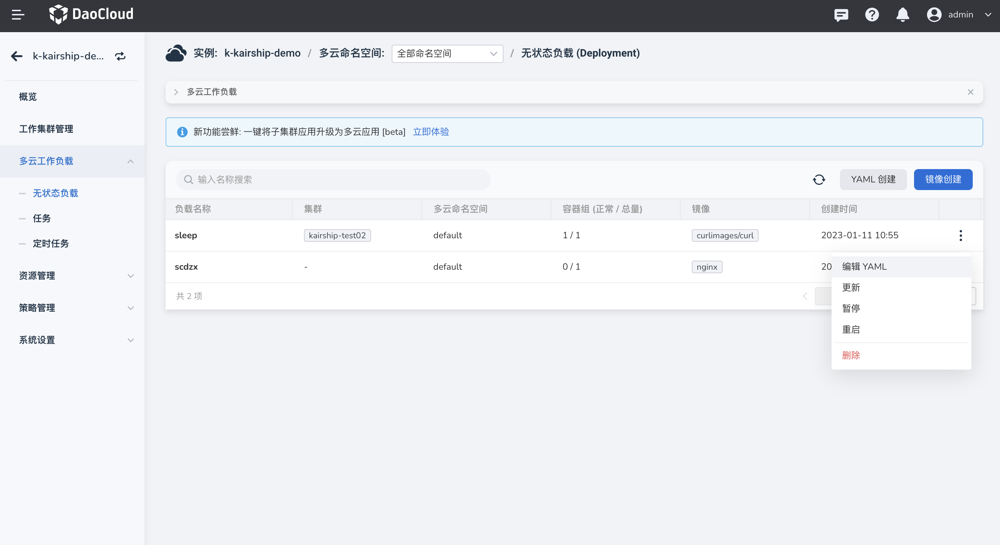
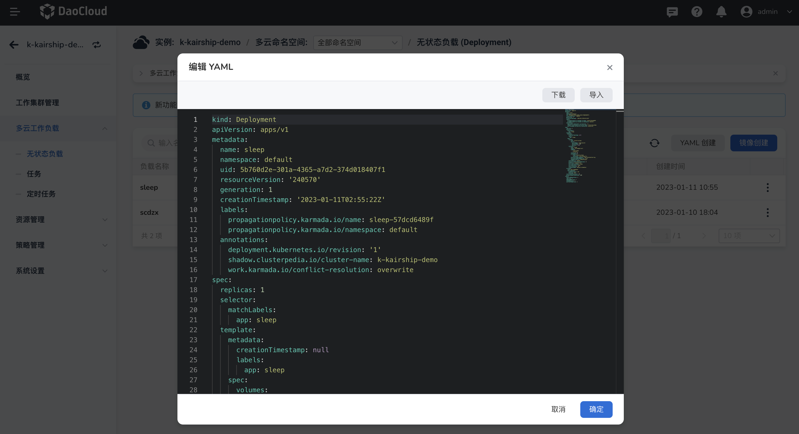
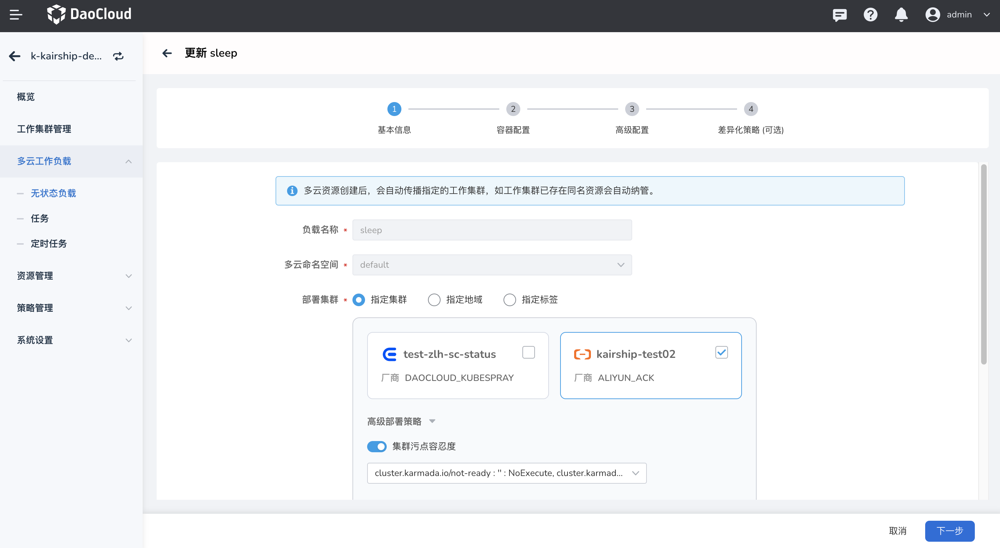

---
hide:
  - toc
---

# 更新多云工作负载

参照以下步骤更新一个无状态负载（Deployment）。

1. 在左侧导航栏中，点击`多云工作负载`，进入多云无状态负载页面，点击`···`可以编辑 YAML 或者更新

    

2. 点击`编辑 YAML`可以通过修改 YAML 信息更新无状态负载。

    

3. 点击`更新`可以通过表单更新无状态负载，负载名称和多云命名空间无法更新。

    
   
4. 完成需要修改的内容后点击确定，更新成功。
