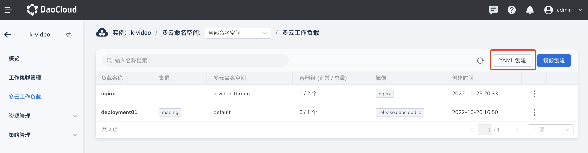
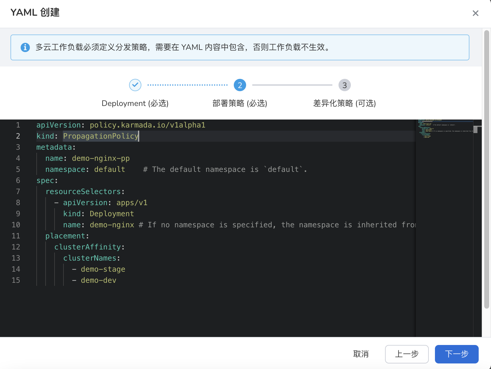
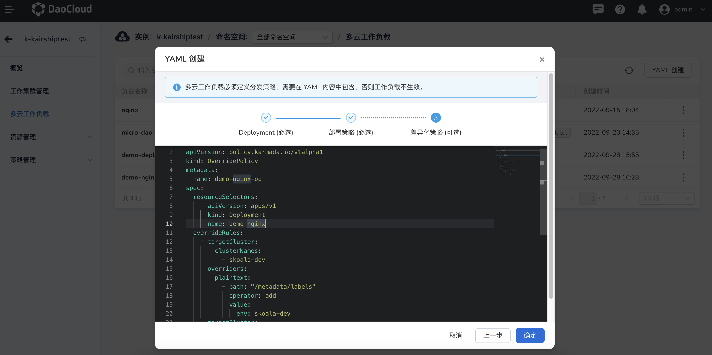
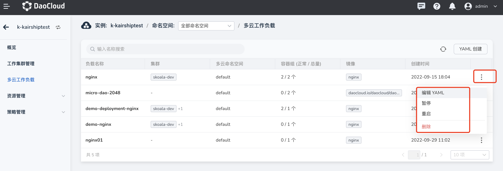

# 通过 YAML 创建多云工作负载

除了通过镜像创建工作负载外，还可以通过输入 YAML 语句来创建。

这种创建方式的步骤比较简单，如下所述。

1. 在左侧导航栏中，点击`多云工作负载`，点击右上角的`YAML 创建`按钮。

    

2. 例如输入创建 Deployment 的 YAML 语句后，点击`下一步`。

    

3. 输入部署策略的 YAML 语句后，点击`下一步`。

    

4. 输入差异化策略的 YAML 语句后，点击`确定`。

    

5. 自动返回多云工作负载列表，点击列表右侧的 `⋮`，可以编辑修改 YAML，还可以暂停、重启和删除该负载。

    

## YAML 示例

多云编排模块自带的 YAML 编辑器中会自动检测 YAML 语法，如有错误，会出现相关提示。
以下列出一些常用的示例，您稍加修改就可以使用。

### Deployment 示例

```yaml
# Kubernetes Deployment
apiVersion: apps/v1
kind: Deployment
metadata:
  name: demo-nginx
  labels:
    app: demo-nginx
spec:
  replicas: 1
  selector:
    matchLabels:
      app: demo-nginx
  template:
    metadata:
      labels:
        app: demo-nginx
    spec:
      containers:
      - image: nginx
        name: nginx
```

### 部署策略示例

```yaml
# Karmada PropagationPolicy
apiVersion: policy.karmada.io/v1alpha1
kind: PropagationPolicy
metadata:
  name: demo-nginx-pp
  namespace: default    # The default namespace is `default`.
spec:
  resourceSelectors:
    - apiVersion: apps/v1
      kind: Deployment
      name: demo-nginx # If no namespace is specified, the namespace is inherited from the parent object scope.
  placement:
    clusterAffinity:
      clusterNames:
        - demo-stage
        - demo-dev
```

### 差异化策略示例

```yaml
# Karmada OverridePolicy
apiVersion: policy.karmada.io/v1alpha1
kind: OverridePolicy
metadata:
  name: demo-nginx-op
spec:
  resourceSelectors:
    - apiVersion: apps/v1
      kind: Deployment
      name: demo-nginx
  overrideRules:
    - targetCluster:
        clusterNames:
          - demo-dev
      overriders:
        plaintext:
          - path: "/metadata/labels/env"
            operator: add
            value: demo-dev
    - targetCluster:
        clusterNames:
          - demo-stage
      overriders:
        plaintext:
          - path: "/metadata/labels/env"
            operator: add
            value: demo-stage
```
