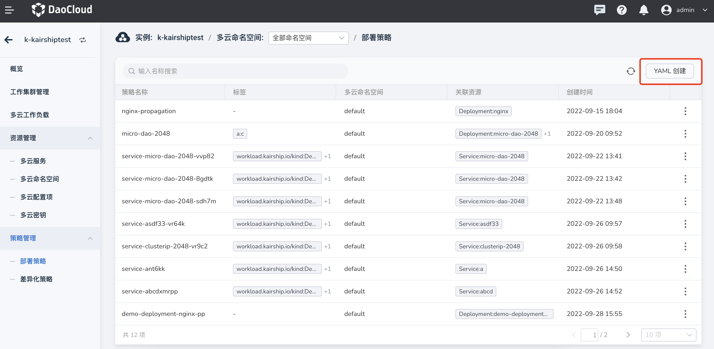
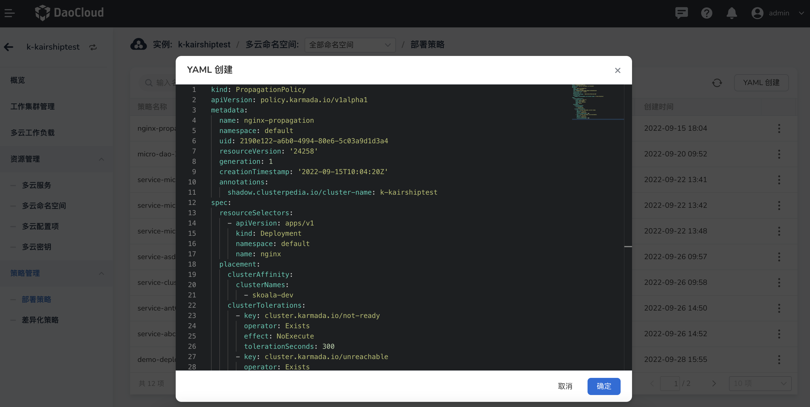
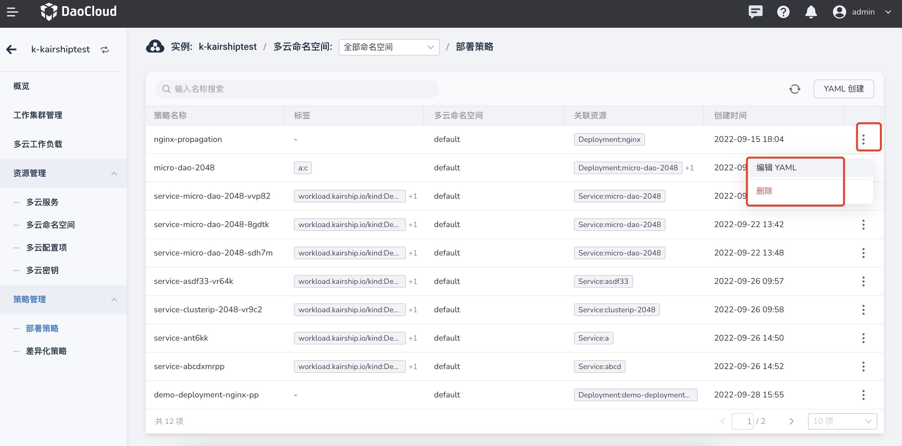

# 差异化策略

多云编排支持差异化策略，支持在界面上查看当前实例的差异化策略列表及其关联的多云资源，持以 YAML 的方式维护创建和编辑差异化策略信息，支持在界面上查看当前实例的差异化策略列表以及当前差异化策略关联的多云资源。

差异化策略定义了在多云多集群中不同的配置，方便管理传播策略（Propagation Policy）和覆盖策略（Override Policy）。

参照以下步骤创建一个差异化策略。

1. 进入某一个多云实例后，在左侧导航栏中，点击`策略管理` -> `差异化策略`，点击右上角的 `YAML 创建`按钮。

    

2. 在 `YAML 创建`页面中，输入正确的 YAML 语句后，点击`确定`。

    

3. 返回差异化策略列表，新创建的默认位于第一个。点击列表右侧的 `⋮`，可以编辑 YAML 和执行删除操作。

    

    !!! note

        若要删除一个差异化策略，需要先移除该策略相关的工作负载，删除之后该策略有关的信息都将被删除，请谨慎操作。

## YAML 示例

此处列出一个差异化策略的 YAML 示例，您稍加修改就可以使用。

```yaml
kind: OverridePolicy
apiVersion: policy.karmada.io/v1alpha1
metadata:
  name: nginx-op
  namespace: default
  uid: 09f89bc4-c6bf-47b3-81bf-9e494b831aac
  resourceVersion: '856977'
  generation: 1
  creationTimestamp: '2022-09-21T10:30:40Z'
  labels:
    a: b
  annotations:
    shadow.clusterpedia.io/cluster-name: k-kairshiptest
spec:
  resourceSelectors:
    - apiVersion: apps/v1
      kind: Deployment
      namespace: default
      name: nginx
  overriders: {}
```
