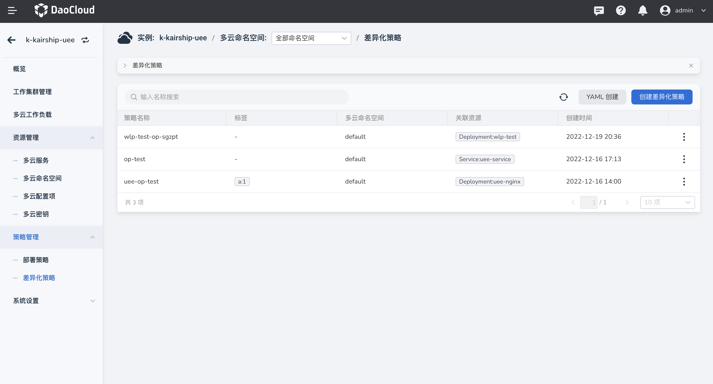
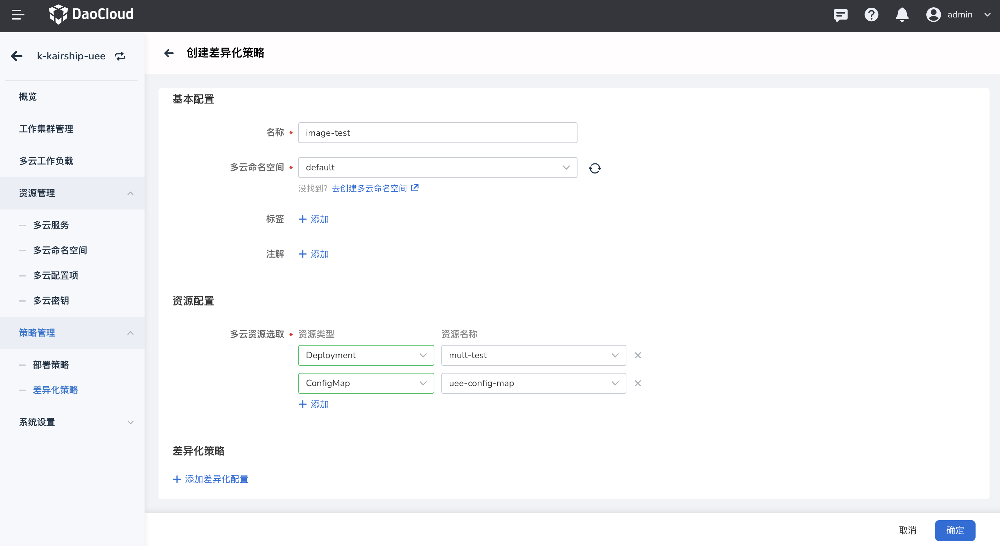
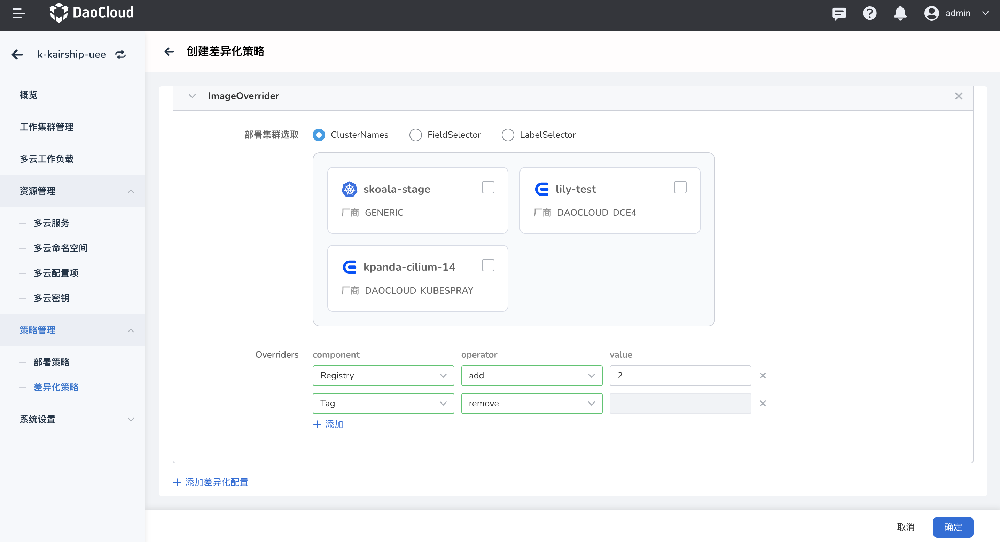
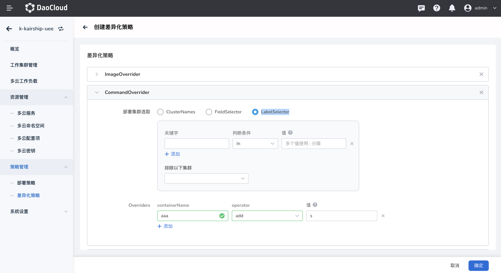

# 部署策略

差异化策略（Override Policy）的作用是，定义在下发到不同集群中的配置，可以是不一样的，例如不同的集群所对应的镜像仓库的地址是不一样的，那就需要设置在不同集群中的工作负载的镜像地址不同，例如在不同的环境下，需要设置不同的环境变量等。差异化策略（Override Policy）的作用时机是在部署策略（Propagation Policy）之后，以及在真正在下发到集群之前。

多云编排支持差异化策略，支持在界面上查看当前实例的差异化策略列表及其关联的多云资源，并且可以通过表单和 YAML 两种方式创建和更新差异化策略的信息。

## 1.YAML 创建

参照以下步骤使用 YAML 创建一个部署策略。

1. 进入某一个多云实例后，在左侧导航栏中，点击`策略管理` -> `部署策略`，点击右上角的 `YAML 创建`按钮。

    

2. 在 `YAML 创建`页面中，输入正确的 YAML 语句后，点击`确定`。

    

3. 返回部署策略列表，新创建的默认位于第一个。点击列表右侧的 `⋮`，可以编辑 YAML 和执行删除操作。

    !!! note

        若要删除一个部署策略，需要先移除该策略相关的工作负载，删除之后该策略有关的信息都将被删除，请谨慎操作。

### YAML 示例

此处列出一个部署策略的 YAML 示例，您稍加修改就可以使用。

```yaml
kind: PropagationPolicy
apiVersion: policy.karmada.io/v1alpha1
metadata:
  name: nginx-propagation
  namespace: default
  uid: 2190e122-a6b0-4994-80e6-5c03a9d1d3a4
  resourceVersion: '24258'
  generation: 1
  creationTimestamp: '2022-09-15T10:04:20Z'
  annotations:
    shadow.clusterpedia.io/cluster-name: k-kairshiptest
spec:
  resourceSelectors:
    - apiVersion: apps/v1
      kind: Deployment
      namespace: default
      name: nginx
  placement:
    clusterAffinity:
      clusterNames:
        - skoala-dev
    clusterTolerations:
      - key: cluster.karmada.io/not-ready
        operator: Exists
        effect: NoExecute
        tolerationSeconds: 300
      - key: cluster.karmada.io/unreachable
        operator: Exists
        effect: NoExecute
        tolerationSeconds: 300
```

## 2. 表单创建

参照以下步骤创建一个差异化策略。

1. 进入多云编排模块，点击某一实例——>策略管理——>差异化策略，本页面展示了当前实例内的所有差异化策略，点击列表上方的 创建差异化策略按钮。


2. 进入表单创建页面，创建一个完整的差异化策略需要配置基础配置、资源配置、差异化策略三部分。

基本配置：包括名称、多云命名空间、标签和注解。其中名称和多云命名空间为必填项。

资源配置：支持选取所选多云命名空间下的多云资源进行差异化配置，多云资源也支持多选。

差异化策略：支持添加镜像/运行参数/运行命令/自定义等的差异化配置。



3. 填写完成后点击确定则创建成功，支持对一条差异化策略进行 YAML 更新、表单更新、删除操作。

## 差异化策略

接下来将详细介绍差异化策略，共分为四种，且支持添加多条差异化配置：

- ImageOverrider：镜像的差异化配置。
- ArgsOverrider：运行参数的差异化配置。
- CommandOverrider：运行命令的差异化配置。
- PlainText：自定义的差异化配置。

1. 点击添加差异化配置，选择 ImageOverrider 时：

第一步：选择部署集群

支持 ClusterNames（集群名称）、FieldSelector（区域）、LabelSelector（标签）三种方式选择部署集群。

ClusterNames：直接选择指定的集群名称



FieldSelector：通过字段来选择集群，包括 provider（提供集群基础设施的服务商）、region（区域：是可用区的集合，指可以在其中托管资源的特定地理位置，例如：北京、上海、深圳、成都等。）、zone（可用区：是区域内的部署区域，例如上海可用区1、上海可用区2······），还支持从已选集群中排除某指定集群。


LabelSelector：通过标签来选择集群，支持自定义标签，同时也支持排除指定集群。



第二步：对选中集群进行镜像的差异化配置

| 字段      | 必填 | 描述                                                         | 示例                      |
| :-------- | :--- | :----------------------------------------------------------- | :------------------------ |
| Component | 是   | 镜像组成成分                                                 | Registry、Repository、Tag |
| Operator  | 是   | 对镜像进行的操作                                             | add、remove、replace      |
| Value     | 否   | 当 Operator 为'add'或'replace'时不能为空，默认为空，当 operator 为 remove 时不填。 |                           |

2. 当选择 ArgsOverrider 时：

第一步仍然需要选择部署集群

第二步：对选中集群进行运行参数的差异化配置

| 字段          | 必填 | 描述                                                         | 示例        |
| :------------ | :--- | :----------------------------------------------------------- | :---------- |
| ContainerName | 是   | 容器名                                                       |             |
| Operator      | 是   | 应用在 args 上的操作                                         | add、remove |
| Value         | 否   | 应用在 args 上的值，当 operator 为 add 时该值 append 到 args，当 operator 为 remove 时，该值从 args 移除，如果该值为空，args 维持原状。 |             |

3. 当选择 CommandOverrider 时：

第一步仍然需要选择部署集群

第二步：对选中集群进行运行命令的差异化配置

| 字段          | 必填 | 描述                                                         | 示例                                  |
| :------------ | :--- | :----------------------------------------------------------- | :------------------------------------ |
| ContainerName | 是   | 容器名                                                       |                                       |
| Operator      | 是   | 应用在 command 上的操作                                      | add、remove                           |
| Value         | 否   | 应用在 command 上的值，当 operator 为 add 时该值 append 到 command，当 operator 为 remove 时，该值从 command 移除，如果该值为空，command 维持原状。 | 可以添加单个或多个值，多值使用 ; 划分 |

4. 当选择 PlainText 时：

第一步仍然需要选择部署集群

第二步：对选中集群进行运行命令的差异化配置

| 字段     | 必填 | 描述                                                         | 示例                 |
| :------- | :--- | :----------------------------------------------------------- | :------------------- |
| Path     | 是   | 目标字段的路径                                               |                      |
| Operator | 是   | 对目标字段操作类型                                           | add、remove、replace |
| Value    | 否   | 应用在目标字段的值，当 Operator 为 remove 时，此字段必须为空 |                      |
