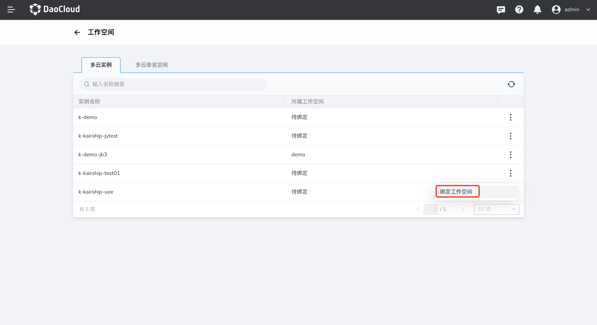
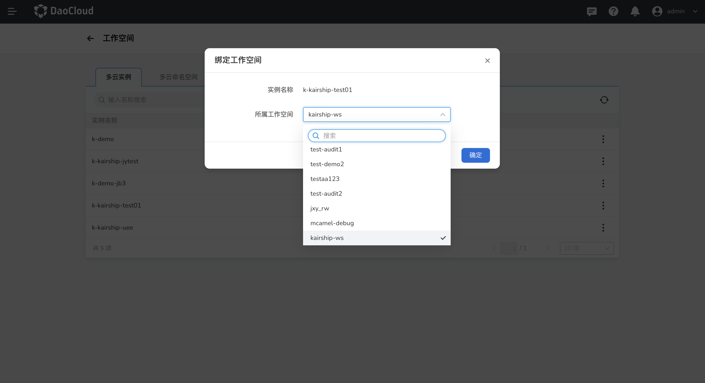
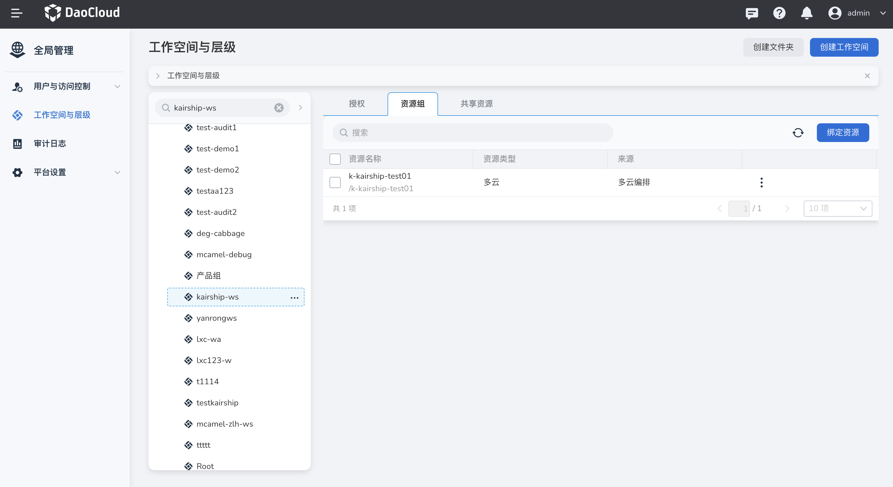
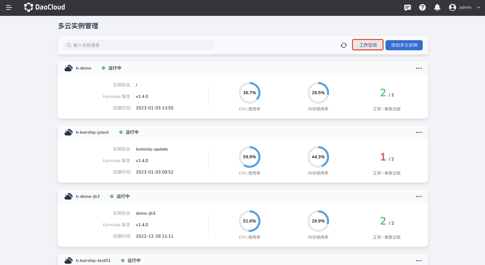
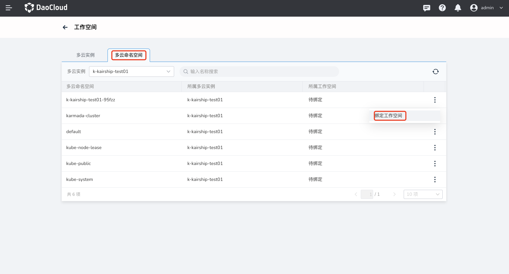
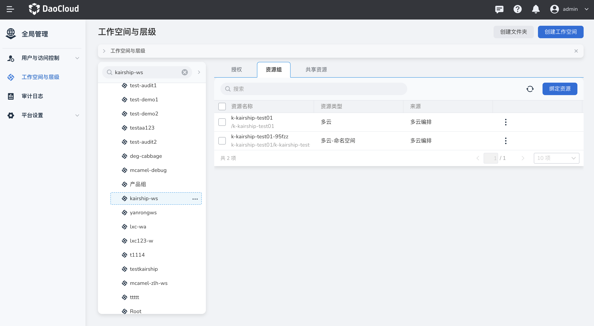

# 绑定工作空间

多云实例和多云命名空间可以绑定到某个[工作空间](../ghippo/04UserGuide/02Workspace/workspaces.md)。绑定到工作空间后，具有相关权限的用户即可在对应的工作空间中管理这些资源。

**注意事项**

- 当前操作用户应具有 Admin 或 Workspace Admin 权限。有关权限的更多说明，可参考[角色和权限管理](../ghippo/04UserGuide/01UserandAccess/role.md)和[工作空间权限](../ghippo/04UserGuide/02Workspace/wspermission.md)。
- 一个多云实例/命名空间只能绑定到一个工作空间。

## 绑定多云实例与工作空间

1. 进入多云编排模块，在页面右上角点击工作空间，

    

2. 进入工作空间页面，在多云实例列表页面选择目标实例点击 `ⵗ`，选择`绑定到工作空间`。

    

3. 选择想要绑定的工作空间，然后点击`确定`。

    

4. 此时多云实例已经与`kairship-ws`绑定。点击全局管理，进入工作空间与层级页面，选择`kairship-ws`资源组，可以看到`k-kairship-test01`已经被绑定。

    

    

## 绑定多云命名空间与工作空间

1. 进入多云编排模块，在页面右上角点击工作空间，选择多云实例页签。

    

2. 在多云命名空间tab页内，选择某多云实例`k-kairship-test01`的某多云命名空间`k-kairship-test01-95fzz`，右侧点击 `ⵗ`，选择`绑定到工作空间`。

    

3. 选择想要绑定的工作空间，然后点击`确定`。

    

4. 此时多云命名空间已经与`kairship-ws`绑定。点击全局管理，进入工作空间与层级页面，选择`kairship-ws`资源组，可以看到`k-kairship-test01-95fzz`已经被绑定。
   
    
