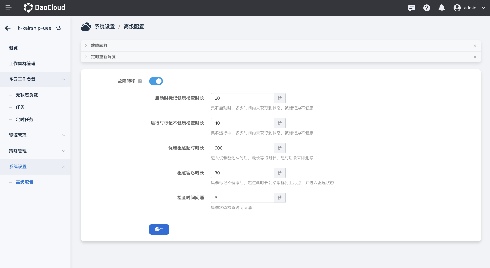
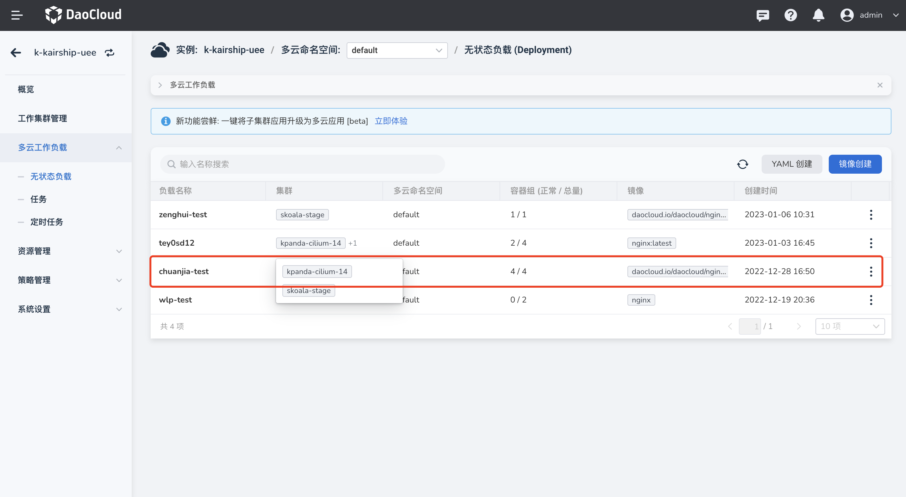
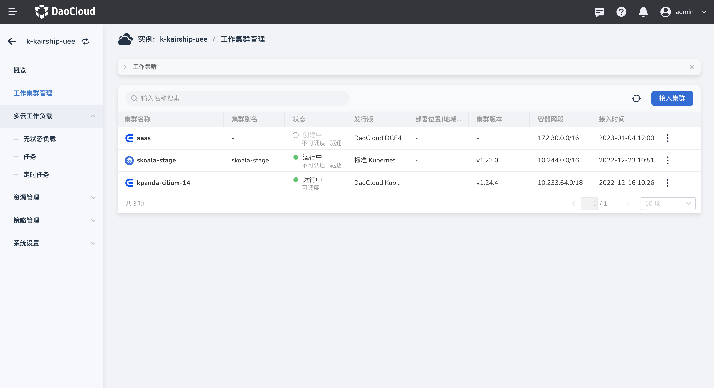
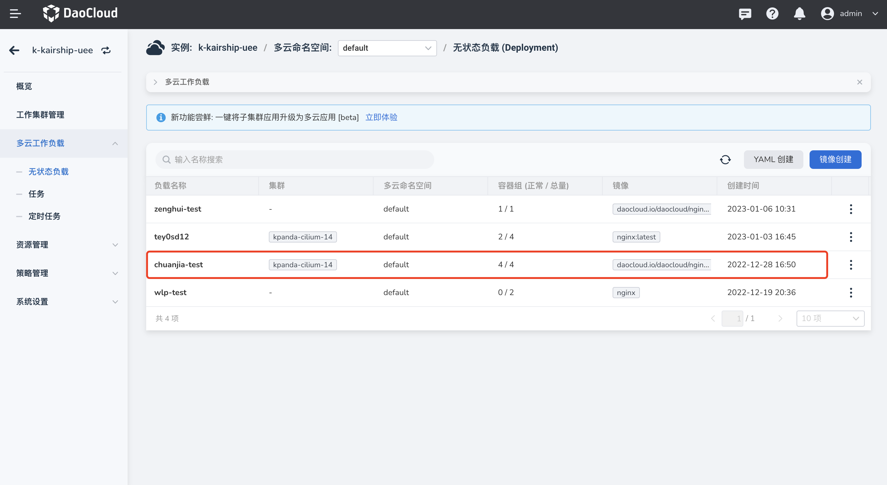

# 故障转移

当工作负载部署在某个集群内发生故障时，将会自动将故障集群 Pod 副本迁移到其他可用集群，以保证服务稳定性。

**前提条件**

多云工作负载的调度策略只能选择聚合模式或者动态权重模式，此时故障转移功能才能生效。

## 开启故障转移

1. 进入多云编排模块，点击系统设置-高级配置，故障转移可实现多个集群之间的副本调度，默认关闭，如有需要请开启。

    

2. 以下参数均针对集群，点击开启故障转移并`保存`。

    | 参数                         | 描述                                                         | 默认值 |
    | ---------------------------- | ------------------------------------------------------------ | ------ |
    | 集群启动时标记健康检查时长   | 集群启动时，在多少时间内未获取到状态，将会被标记为不健康     | 60秒   |
    | 集群运行时标记不健康检查时长 | 集群运行中，在多少时间内未获取到状态，将会被标记为不健康     | 40秒   |
    | 优雅驱逐超时时长             | 当 pod 进入优雅驱逐队列后，最长等待时长，超时后会立即删除    | 600秒  |
    | 驱逐容忍时长                 | 当集群被标记为不健康后，会等待一段时间，若集群未在此时长内自动恢复健康状态，则会给集群打上污点，并进入驱逐状态 | 30秒   |
    | 检查时间间隔                 | 集群状态检查时间间隔，每一小段时间将检查一次集群状态         | 5秒    |

## 验证故障转移

1. 创建一个多云无状态负载，选择部署在多个集群上，调度策略选择聚合/动态权重模式.

    

2. 若此时一个集群不健康并且在指定的时间范围内并未恢复，则将会为此集群打上污点，进入驱逐状态（此文档将手动为某一集群打上污点）

    

3. 此时无状态负载的 pod 将会根据剩余集群的资源等情况进行迁移。最终不健康（被打上污点）的集群内将不存在任何 pod。

    
