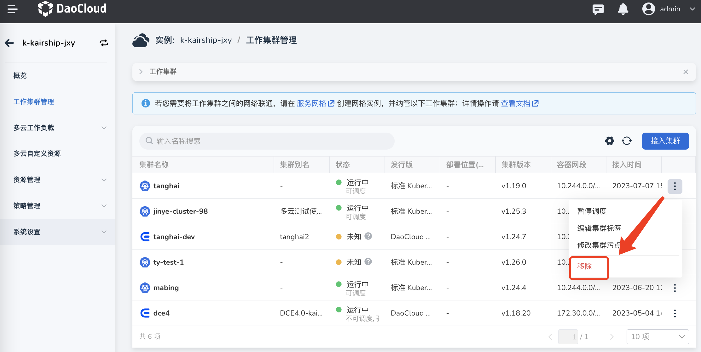

# 管理工作集群

创建多云实例后，需要先接入工作集群。

## 接入集群

1. 点击左侧导航栏的 __工作集群管理__ ，然后在右上角点击 __接入集群__ 。

    若想联通工作集群之间的网络，需在服务网格页面创建网格实例并纳管工作集群，操作详情可参考[多云网络互联](../mspider/user-guide/multicluster/cluster-interconnect.md)。

    

2. 选择想要添加的工作集群，点击 __确认__ 。

    若列表中没有您想添加的目标集群，可进入容器管理模块[接入](../kpanda/user-guide/clusters/integrate-cluster.md)或[创建](../kpanda/user-guide/clusters/create-cluster.md)集群。

    

## 移除集群

1. 在集群右侧点击 __…__ 按钮，在弹出菜单中选择 __移除__ 。

    

2. 在弹窗中输入集群的名称，确认无误后点击 __删除__ 。

    { width="500" }

!!! note

    - 移除工作集群后，该集群工作负载将不再受此多云实例的管辖。
    - 已经分发到此集群的所有多云工作负载将自动迁移到此多云实例管辖的其他工作集群。

## 更多操作

系统会自动返回工作集群列表。在集群右侧点击 __…__ 按钮可以执行 __暂停/恢复调度__ 、 __编辑集群标签__ 、 __修改集群污点__ 等操作。

### 暂停/恢复调度

1. 点击 __暂停调度__ 可以让集群暂停调度，即新的多云资源不会再被分发到该集群。但之前已经分发到该集群的多云资源则不受影响。

2. 此时点击 __修改集群污点__ ，发现集群被自动加上了污点。

    > 若想恢复调度也可以点击 __恢复调度__ ，或者手动去除对应的集群污点。

    

### 修改集群污点

1. 点击 __修改集群污点__ ，可以控制集群可以部署的工作负载、容器等资源。
2. 在弹框内输入污点的键值信息，值可以为空。
3. 下拉选择污点效果，点击 __确定__ 。

    > 支持添加多个污点。目前支持两种污点效果：

    | 效果       | 描述                                                         |
    | ---------- | ------------------------------------------------------------ |
    | NoSchedule | 只有拥有和这个污点相匹配的容忍度的 Node 才能被分配到该集群上 |
    | NoExecute  | 定义驱逐行为以应对集群故障。若污点效果定义为 NoExecute，当工作负载或者 Pod 已经在该集群上运行，则会被驱逐。如果没有在该集群运行，也不会再被调度到该集群上 |

    
