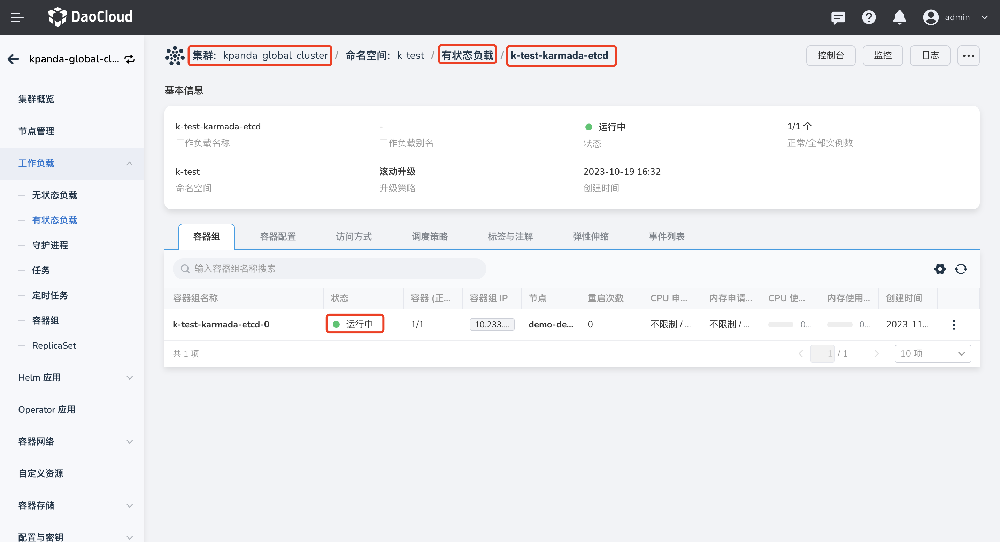
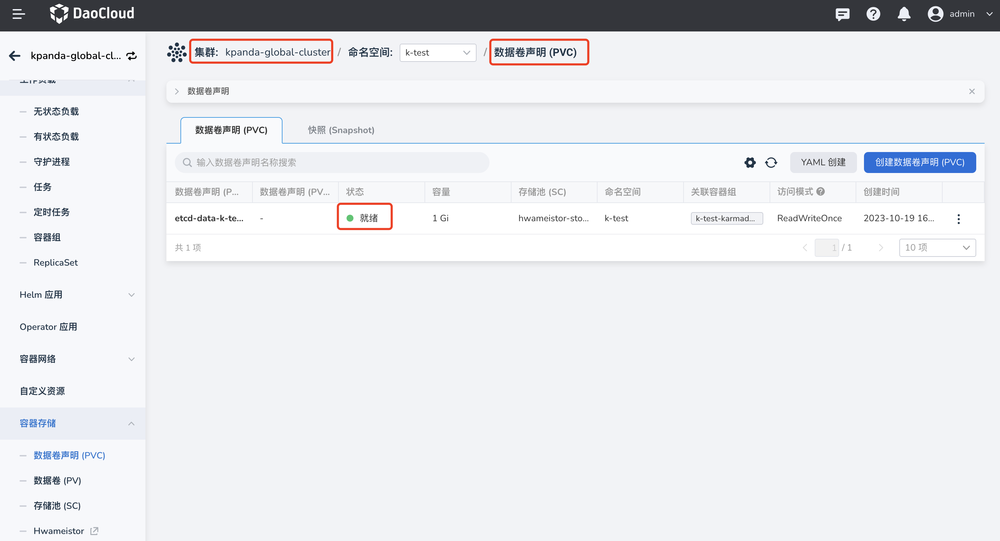

---
hide:
  - toc
---

# 添加实例

在开始使用多云编排模块提供的各种功能之前，必须先添加一个多云实例，通过该实例才能管理各种多云资源。

!!! note

    - 由于 DCE 5.0 多云编排模块借用了开源项目 [Karmada](https://karmada.io/) 的能力，所以创建多云实例时会自动创建一个 Karmada 实例。

    - 新建的多云实例默认位于[全局管理集群](../../kpanda/user-guide/clusters/cluster-role.md)，以虚拟集群的形式存在，用户无感知。
    
    - 为便于和真实集群进行区分，所有多云实例对应的虚拟集群的名称都带有 `k-` 前缀。

添加多云实例的步骤如下：

1. 在多云实例列表中，点击右上角的`添加多云实例`。

    

2. 参考下列信息填写各项配置，最后在右下角点击`确定`。

    - 管理面集群：可选的集群列表来自[容器管理](../../kpanda/intro/index.md)模块中接入或创建的集群。如果没有想选的集群，可以去容器管理模块中[接入](../../kpanda/user-guide/clusters/integrate-cluster.md)或[创建](../../kpanda/user-guide/clusters/create-cluster.md)集群。
    - 实例释放：如果勾选，删除多云实例时会同步删除对应的 Karmada 实例。如果不删除，可以继续通过终端使用，但无法在 DCE 5.0 的多云编排模块内管理该 Karmada 实例。建议同步删除。

        

3. 选择安装多云实例的管理面集群时，选择安装多云实例的管理面集群时，建议使用运行正常并且安装了存储类（SC）的集群并保证对应的存储卷空间充足，否则存在安装失败的风险。若安装失败，可以在对应的管理面集群中查看原因。可根据以下步骤检查问题。

    - 在管理面集群无状态负载中，检查`etcd`的运行状态。

        

    - 检查 PVC 是否为就绪（bound）状态.

        

    - 选择`kairship-system`命名空间下的`kairship-apiserver`无状态负载，进行更新操作。

        

      - 进入更新页面后，修改容器配置-生命周期的启动命令，可根据管理面集群的真实情况更新。

          

    - 如果管理面集群中不存在存储卷声明（PVC），而是使用 hostPath，尽管可以成功安装，但无法实现高可用功能。