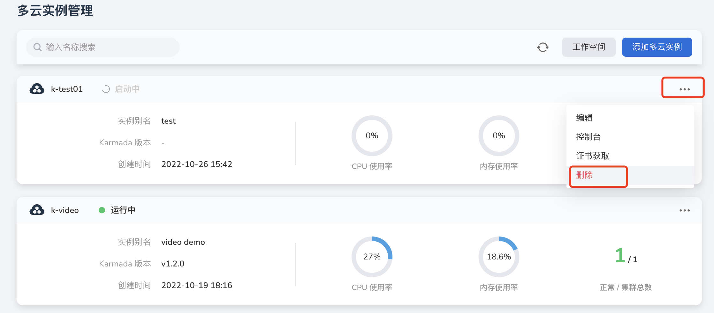
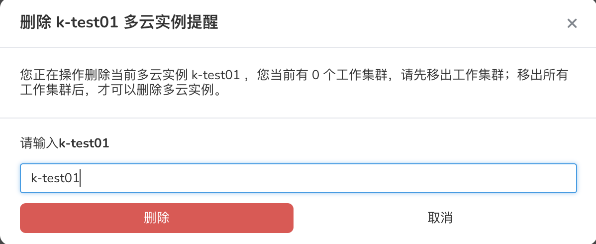

---
hide:
  - toc
---

# 删除实例

如果不再使用某个实例，可以参照以下步骤删除。

1. 在多云实例列表中，点击右侧的 `...` 按钮，在弹出菜单中选择`删除`。

    

2. 在弹窗中输入该实例的名称，确认无误后，点击`删除`按钮。

    

!!! note

    若要删除一个实例，请先删除实例相关的集群、工作负载、服务。实例被删除后，该实例相关的所有信息也会被全部删除，请谨慎操作。

!!! note

    删除时为了保证不会在工作集群中仍余留资源调度，所以我们会限制您必须解除全部工作集群的关联关系；当您解除关联关系后，此时的删除会被视为一个安全的删除动作。
