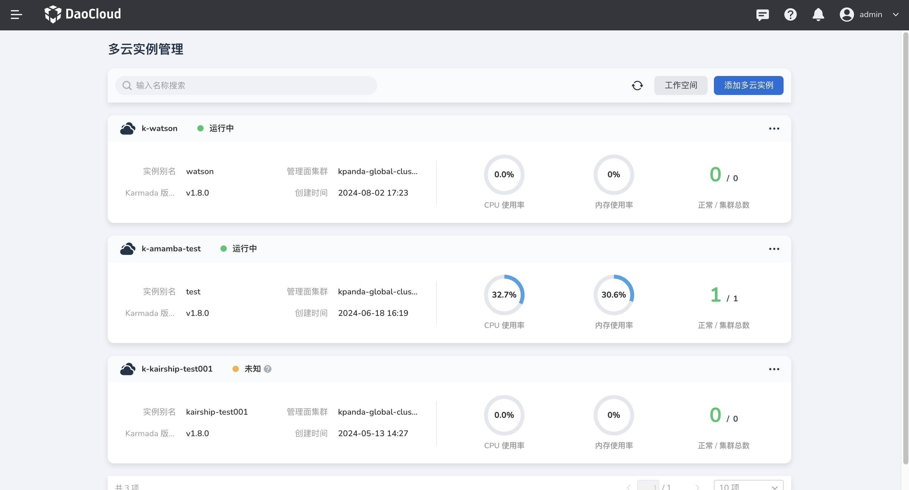
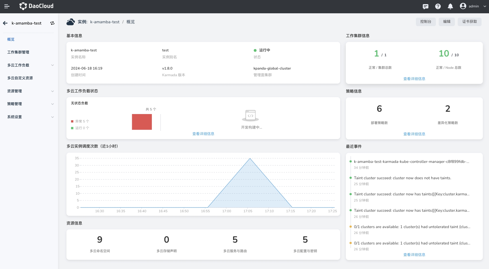
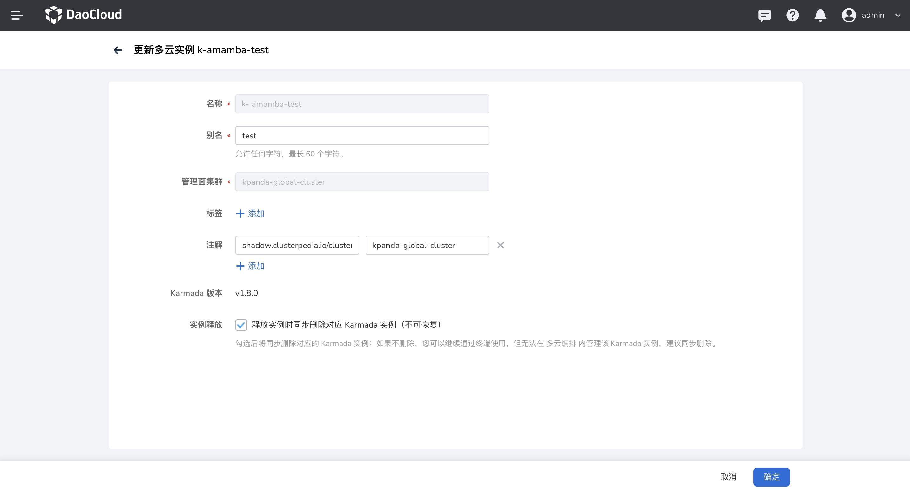
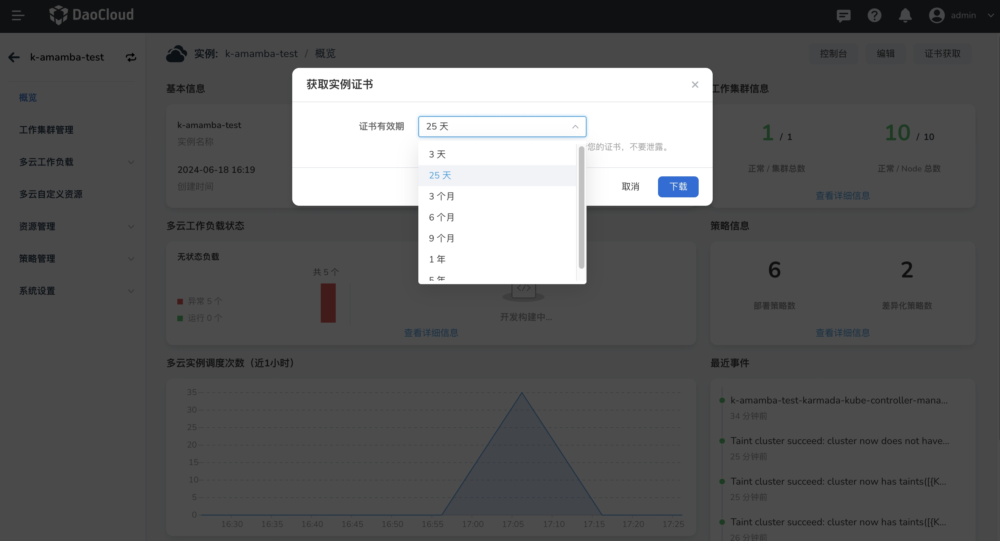

---
hide:
  - toc
---

# 多云实例详情

在 DCE 5.0 多云编排中，你可以方便地查看每个多云实例的详情。

1. 在多云实例列表中，点击某个实例的名称可以进入概览页面。

    

2. 实例概览页面显示了当前实例的基本信息、多云工作负载状态、多云实例调度次数、资源信息、工作集群信息、策略信息、最近事件等。

    

3. 点击概览页面的右上角按钮或者列表的操作栏：支持进入控制台、编辑、证书获取等操作。
   
    - 控制台访问：一键进入多云实例的控制台，让您能够通过命令行直接管理和操作您的实例。
    - 编辑实例：支持更新实例的别名、标签注解，以及设置实例释放时的行为。
    - 证书获取与管理：支持定制证书的有效期，下载后使用该证书能够访问 Kubernetes，需要妥善保管证书，避免泄露。

    

    
