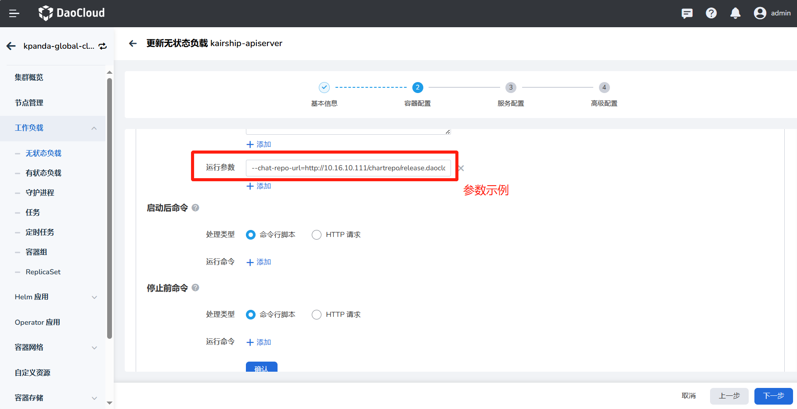

---
hide:
  - toc
---

# 常见问题

1. 多云编排的内核是 [Karmada](https://karmada.io/)，目前支持的 Karmada 版本是多少？能否指定版本？是否可以升级？

    当前默认版本 v1.9.6，支持用户自主升级。

1. 单集群应用如何无缝迁移到多云编排？

    可以使用我们的新功能[一键升级为多云工作负载](../workload/promote.md)。

1. 是否支持跨集群的应用日志收集？

    暂不支持，之后会增加该功能。

1. 分发到多个集群的工作负载，是否可以在一个视图呈现监控信息？

    支持在统一的 UI 上增删改查[多云工作负载](../workload/deployment.md)，了解这些负载被部署到了什么集群，对应的 Service、部署策略等等。

1. 工作负载是否可以跨集群通信？

    支持，参阅[多云网络互联](../../mspider/user-guide/multicluster/cluster-interconnect.md)。

1. Service 能否实现跨集群服务发现？

    支持，参阅[多云网络互联](../../mspider/user-guide/multicluster/cluster-interconnect.md)。

1. 多云编排是否有生产级别支持？

    目前还处于 TP (技术预览) 阶段，尚未达到生产级别的稳定性，很多内部组件高可用有待解决 (多云编排依赖的 etcd 等等)。

1. 如何做到故障转移？

    多云编排原生支持故障转移的功能，在成员集群出现故障的时候，多云编排会进行智能的重调度，完成故障转移。
    可参阅[故障转移介绍](../failover/failover.md)。

1. 多集群的权限问题

    紧密的结合 5.0 现有的[权限体系](../../ghippo/user-guide/access-control/role.md)，与 workspace 打通，完成多云编排实例与 workspaces 的绑定，解决权限问题。

1. 如何查询多集群的事件？

    多云编排完成了产品级别的整合，会展示所有多云编排实例级别的事件。

1. 通过多云编排创建一个多云应用之后，通过容器管理怎么能获取的相关资源信息？

    多云编排 control-plane 本质是一个完整 kubernetes 控制面，只是没有任何承载 workload 的节点。
    因此多云编排在创建多云编排实例的时候，采用了一个取巧的动作，会把实例本身作为一个隐藏的 cluster 加入到容器管理中（不在容器管理中显示）。
    这样就可以完全借助容器管理的能力（搜集加速检索各个 K8s 集群的资源、CRD 等），当在界面中查询某个多云编排实例的资源
    （Deployment、PropagationPolicy、OverridePolicy 等）就可以直接通过容器管理进行检索，做到读写分离，加快响应时间。

1. 如何自定义 __Karmada__ 镜像来源仓库地址？

    多云编排采用开源的 __karmada-operator__ 进行多实例 LCM 管理；
    Operator 提供了丰富的自定义能力。支持在启动参数中自定义 Karmada 资源镜像的仓库地址。

    可以在容器启动命令中增加 __--chat-repo-url__ 参数进行指定

    

1. 如何连接多云集群？

    可以在实例列表页面，点击右侧的 **...** ，在弹出菜单中选择 __控制台__ ，通过命令行连接多云控制平面。

1. 是否可以仅删除多云实例，但是不删除多云编排的组件？

    可以，创建多云实例时，可以选择选择是否勾选实例释放功能。若勾选将同步删除对应的多云实例；
    如果不删除，则可以继续通过终端使用，但无法在多云编排内管理该多云实例，建议同步删除。

1. 多云实例内多个工作集群如何实现网络互通？

    需要在 __服务网格__ 创建网格实例，并且纳管每个工作集群，
    具体操作可参考[多云网络互联](../../mspider/user-guide/multicluster/cluster-interconnect.md)。
