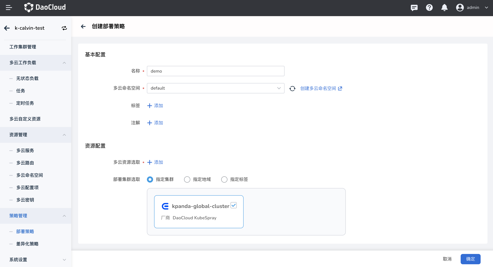
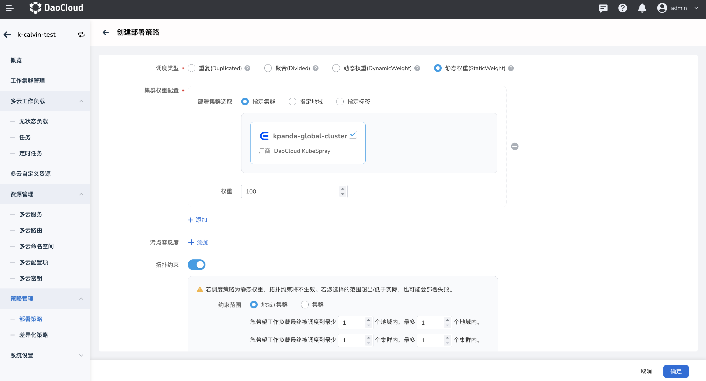

# 部署策略

多云编排支持在界面上查看当前实例的部署策略列表及其关联的多云资源，支持以 YAML 和表单的方式创建和编辑部署策略信息，仅对空闲的部署策略提供删除按钮。

部署策略定义了在多云多集群中如何分发资源。部署策略 (PropagationPolicy)分为命名空间级别和集群级别。

- 命名空间级别部署策略（PropagationPolicy ）表示将一组资源传播到一个或多个成员集群的策略， 只能在自己的命名空间传播资源。
- 集群级别部署策略（ClusterPropagationPolicy） 表示将一组资源传播到一个或多个成员集群的集群范围策略， 能够传播集群级别的资源和系统保留名称空间以外的任何名称空间中的资源。

## YAML 创建

1. 进入某一个多云实例后，在左侧导航栏中，点击`策略管理` -> `部署策略`->`命名空间级别`，点击右上角的 `YAML 创建`按钮。

    

2. 在 `YAML 创建`页面中，输入正确的 YAML 语句后，点击`确定`。

    

3. 返回部署策略列表，新创建的默认位于第一个。点击列表右侧的 `⋮`，可以编辑 YAML 和执行删除操作。

## YAML 示例

此处列出一个部署策略的 YAML 示例，您稍加修改就可以使用。

```yaml title="YAML example"
kind: PropagationPolicy
apiVersion: policy.karmada.io/v1alpha1
metadata:
  name: nginx-propagation
  namespace: default
  uid: 2190e122-a6b0-4994-80e6-5c03a9d1d3a4
  resourceVersion: '24258'
  generation: 1
  creationTimestamp: '2022-09-15T10:04:20Z'
  annotations:
    shadow.clusterpedia.io/cluster-name: k-kairshiptest
spec:
  resourceSelectors:
    - apiVersion: apps/v1
      kind: Deployment
      namespace: default
      name: nginx
  placement:
    clusterAffinity:
      clusterNames:
        - skoala-dev
    clusterTolerations:
      - key: cluster.karmada.io/not-ready
        operator: Exists
        effect: NoExecute
        tolerationSeconds: 300
      - key: cluster.karmada.io/unreachable
        operator: Exists
        effect: NoExecute
        tolerationSeconds: 300
```

## 表单创建

1. 参照以下步骤创建一个部署策略。

    - 基本配置：填写名称、选择多云命名空间，增加标签注解
    - 配置资源：选择多云资源和目标部署集群
    - 部署策略：调度类型、污点容忍度、可以选择是否开启拓扑约束（可参考创建工作负载文档）、支持填写优先级（创建资源时也可以同时创建部署策略，当在本页面也创建了部署策略时，可以根据优先级的高低来判断该资源使用哪个部署策略）
      - 调度类型相比「创建工作负载」新增静态权重(StaticWeight):按照用户定义的权重比例进行调度。

    

    

2. 表单创建集群级别的部署策略，不需要选择命名空间。

    

    !!! note

        若要删除一个部署策略，需要先移除该策略相关的工作负载，删除之后该策略有关的信息都将被删除，请谨慎操作。
