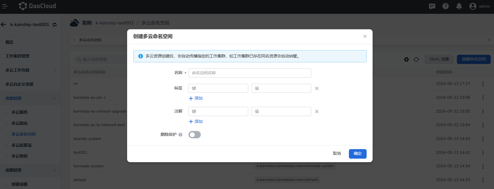
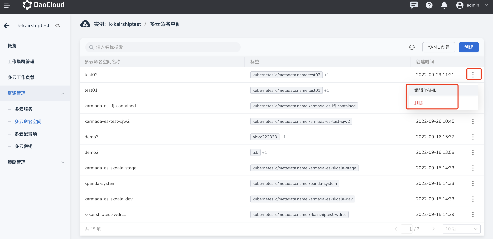

---
hide:
  - toc
---

# 多云命名空间

多云命名空间可以跨云、跨集群管理工作负载。目前提供了基于向导创建的方式。

本文以向导创建为例，参照以下步骤操作。

1. 进入某一个多云实例后，在左侧导航栏中，点击 __资源管理__ -> __多云命名空间__ ，点击右上角的 __创建__ 按钮。

    

2. 在 __创建多云命名空间__ 页面中，输入名称，添加标签与注解后，点击 __确定__ 。

    

3. 返回多云命名空间列表，新创建的默认位于第一个。点击列表右侧的 __⋮__ ，可以执行编辑 YAML、查看事件、更新和删除命名空间等操作。

    

    !!! note

        若要删除一个命名空间，需要先移除该命名空间下的所有工作负载，删除之后命名空间内的工作负载和服务都会受到影响，请谨慎操作。
