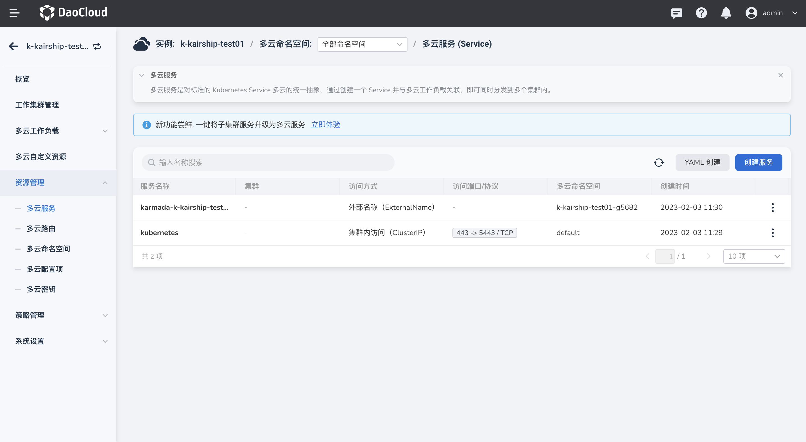

---
hide:
  - toc
---

# 多云服务

多云服务是运行在一组 Pod 上的应用，对外暴露为一个一个的网络服务。
使用 DCE 多云编排模块，您无需修改应用即可使用不熟悉的服务发现机制。
DCE 为运行服务的 Pod 提供了 IP 地址，并为一组 Pod 提供相同的 DNS 名称，可以在这些 Pod 之间进行负载均衡。

参照以下步骤管理多云服务。

1. 进入某一个多云实例后，在左侧导航栏中，点击`资源管理` -> `多云服务`，点击右上角的`创建服务`按钮。

    

2. 在`创建多云服务`页面中，配置访问类型、部署位置、端口配置等信息后，点击`确定`。部署位置分为从多云工作负载选取/指定集群/指定地域/指定标签四种方式，后三种可参考工作负载中的详细介绍，此处新增从工作负载中选取，即继承所选工作负载中的部署策略（pp）。

    

3. 支持一键将子集群服务转换为多云服务，点击列表页的`立即转换`，选择指定工作集群和命名空间下的服务，点击确定。

    

4. 此时查看多云服务列表，发现子集群服务升级成功。

    

5. 点击列表右侧的 `⋮`，可以更新和删除该服务。

    

    !!! note

        如果一个服务被删除，该服务相关的信息也将消失，请谨慎操作。

## YAML 示例

此处列出一个多云服务的 YAML 示例，您稍加修改就可以使用。

```yaml
kind: Service
apiVersion: v1
metadata:
  name: kubernetes
  namespace: default
  uid: a23a0616-789e-469f-88f5-07eb67d460dc
  resourceVersion: '190'
  creationTimestamp: '2023-04-13T10:11:19Z'
  labels:
    component: apiserver
    provider: kubernetes
  annotations:
    shadow.clusterpedia.io/cluster-name: k-kairship-jxy
spec:
  ports:
    - name: https
      protocol: TCP
      port: 443
      targetPort: 5443
  clusterIP: 10.96.0.1
  clusterIPs:
    - 10.96.0.1
  type: ClusterIP
  sessionAffinity: None
  ipFamilies:
    - IPv4
  ipFamilyPolicy: SingleStack
  internalTrafficPolicy: Cluster
status:
  loadBalancer: {}
```
