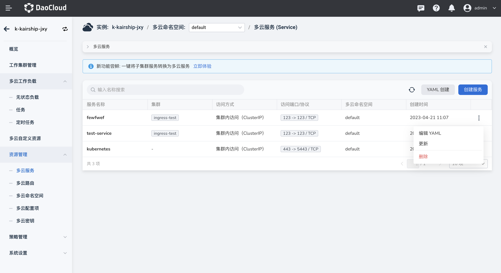

# 更新多云服务

目前提供了两种更新方式：编辑 YAML 和表单更新。

1. 进入某一个多云实例后，在左侧导航栏中，点击`资源管理` -> `多云服务`，点击`⋮`可以表单更新服务。

    

2. 在`编辑 YAML`弹窗中，修改 YAML 信息，点击`确定`则更新了。

    

3. 点击`更新`，可以通过表单方式更新服务，访问类型、名称、多云命名空间都无法更新。

    

4. 完成需要修改的内容后点击`确定`，更新成功。
