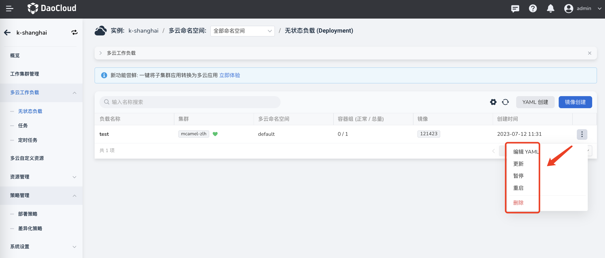

# 创建多云工作负载

在多云实例中[接入工作集群](../cluster.md#_2)后，即可创建多云工作负载或者将单集群中的工作负载一键转换为多云工作负载。

- 支持将一个工作负载分发到不同区域、不同可用区内的不同集群，支持分发到混合云集群中。
- 支持创建多云无状态工作负载、多云任务和多云定时任务。
- 支持通过镜像创建或通过 YAML 文件快速创建。

## 前提条件

- [创建多云实例](../instance/add.md)
- 在多云实例中[添加至少一个工作集群](../cluster.md#_2)
- 如需通过地域、可用区、标签筛选工作负载的部署集群，则需要事先为集群添加地域、可用区、标签信息

## 操作步骤

参照以下步骤创建一个多云无状态负载（Deployment）。

1. 点击多云实例的名称，然后在左侧导航栏点击`多云工作负载`，接着在右上角点击`镜像创建`。

    

2. 参考以下说明填写基本信息。

    - 指定集群：勾选具体的集群直接指定多云工作负载的部署集群。

        

    - 指定区域：根据集群的厂商/地域/可用区筛选部署集群，可同时勾选三个筛选条件

        - `排除以下集群`：从筛选结果中剔除某个集群，不会将工作负载部署到被排除的集群。若
        - `集群污点容忍度`：在[工作集群管理页面为集群添加污点](../cluster.md#_6)后，带有该污点的资源就无法调度到该集群上。在此处开启污点容忍后，即可允许带有对应污点的资源调度到所选集群。
        - `动态区域选择`：动态地将工作负载部署到不同区域中的集群，实现跨区域高可用。<!--产品明确设计后替换为更准确的描述。换言之，此项设置的功能在于，控制工作负载所在的集群至少/最多分布在几个区域/可用区。例如，最大数和最小数均为 1 时表示，将所有工作负载都部署到 **同一区域/可用区** 下的集群-->

            

    - 指定标签：通过标签选择将工作负载部署到哪些集群

        - 支持添加一条或者多条集群标签
        - 操作符——`In`：节点必须包含所选的标签，并且该标签的取值必须 **属于** 某个取值集合。多个值用 `；` 隔开
        - 操作符——`Exists`：节点包含某个标签即可，不关注标签的具体取值

            

    - 自动传播：开启后，自动检测多云工作负载配置依赖的 ConfigMap 与 Secret 等资源，并将这些资源自动分发到所选的每个部署集群。
    - 实例数：设置多云工作负载的副本数
    - 调度策略-`重复`：在每个所选集群中重复部署`实例数`字段设定的副本数，`总副本数 = 实例数 ✖️ 部署集群数`
    - 调度策略-`聚合`：将`实例数`字段设定的副本数分发到尽可能少的集群中。`总副本数 = 实例数`
    - 调度策略-`动态权重`：根据所有目标集群实时可调度的最大实例数，将工作负载动态调度到不同的部署集群中。`总副本数 = 实例数`

        

    !!! note

        - 如果找不到目标的部署集群，可减少筛选条件或者[添加新的工作集群](../cluster.md#_2)
        - 设置`实例数`和`调度策略`后，会在`调度策略`下方提示最终部署的总副本数

3. 参考[容器配置](../../kpanda/user-guide/workloads/create-deployment.md#_4)填写容器配置信息。

4. 参考[高级配置](../../kpanda/user-guide/workloads/create-deployment.md#_6)填写高级配置。

    !!! note

        - 如无需添加差异化配置，则直接在右下角点击`确定`即可完成创建多云工作负载。
        - 如需要添加差异化配置，则点击`下一步`并继续参考下方文档填写配置信息。

5. 参考以下说明填写差异化配置，最后点击`确定`。

    - 默认配置：即前述步骤中填写的通用配置，在此处不可修改。
    - 如需修改默认配置，需要在页面底部点击`上一步`返回对应的配置环境重新填写信息。
    - 在默认配置下方点击 `➕` 号并选择集群，即可为所选集群设置不同于其他集群的差异化配置。
    - 未设置差异化配置的集群，沿用默认配置。
    - 目前支持为不同集群配置不同的容器镜像、环境变量、标签、注解。

        

页面会自动返回多云无状态负载列表，点击右侧的更多操作按钮，可以编辑工作负载的 YAML、更新/暂停/重启/删除工作负载。

[下一步：创建多云服务](../resource/service.md){ .md-button .md-button--primary }
