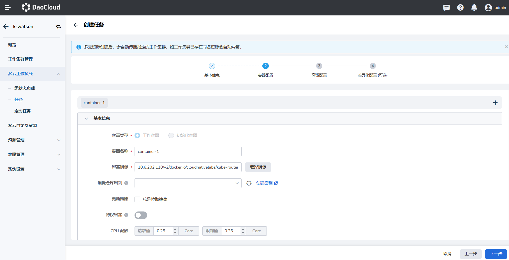
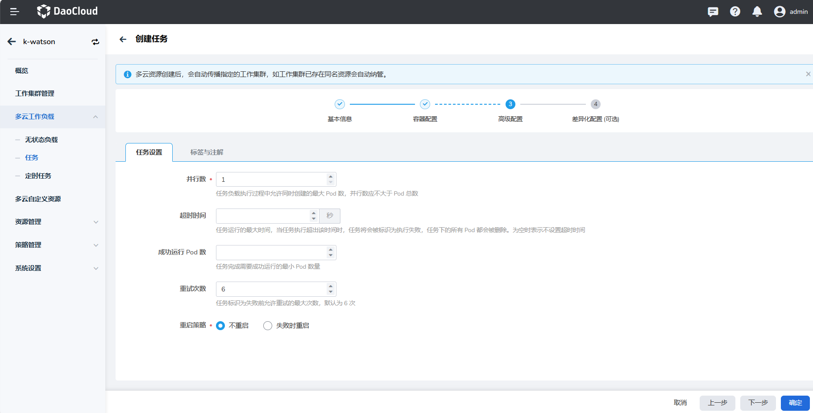
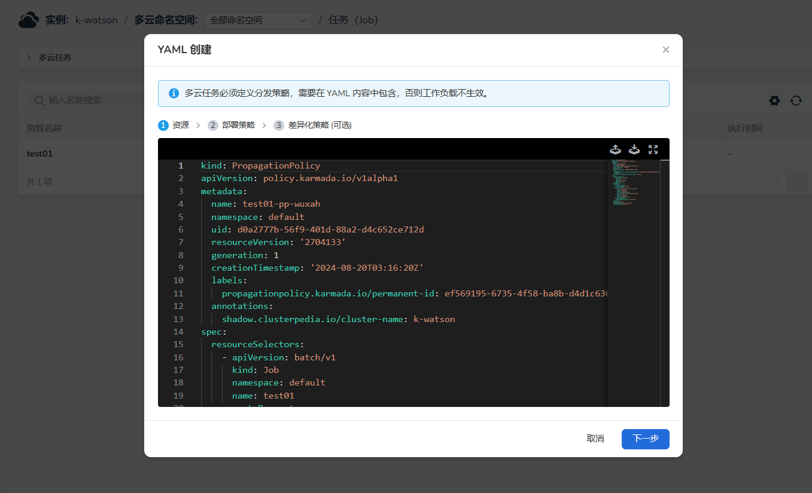

---
hide:
  - toc
---

# 多云任务

目前支持两种方式创建多云任务：镜像创建和 YAML 创建。

## 镜像创建

1. 在左侧导航栏中，点击 __多云工作负载__ ，进入任务页面，点击右上角的 __镜像创建__ 按钮。

    

1. 在 __创建任务__ 页面中，配置负载的基本信息后，点击 __下一步__ 。

    

    - 负载名称：最多包含 63 个字符，只能包含小写字母、数字及分隔符（“-”），且必须以小写字母或数字开头及结尾。同一命名空间内同一类型工作负载的名称不得重复，而且负载名称在工作负载创建好之后不可更改。
    - 多云命名空间：选择将新建的任务部署在哪个命名空间，默认使用 default 命名空间。找不到所需的命名空间时可以根据页面提示去创建新的。
    - 部署集群：提供三种选择的方式，决定工作负载将会部署在哪些集群上。
    - 实例数：输入工作负载的 Pod 实例数量。默认创建 1 个 Pod 实例。
    - 调度策略：提供三种选择方式，决定将工作负载的实例以哪种方式进行分配。
    - 描述：输入工作负载的描述信息，内容自定义。字符数量应不超过 512 个。

    部署集群分为三种方式：

    - 指定集群：通过选择集群名称来指定集群
    - 指定地域：通过选择厂商、地域、可用区来指定集群
    - 指定标签：通过添加指标来指定集群
    - 还可以在高级部署策略中选择排除集群/设置集群污点容忍度/动态区域选择，最终会在底部展示预计会被调度到哪些集群上。

    调度策略分为三种方式

    - 重复：在所选的所有集群内分别调度相同的实例数
    - 聚合：将实例总数尽可能少的调度在所选择的所有集群中
    - 动态权重：根据所选择的所有集群实时的可调度最大实例数，等比例运行所填实例总数

1. 在 __容器配置__ 页面中，配置负载所在容器的基本信息，可选择配置生命周期、健康检查等信息，然后点击 __下一步__ 。

    

1. 在 __高级配置__ 页面中，可以配置任务设置和标签与注解。

    

    任务设置需要包括以下数据：

    - 并行数：任务执行过程中允许同时创建的最大 Pod 数，并行数应不大于 Pod 总数。默认为 1。
    - 超时时间：超出该时间时，任务会被标识为执行失败，任务下的所有 Pod 都会被删除。为空时表示不设置超时时间。
    - 成功运行 Pod 数：任务完成需要成功运行的最小 Pod 数量。
    - 重试次数：任务标识为失败前允许重试的最大次数，默认为 6 次。
    - 重启策略：设置失败时是否重启 Pod。

    如果您在创建完成后，无需配置差异化时，则可以直接使用 __确认__ 完成多云任务的创建。

1. 在 __差异化配置__ 页面中，选择个性化的容器配置、标签和注解后，点击 __确定__ 。

    

    您可以在左侧列表区域增加对应的差异化配置项，当您新增一个差异化配置项之后，需要指定对应的集群。
    集群的可选择范围仅为刚开始选择的集群，被选择的集群则会使用指定的差异化配置；未被指定的集群仍旧使用默认配置

!!! note

    - 通过镜像创建多云工作负载时，如果需要采用指定位置、指定标签的高级能力进行创建时，需要确保工作集群已设定对应的位置或者标签；
    增加标签需要在单个集群内增加，可由工作集群管理列表跳转到对应的集群维护。
    - 配置副本数时，需要关注对应的调度策略，仅重复时会在多个集群中全部启动配置的副本数。

## YAML 创建

1. 在左侧导航栏中，点击 __多云工作负载__ ，进入任务页面，点击右上角的 __YAML 创建__ 按钮。

    

2. 输入或导入资源的 YAML 文件，点击 __确定__ 。

    

### YAML 示例

此处列出一个多云任务的 YAML 示例，您稍加修改就可以使用。

```yaml
kind: Job
apiVersion: batch/v1
metadata:
  name: test01
  namespace: default
  uid: 37b438e1-78b6-407f-ab96-3db5934b8935
  resourceVersion: '2704134'
  generation: 1
  creationTimestamp: '2024-08-20T03:16:19Z'
  labels:
    app: test01
    controller-uid: 37b438e1-78b6-407f-ab96-3db5934b8935
    job-name: test01
    propagationpolicy.karmada.io/name: test01-pp-wuxah
    propagationpolicy.karmada.io/namespace: default
    propagationpolicy.karmada.io/permanent-id: ef569195-6735-4f58-ba8b-d4d1c6363d47
  annotations:
    batch.kubernetes.io/job-tracking: ''
    propagationpolicy.karmada.io/name: test01-pp-wuxah
    propagationpolicy.karmada.io/namespace: default
    shadow.clusterpedia.io/cluster-name: k-watson
spec:
  parallelism: 1
  backoffLimit: 6
  selector:
    matchLabels:
      controller-uid: 37b438e1-78b6-407f-ab96-3db5934b8935
  template:
    metadata:
      creationTimestamp: null
      labels:
        app: test01
        controller-uid: 37b438e1-78b6-407f-ab96-3db5934b8935
        job-name: test01
    spec:
      containers:
        - name: container-1
          image: 10.6.202.110/v2/docker.io/cloudnativelabs/kube-router:v1.6.0
          resources:
            limits:
              cpu: 250m
              memory: 512Mi
            requests:
              cpu: 250m
              memory: 512Mi
          lifecycle: {}
          terminationMessagePath: /dev/termination-log
          terminationMessagePolicy: File
          imagePullPolicy: IfNotPresent
          securityContext:
            privileged: false
      restartPolicy: Never
      terminationGracePeriodSeconds: 30
      dnsPolicy: ClusterFirst
      securityContext: {}
      schedulerName: default-scheduler
  completionMode: NonIndexed
  suspend: false
status: {}
```
