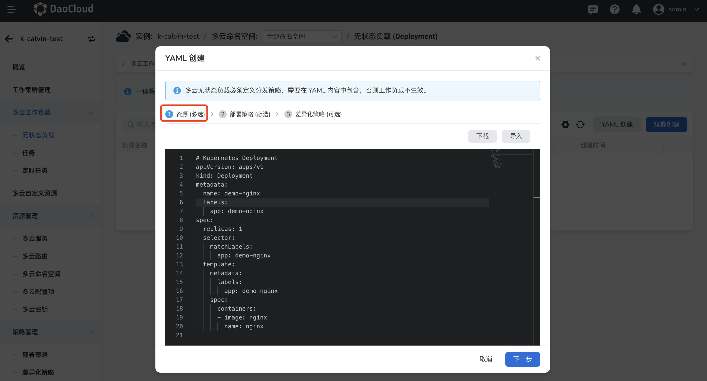
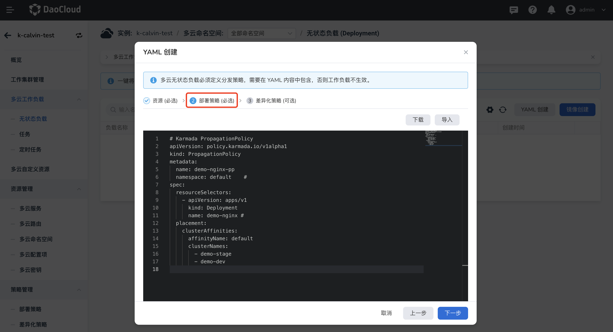
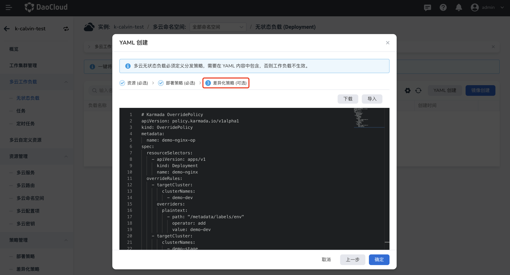

# 通过 YAML 创建多云 Deployment

支持通过镜像和 YAML 文件两种方式创建多云无状态负载（Deployment）。您可以根据实际情况选择适合自己的创建方式。

- 镜像创建通过表单填写各项配置，通俗易懂、简单易用，但步骤较为繁琐。
- YAML 创建通过 YAML 文件配置各项信息，操作步骤更少、效率更高，但要求操作者掌握一定的后端技术知识。

本文介绍如何通过 YAML 创建多云 Deployment。如需了解镜像创建方式，可参考[通过镜像创建多云 Deployment](deployment.md)。

## 前提条件

- [创建多云实例](../instance/add.md)
- 在多云实例中[添加至少一个工作集群](../cluster.md#_2)

## 操作步骤

1. 在左侧导航栏中，点击`多云工作负载`->`无状态负载`，然后在右上角点击 `YAML 创建`。

    

2. 输入或导入资源的 YAML 文件，支持同时填写工作负载相关联的配置项、密钥信息，然后点击`下一步`。

    > 点击`下载`可以将当前的 YAML 文件下载并保存到本地，便于后续在其他场景中使用。

    

3. 输入或导入部署策略的 YAML 文件，然后点击`下一步`。

    

4. 输入或导入差异化策略的 YAML 文件，然后点击`确定`。

    !!! note

        差异化策略为可选配置。如无需差异化配置，则不用在此输入任何内容，直接点击`确定`即可。

    

页面会自动返回多云工作负载列表，点击列表右侧的 `⋮`，可以编辑修改 YAML，还可以暂停、重启和删除该负载。


## YAML 文件示例

多云编排模块自带的 YAML 编辑器中会自动检测 YAML 语法。如有错误，会用红色波浪线标记错误点。

下面提供一些常用的 YAML 文件示例，您稍加修改就可以使用。

### Deployment 示例

```yaml
# Kubernetes Deployment
apiVersion: apps/v1
kind: Deployment
metadata:
  name: demo-nginx
  labels:
    app: demo-nginx
spec:
  replicas: 1
  selector:
    matchLabels:
      app: demo-nginx
  template:
    metadata:
      labels:
        app: demo-nginx
    spec:
      containers:
      - image: nginx
        name: nginx
```

### 部署策略示例

```yaml
# Karmada PropagationPolicy
apiVersion: policy.karmada.io/v1alpha1
kind: PropagationPolicy
metadata:
  name: demo-nginx-pp
  namespace: default    # (1)
spec:
  resourceSelectors:
    - apiVersion: apps/v1
      kind: Deployment
      name: demo-nginx # (2)
  placement:
    clusterAffinities:
      affinityName: default
      clusterNames:
        - demo-stage
        - demo-dev
```

1. The default namespace is `default`.
2. If no namespace is specified, the namespace is inherited from the parent object scope.

### 差异化策略示例

```yaml
# Karmada OverridePolicy
apiVersion: policy.karmada.io/v1alpha1
kind: OverridePolicy
metadata:
  name: demo-nginx-op
spec:
  resourceSelectors:
    - apiVersion: apps/v1
      kind: Deployment
      name: demo-nginx
  overrideRules:
    - targetCluster:
        clusterNames:
          - demo-dev
      overriders:
        plaintext:
          - path: "/metadata/labels/env"
            operator: add
            value: demo-dev
    - targetCluster:
        clusterNames:
          - demo-stage
      overriders:
        plaintext:
          - path: "/metadata/labels/env"
            operator: add
            value: demo-stage
```
