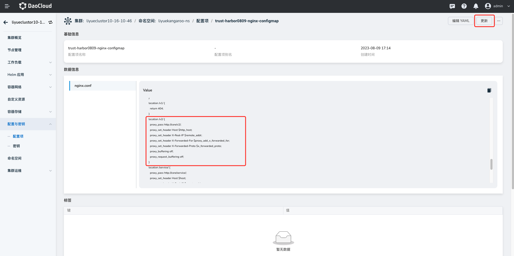

# Harbor Nginx 配置最佳实践

Harbor 内部涉及到 portal 和 core 两个服务对外暴露功能，并且控制流和数据流都经过 Nginx 组件，
如果 Nginx 配置不合理就会出现镜像拉取失败、Helm repo 添加或者更新失败。


## 场景一：504 Gateway Timeout 报错

假如服务出现超时，有两种可能：第一种，本身很耗时，比如拉取大镜像；第二种，可能服务所在机器负载太高，响应很慢。

### pull/push 大镜像

Nginx proxy 后端服务默认超时时间是 60s，镜像 Pull 或者 Push 都需要经过 Nginx。
如果遇到大镜像（比如机器学习类的）push 或者 pull 时间很长，则很容易触发超时时间。
此时需要根据服务性能、网络情况来修复这个超时时间，可以在 ConfigMap 中增加下面两条 proxy 后重启 Pod 来解决，如将超时时间改为 15min。

举例：

1. 在创建托管 harbor 的场景中，使用 Helm 模板部署 ingress-nginx。
   可以在 `容器管理` -> `集群详情` -> `配置项` 中搜索找到 nginx-config。

    

2. 进入详情，通过`更新`按钮，在如下位置增加 proxy 配置，将超时时间修改为 900s（15min），保存后需要重启 Pod。

    

3. proxy 配置 demo。

    ```nginx
    location /v2/ {
        proxy_send_timeout 900;
        proxy_read_timeout 900;
        }
    ```

### 服务所在机器负载太高

需要排查负载高的原因，再针对问题进行解决。

## 场景二：helm repo 操作失败

原因：Chartmuseum 服务针对每个 repo 有一个 `index-cache.yaml` 的文件，这个文件记录了这个仓库中所有 Helm Chart 的信息。
假如达到了上万个 Helm Chart，会导致 `index-cache.yaml` 膨胀到几十 MB，在执行 `helm repo add/update` 时由于文件字节过大导致拉取这个文件失败。

解决办法：

- 增加超时时间和开启 gzip 压缩功能
- 设置 gzip_types 类型只针对固定类型进行压缩
- 设置 gzip_min_length 在小于长度时不进行压缩

举例：

1. 在创建托管 harbor 的场景中，使用 Helm 模板部署 ingress-nginx。
   可以在 `容器管理` -> `集群详情` -> `配置项` 中搜索找到 nginx-config。

    

2. 进入 config 详情，通过`更新`按钮，在如下位置增加 proxy 配置，保存后需要重启 Pod。

    

3. 通过 Proxy 配置 demo：

    ```nginx
    location /chartrepo/ {
        proxy_send_timeout 900;
        proxy_read_timeout 900;
        gzip on;
        gzip_min_length 1000;
        gzip_proxied expired no-cache no-store private auth;
        gzip_types text/plain text/css application/json application/javascript application/x-javascript text/xml application/xml application/xml+rss text/javascript application/x-yaml text/x-yaml;
        }
    ```
