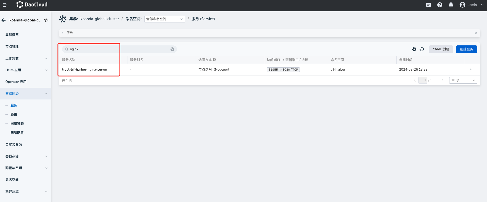

# 通过 LoadBalancer 模式部署 Harbor

目前 DCE 5.0 镜像仓库暂不支持使用 LoadBalancer 方式部署 Harbor，仅支持使用 Ingress 和 NodePort 方式。
本文简要说明如何手工修改访问类型为 LB。

## 1. 创建 NodePort 的 Harbor 服务

首先[创建托管 Harbor](../managed/harbor.md)，创建一个访问方式为 NodePort 的 Harbor 服务。


## 2. 创建 LoadBalancer 类型的 svc 资源

在 Harbor 所在集群的 **容器网络** -> **服务** 创建一个 LB 类型的 svc 资源。

!!! note

    创建 LB 类型的 svc 资源时，标签需要和 nginx svc 的 label 保持一致，且需要创建在同一个命名空间内。

Harbor 服务创建成功之后，Harbor 所在集群的 **容器网络** -> **服务** 会自动出现 nginx 的 svc 资源。
在服务列表中，点击右侧的 **⋮** 按钮，在弹出菜单中选择 **更新** ，可查看 nginx 的 label 信息。




## 3. 修改 harborclusters.goharbor.io CR

修改 harborclusters.goharbor.io 这个 CR 的 externalUrl 字段，改为 LB 的 IP 即可。

### 通过 UI 修改

1. 在自定义资源列表，搜索 harborclusters.goharbor.io

    

2. 点击名称进入详情，选择 API 版本为 **v1beta1** ，修改 API 版本之后保存。

   

### 通过命令行修改

在对应集群中运行以下命令：

```bash
kubectl edit harborclusters.goharbor.io
```
