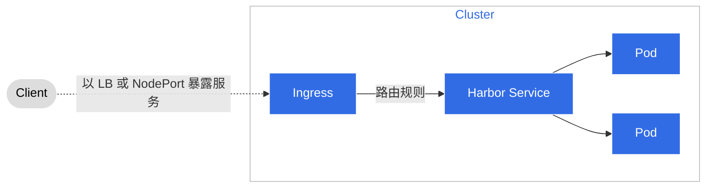
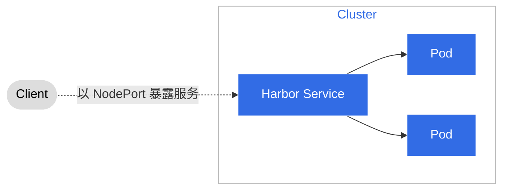

# 托管 Harbor 应该选择什么访问类型

在创建`托管 Harbor` 时，需要选择访问类型。目前支持两种类型：Ingress 和 NodePort。
下表说明了这两种访问类型的优缺点；

<table>
  <tr>
    <th></th>
    <th>Ingress</th>
    <th>NodePort</th>
  </tr>
  <tr>
    <td>优点</td>
    <td>
      <ol>
        <li>使用 Ingress 方便管理和使用，域名易记住，服务易迁移。</li>
        <li>支持上传 HTTPS 证书，可以实现拉镜像不用配置非安全仓库。</li>
      </ol>
    </td>
    <td>
      <ol>
        <li>不依赖任何组件，可快速启动服务进行 Demo 和试用。</li>
        <li>NodePort 性能较高，没有额外的路由处理。</li>
      </ol>
    </td>
  </tr>
  <tr>
    <td>缺点</td>
    <td>
      <ol>
        <li>在私有网络环境需要配合 DNS 服务做域名解析，需要依赖基础网络设施。</li>
        <li>Ingress 会对性能产生一定的损失，因为需要进行额外的路由处理。</li>
      </ol>
    </td>
    <td>
      <ol>
        <li>管理不便，IP 和某一台宿主机强绑定，并且镜像地址变得不可迁移；</li>
        <li>只能使用自签证书，在拉取镜像时需要配置非安全仓库。</li>
      </ol>
    </td>
  </tr>
</table>

!!! tip

    - 在 **生产环境** 中，建议使用 Ingress 方式，因为 Ingress 可以使用 HTTPS 协议，
      可以使用自签证书或者购买证书，这样可以避免在拉取镜像时需要配置非安全仓库的问题。
    - 在 **测试环境** 中，建议使用 NodePort 方式，因为NodePort方式不依赖任何组件，
      可快速启动服务进行 Demo 和试用。

## Ingress

**前提条件：**

- 集群必须安装 Ingress 组件，Ingress 组件可以是 Nginx、Traefik、HAProxy 等，具体安装方法请参考
  [Ingress](../../network/modules/ingress-nginx/index.md)。
- 集群必须安装 DNS 服务，DNS 服务可以是 CoreDNS、KubeDNS、Bind 等，具体安装方法请参考
  [DNS](https://kubernetes.io/zh-cn/docs/concepts/services-networking/dns-pod-service/)。
- 集群必须安装 LoadBalancer 组件，LoadBalancer 组件可以是 MetalLB、F5、Nginx 等，具体安装方法请参考
  [LoadBalancer](../../network/modules/metallb/index.md)。

**Ingress 流程**

Ingress 可以从集群外部暴露 HTTP 和 HTTPS 路由到集群内部的服务，流量路由由 Ingress 资源上定义的规则控制。
在托管 Harbor 中 Ingress 使用流程如下图所示。



对于 **私有云** ，使用 Ingress 部署完托管 Harbor 之后，需要在 DNS 服务中添加域名解析，
将域名解析到 LoadBalancer 的 IP 地址上，这样用户就可以通过域名访问 Harbor 了；
添加 DNS 域名解析需要在 Kubernetes 集群内和 Kubernetes 集群外分别进行操作，具体操作步骤如下：

### 在 Kubernetes 集群内添加 DNS 域名解析

在 Kubernetes 集群内，需要在 CoreDNS 组件中添加 DNS 域名解析，具体操作步骤如下：

1. 进入 CoreDNS 组件的 ConfigMap 中，执行如下命令：

    ```bash
    kubectl -n kube-system edit configmap coredns
    ```

2. 进入 CoreDNS 组件的 Configmap 中后，执行如下命令，将 `harbor.example.com` 解析到 LoadBalancer 的 IP 地址上：

    ```text
    hosts {
      10.1.1.1 harbor.example.com
      fallthrough
    }
    ```

    !!! note

        `harbor.example.com` 为用户自定义的域名，LoadBalancer 的 IP 地址为 Ingress 的 IP 地址。

3. 保存退出，会重新创建 CoreDNS Pod：

    ```bash
    kubectl get pod -n kube-system coredns-5c98db65d4-2t2l2
    ```

### 在 Kubernetes 集群外添加 DNS 域名解析

在集群外也是通过单独部署一个 CoreDNS 组件来实现 DNS 域名解析，然后配置域名。参照上述第 2 步。

**如果用户的域名是公网域名，那就不需要做上述步骤，公网域名能被解析。**

## NodePort

NodePort 是一种访问 Kubernetes 集群中 Service 的方法，它会在每个 Node 上打开一个端口，
该端口会将流量转发到 Service 的端口上。NodePort 使用流程如下图所示。


