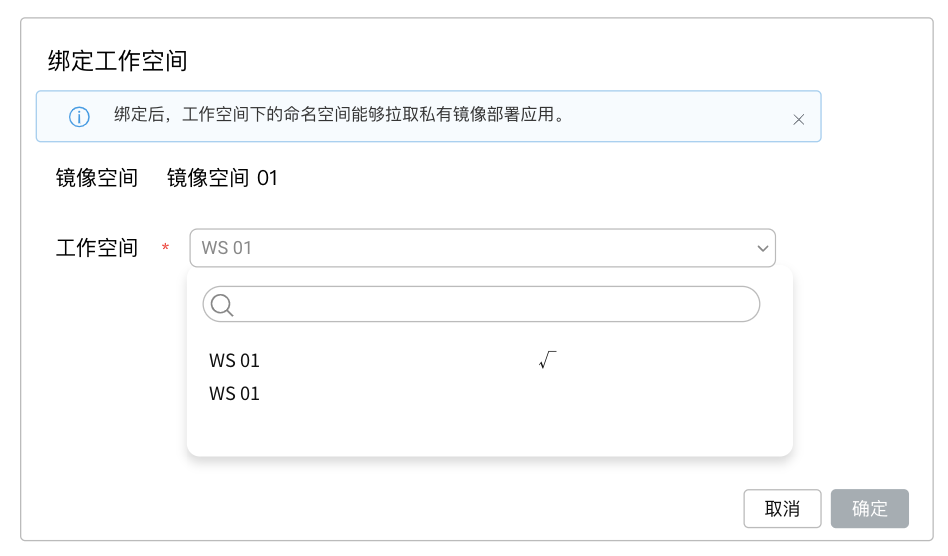
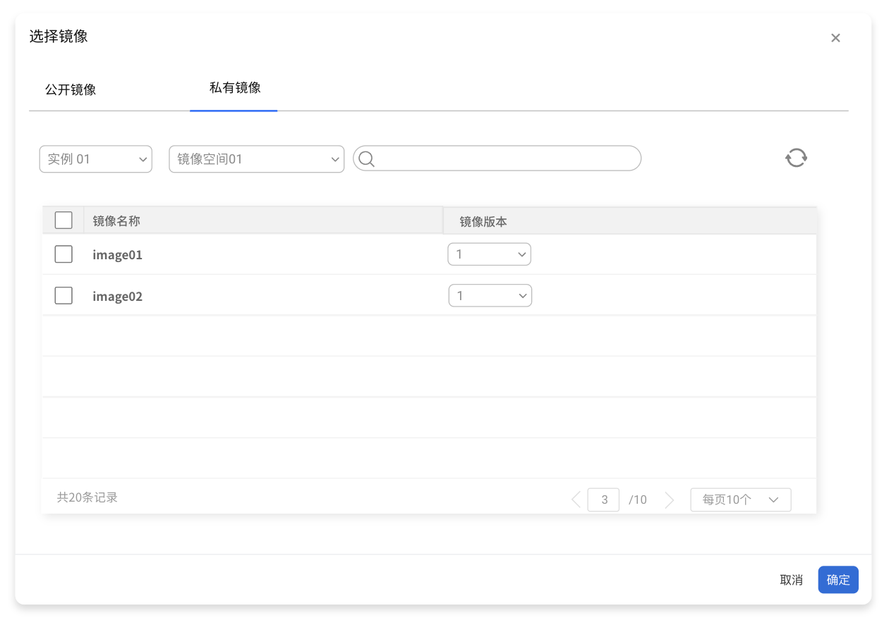

# 镜像空间绑定工作空间

镜像空间有两种类型：公开和私有。公开镜像空间中的镜像为公开镜像，私有镜像空间中的镜像为私有镜像。

对于公开镜像，用户在容器管理模块部署应用时能够通过`选择镜像`按钮，选择`镜像仓库` - `仓库集成`中所有公开镜像空间中的镜像部署应用，无需任何配置。

对于私有镜像，则需要管理员将私有镜像空间分配给工作空间（租户）后，才能够被工作空间下的成员使用，确保私有镜像的安全性。

前提条件：已经创建或集成了一个外部 Harbor 仓库，且已创建一个或多个镜像空间。

## 绑定步骤

1. 使用具有 Admin 角色的用户登录 Web 控制台，从左侧导航栏点击`镜像仓库`。

    

1. 在左侧导航栏点击`仓库集成`，点击某个仓库名称进入仓库，并导航至镜像`仓库空间`菜单。

1. 点击某个镜像空间条目右侧的`绑定工作空间`按钮，选择要绑定的工作空间。

1. 点击`确定`完成绑定工作空间。

    

## FAQ

1. 在 kubenetes 命名空间部署应用时，通过“选择镜像”按钮仍选择不到镜像空间中的镜像。

    - 排查该 kubenetes 命名空间是否绑定了工作空间（需要绑定）。
    - 排查该镜像空间是否绑定了 kubenetes 命名空间所在的工作空间（需要绑定）。
    - 排查该镜像空间状态是私有该是公开，切换如下 tab 查找。

    

2. 将镜像空间分配给工作空间使用，与在工作空间下关联仓库有什么区别？

   平台管理员 admin 可以统一管理，批量将一个镜像空间分配给多个工作空间使用，而无需分别关联。

   工作空间管理员 workspace admin 可以根据需要自己关联外部镜像仓库给成员使用，而无需全部依赖于平台管理员，使用起来更为灵活。
