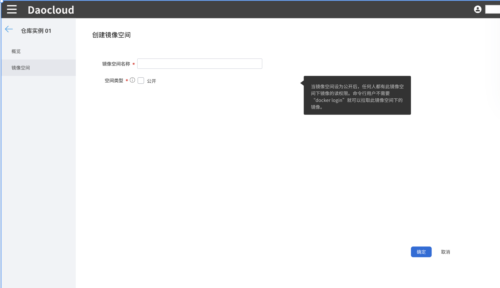

# 创建镜像空间

Harbor 提供了基于镜像空间（project）的镜像隔离功能。镜像空间分为公开和私有两种类型：

- 公开镜像仓库：所有用户都可以访问，通常存放公开的镜像，默认有一个 library 公开镜像空间。
- 私有镜像仓库：只有授权用户才可以访问，通常存放镜像空间本身的镜像。

前提条件：已经创建或集成了一个外部 Harbor 仓库。

1. 使用具有 Admin 角色的用户登录 Web 控制台，从左侧导航栏点击`镜像仓库`。

    

1. 在左侧导航栏点击`托管 Harbor`，点击某个仓库名称，并导航至`镜像空间`菜单。

1. 点击右上角的`创建镜像空间`按钮，填写镜像空间名称，选择类型后点击`确定`。

    

!!! info

    若镜像空间状态为公开，则空间中的镜像能够被平台上的所有kubenetes命名空间拉取使用；
    若镜像空间状态为私有，则只有管理员admin将该镜像空间绑定到一个或多个工作空间（租户）后，才能被工作空间（租户）下的kubenetes命名空间拉取使用。
