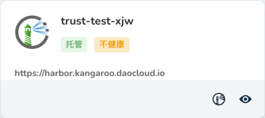

# 镜像仓库 FAQ

## 创建的托管仓库状态为不健康


- A1：用户输入的数据库、Redis、S3 存储等信息有误，导致无法连接，可通过查看日志文件进行排查。现象主要是几个核心服务有 Pod 启动失败，可以通过查看日志进一步确认原因。

    ```shell
    kubectl -n kangaroo-lrf04 get pods
    ```
    ```none
    NAME                                                         READY   STATUS    RESTARTS   AGE
    trust-node-port-harbor-harbor-chartmuseum-57fdfb9cdc-qznwc   1/1     Running   0          20h
    trust-node-port-harbor-harbor-core-855f8df46c-cgqb9          1/1     Running   0          20h
    trust-node-port-harbor-harbor-jobservice-6b958dbc57-ks997    1/1     Running   0          20h
    trust-node-port-harbor-harbor-portal-5cf6bf659b-kj6gd        1/1     Running   0          20h
    trust-node-port-harbor-harbor-registry-5ccbf457c5-qrtx5      2/2     Running   0          20h
    trust-node-port-harbor-harbor-trivy-dbdc8945-xh6rv           1/1     Running   0          20h
    trust-node-port-nginx-deployment-677c74576-7kmh4             1/1     Running   0          20h
    ```

- A2：如果 A1 排查无误，排查 `harborcluster` 资源是否健康，如下命令查看 `harborcluster` 资源状态。

    ```shell
    kubectl -n kangaroo-lrf04 get harborclusters.goharbor.io
    ```
    ```none
    NAME              PUBLIC URL                 STATUS
    trust-node-port   https://10.6.232.5:30010   healthy
    ```

- A3：如果 A2 排查无误，在 `kpanda-global-cluster` 集群上排查 `registrysecrets.kangaroo.io` 资源是否创建，以及 `status` 情况。

    提示: namespace 默认为 kangaroo-system。

    ```shell
    kubectl -n kangaroo-system get registrysecrets.kangaroo.io
    ```
    ```none
    NAME                        AGE
    inte-bz-harbor-1            34d
    ```
    ```shell
    kubectl -n kangaroo-system describe registrysecrets.kangaroo.io inte-bz-harbor-1
    ```

!!! tip

    - 上述 A1、A2 都在托管 Harbor 所在的集群上排查问题，目标集群通过如下页面路径查看：`仓库实例` -> `概览` -> `部署位置`
    - 上述 A3 在 `kpanda-global-cluster` 集群上验证。

## 创建 `Project` 或上传镜像后发现页面上的镜像空间和可用存储未增加

这是因为 UI 页面上在`托管 Harbor` 首页、仓库集成详情中的统计信息是异步获取的数据，会有一定的延迟，最长延迟为 `10` 分钟。

## 仓库集成后但状态为不健康



首先确认实例是否真的健康，如果实例不健康，则需要排查实例的问题；
如果实例健康，则通过在 `kpanda-global-cluster` 集群上排查 `registrysecrets.kangaroo.io`
资源是否创建，并排查 `status` 情况，这样可以初步确认问题所在。

提示：namespace 默认为 kangaroo-system。

```shell
kubectl -n kangaroo-system get registrysecrets.kangaroo.io
```
```none
NAME                     AGE
trust-test-xjw           34d
```

```shell
kubectl -n kangaroo-system get registrysecrets.kangaroo.io trust-test-xjw -o yaml
```
```yaml
apiVersion: kangaroo.io/v1alpha1
kind: RegistrySecret
metadata:
  name: trust-test-xjw
  namespace: kangaroo-system
spec:
  ....
status:
  state:
    lastTransitionTime: "2023-03-29T03:27:31Z"
    message: 'Get "https://harbor.kangaroo.daocloud.io": dial tcp: lookup harbor.kangaroo.daocloud.io
      on 10.233.0.3:53: no such host'
    reason: RegistryHealthCheckFail
    status: "False"
    type: HealthCheckFail
```

## 仓库集成后，在镜像列表页面实例中不可查看

请确认仓库集成的资源是否健康，如果不健康是不会在镜像列表页面的实例列表中显示的。
确认方式请参考[仓库集成后不健康的确认方法](#_2)。

## 在 `Kpanda` 镜像选择器中选中一个私有 `Project` 镜像但部署时提示镜像拉取失败

- A1：能在镜像选择器中看到私有 `Project` 表明 `Project` 和 `Workspace` 已经进行了绑定，
  此时需要去镜像部署的目标集群 `namespace` 中确认是否生成名为 `registry-secret` 的 `secret`。

    ```shell
    kubectl -n default get secret registry-secret
    ```
    ```none
    NAME              TYPE                             DATA   AGE
    registry-secret   kubernetes.io/dockerconfigjson   1      78d
    ```

- A2：如果确认已经生成名为 `registry-secret` 的 `secret`，则需要确认 `secret` 中的 `dockerconfigjson` 是否正确。

    ```shell
    kubectl get secret registry-secret -o jsonpath='{.data.*}'| base64 -d | jq
    ```
    ```none
    {
      "auths": {
        "127.0.0.1:5000": {
          "auth": "YWRtaW46SGFyYm9yMTIzNDU="
        }
      }
    }
    ```
    ```shell
    echo "YWRtaW46SGFyYm9yMTIzNDU=" | base64 -d
    ```
    ```none
    admin:Harbor12345
    ```
