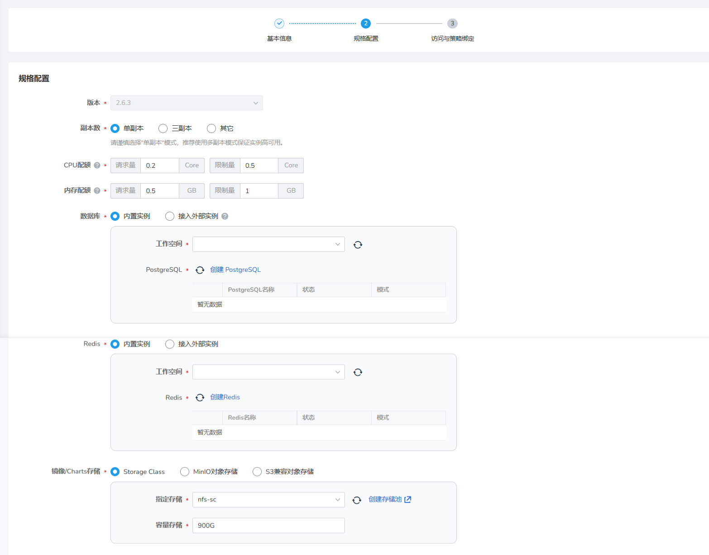

# 托管 Harbor

Harbor 是一个开源的镜像仓库服务，用于容器镜像、Helm Chart 等符合 OCI 标准的 Artifact 的安全托管及高效分发，能够帮助您跨云原生计算平台（如 Kubernetes 和 Docker）一致且安全地管理 Artifact。DaoCloud Enterprise 平台提供了基于 Harbor 的快捷部署能力，并通过与平台中的应用工作台、容器管理模块打通，与工作空间绑定等一系列便捷通道，实现了一站式高可用、高性能、高效率的部署、管理、使用等全周期的镜像仓库服务。

## 产品功能

- 支持多副本部署实现高可用
- 支持将平台用户导入原生 Harbor 实例
- 提供原生 Harbor 实例入口，用户在平台 UI 的操作与在原生 Harbor 中的操作实时同步生效
- 支持使用平台自建数据库或接入外部数据库
- 支持使用平台自建 Redis 实例或接入外部 Redis 实例
- 支持指定内部存储或使用外部 S3 兼容对象存储

## 功能优势

- 多镜像仓库实例，满足开发、测试、生产等多种环境，多套镜像仓库的需求。
- 打破模块之间的调用壁垒，支持在应用工作台和容器管理模块部署应用时快速拉取镜像
- 提供统一的管理控制平面，管理员能够在同一界面对多个 Harbor 实例进行全生命周期管理。

## 前置条件

托管 Harbor 使用的是 Harbor Operator 技术来进行 Harbor 创建、升级、删除等全生命周期管理，在创建托管 Harbor 之前，需要先在容器管理中安装 Harbor Operator，版本要求最低 1.4.0；安装步骤如下:

- 1. 进入到容器管理的集群管理功能模块，选中需要安装 Harbor 的集群。
- 2. 进入集群后进入 Helm 应用 -> Helm 模版功能模块中，搜索 Harbor Operator 的Helm.
- 3. 点击安装即可。

## 操作步骤

1. 使用具有 Admin 角色的用户登录 Web 控制台，从左侧导航栏点击`镜像仓库`。

    

1. 在左侧导航栏点击`托管 Harbor`，点击右上角的`创建实例`按钮。

    

1. 填写实例名称，选择部署位置后点击`下一步`（若无部署位置可选，需先前往容器管理创建集群和命名空间）。

    

1. 填写数据库、Redis 实例和镜像/Charts 存储信息后点击`下一步`（当前只支持接入外部数据库和 Redis 实例）。

   > 数据库填写提示：
   > -  地址: postgres://{host}:{port}, e.g. postgres://acid-minimal-cluster.default.svc:5432
   > -  用户名: 填写连接数据库的用户名
   > -  密码:  填写连接数据库的密码

   > Redis填写提示：Redis填写分为单机和哨兵模式
   > - 单机模式填写地址：redis://{host}:{port}，需要替换 host、port 两个参数。
   > - 哨兵模式填写地址：redis+sentinel://{host}:{port}?sentinelMasterId={master_id}，需要替换 host、port、master_id 三个参数。
   > - 密码：有就填写，没有就不填写

    

1. 填写域名，选择 ingress 实例，输入管理员密码后点击`确定`（用户名/密码用于登录原生 Harbor 实例，请妥善保管密码）。
    > 域名填写提示: http://{host}， host 前面的 http:// 必须要带上。

    

1. 返回托管 Harbor 实例列表，新创建的实例默认位于第一个，等待状态从`更新中`变为`健康`，即可正常使用。

    

1. 点击某个实例右侧的 `...`，可以选择编辑、删除或进入原生 Harbor。

    
