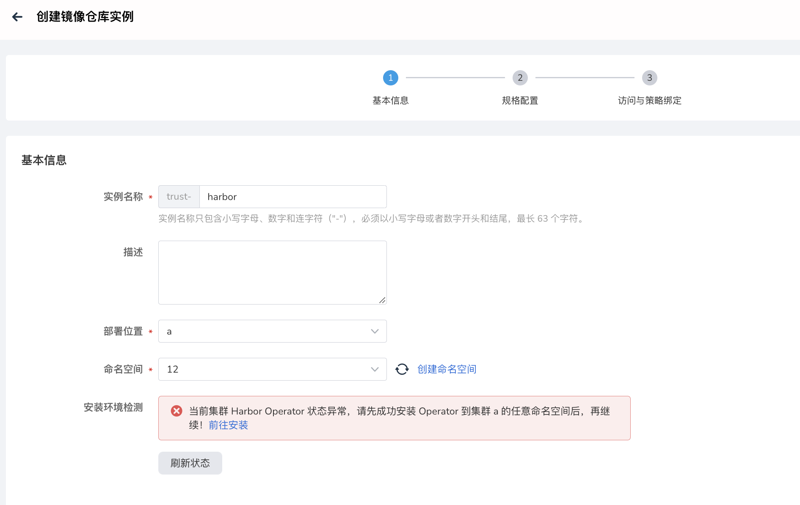
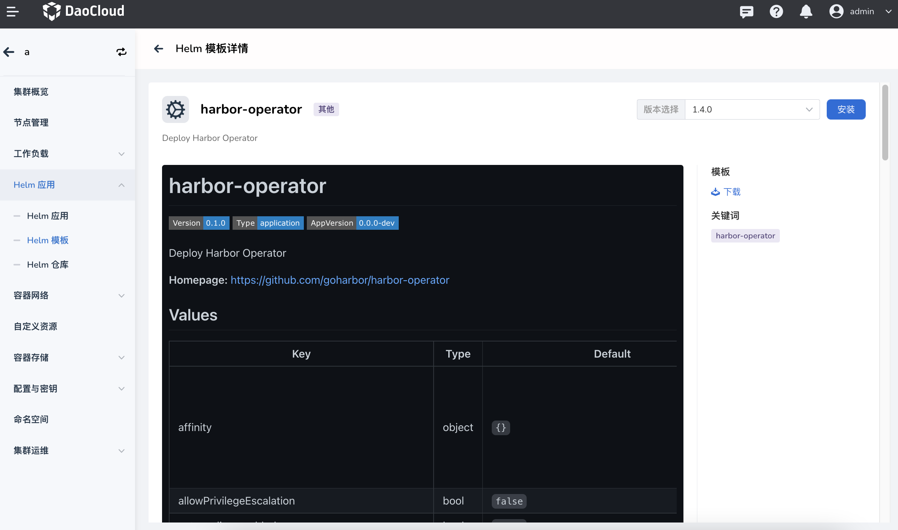
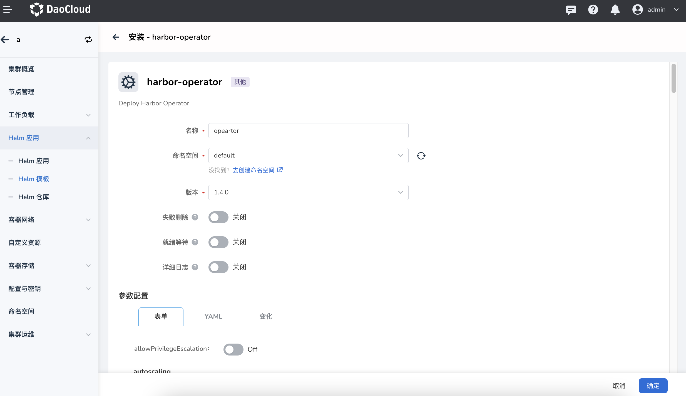
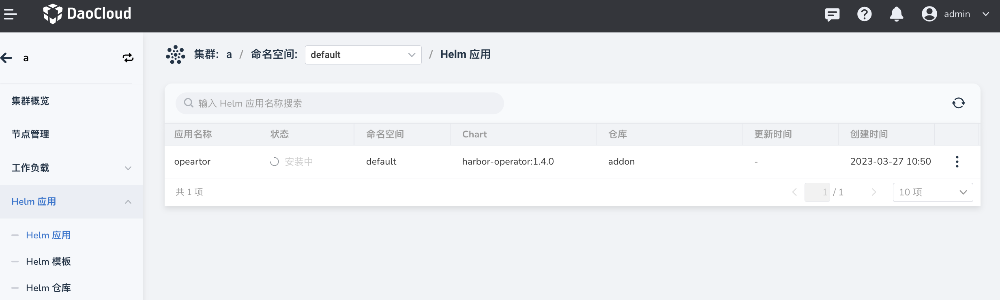

---
hide:
  - toc
---

# 安装 Harbor Operator

托管 Harbor 使用的是 Harbor Operator 技术来进行 Harbor 创建、升级、删除等全生命周期管理。
在创建托管 Harbor 之前，需要先在容器管理中安装 Harbor Operator，版本要求最低 1.4.0。

1. 如果在创建 Harbor 实例时，出现以下异常提示，请点击`前往安装`。

    

1. 进入`容器管理`的 `Helm 应用` -> `Helm 模板`，找到并点击 Harbor Operator 卡片。

    

1. 选择版本，点击`安装`。

    

1. 输入名称和命名空间后，点击`确定`。

    

1. 等待安装完成。

    

下一步：[创建托管 Harbor 实例](./harbor.md)
