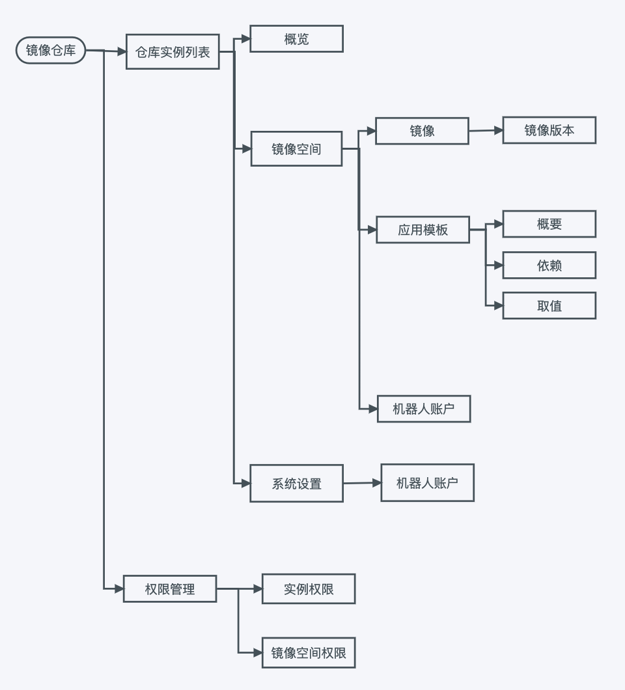

# 什么是镜像仓库

容器镜像仓库是一种存储库（或存储库集合），用于存储 Kubernetes、DevOps 和基于容器的应用开发容器镜像。

DaoCloud 镜像仓库是一个支持多实例生命周期管理的云原生镜像托管服务，支持将镜像仓库实例部署至任意云原生基础环境，同时支持镜像/应用模板（Helm Chart）生命周期管理及企业级授权管理。

支持镜像安全扫描、异地同步、加速分发等多种功能，高效实现镜像托管和分发服务，保障业务极速部署。系统架构图如下：

## 容器镜像

容器包含了组成应用的文件和组件，然后可以快速实现横向扩展，或根据需要移至其他系统，而容器镜像就是容器镜像的一个副本。
创建容器镜像后会形成一种模板，随后您就可利用该模板来创建新应用或扩展现有应用。

使用容器镜像时，需要一个位置来保存和访问创建的镜像，这正是容器镜像仓库的作用。
镜像仓库主要用于存储容器镜像，可通过上传（推送）和下载（提取）过程共享。
如果该镜像在另一个系统上，则其中包含的原始应用也可在该系统上运行。

除了容器镜像，镜像仓库还会存储应用编程接口（API）路径和访问控制参数。

## 公共和私有容器镜像仓库

容器镜像仓库有两种类型：公共和私有。

公共镜像仓库适用于希望尽快启动并运行镜像仓库的个人或小团队，这种镜像仓库具有基本的功能/服务，使用简单。

小型的初创企业可利用标准和开源镜像从头开始，逐渐发展。然而，在发展过程中，可能会出现补丁、隐私和访问控制等安全问题。

通过私有镜像仓库，可以将安全与隐私整合到远程托管或内部托管的企业容器镜像存储中。
公司可选择创建并部署自己的容器镜像仓库，也可选择商业支持的私有镜像仓库服务。
这些私有镜像仓库通常具有高级安全功能和技术支持，DaoCloud 镜像仓库就是一个很好的例子。

## 私有容器镜像仓库须知

私有容器镜像仓库的一大主要优势是能够控制哪些人能访问什么内容，并根据需要扫描漏洞和补丁，通常需要对镜像和用户进行身份验证。

为企业选择私有容器镜像仓库服务时要注意的一些重要事项：

- 多个身份验证系统支持
- 基于职能角色的访问权限控制管理（RBAC）
- 漏洞扫描功能
- 能够在可审计日志中记录使用情况，以便跟踪到单个用户的活动
- 为自动化而优化

基于职能角色的访问权限控制允许在镜像仓库内根据用户职能角色分配能力。
例如，开发人员需要上传到镜像仓库和从镜像仓库下载的访问权限，而团队成员或测试人员只需要下载访问权限。

对于拥有 AD 或 LDAP 等用户管理系统的企业，可将该系统直接链接到容器镜像仓库并用于 RBAC。

私有镜像仓库可防止具有漏洞的镜像或来自未授权用户的镜像进入公司系统。
您也可以执行定期扫描，查找任何安全问题，然后根据需要进行修补。

私有镜像仓库还允许采用身份验证措施，来验证上面存储的容器镜像。
采用这些措施后，上传镜像的人必须先对其进行数字签名，才能上传到镜像仓库中。
这样可跟踪活动，以及避免用户无权进行的上传操作。您还可在各个阶段标记镜像，以便能够根据需要进行恢复。

## DaoCloud 容器镜像仓库

DaoCloud 私有容器镜像仓库可支持您使用快速扩展所需的存储来构建、分布和部署容器。
它使用 Clair 来分析镜像的安全漏洞，从而能够识别潜在问题，并在问题成为安全风险之前加以解决。

DaoCloud 私有容器镜像仓库可通过功能强大并可由您控制的访问权限和身份验证设置，确保以私有方式存储您的应用，并具有以下功能和优势：

- 可与多个存储后端和身份提供商兼容
- 日志和审核
- 可扩展的灵活 API
- 直观的用户界面（UI）
